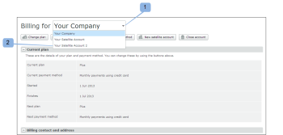
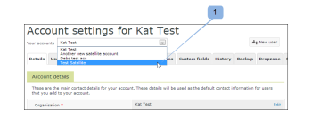

# [!DNL Workfront Proof] でのサテライトアカウントの管理

>[!IMPORTANT]
>
>この記事では、スタンドアロン製品の [!DNL Workfront Proof] の機能について説明します。[!DNL Adobe Workfront] 内のプルーフについて詳しくは、[プルーフ](../../../review-and-approve-work/proofing/proofing.md)を参照してください。

[!DNL Workfront Proof] 管理者として、組織のアカウントに設定されたサテライトアカウントを管理できます。

## 請求情報の更新

サテライトアカウントの請求詳細を表示および管理するには、次の手順を実行します。

1. [!UICONTROL 請求]ページに移動します。
1. ページの上部にあるドロップダウンメニューを開き (1)、関連するサテライトアカウントを選択します。（2）

   詳しくは、[ [!DNL Workfront Proof] [!UICONTROL 請求]ページ](../../../workfront-proof/wp-billingsettings/manage-your-billing/wp-billing-page.md)を参照してください。

   

## アカウント情報の更新

サテライトアカウントのアカウント設定を表示および管理するには、次の手順を実行します。

1. ページ上部の[!UICONTROL アカウント設定]に移動します。
1. **[!UICONTROL アカウント]**&#x200B;ドロップダウンメニューをクリックし、関連するサテライトアカウントを選択します。（1）
1. 関連するタブをクリックして、サテライトアカウントのアカウント設定を管理します。

