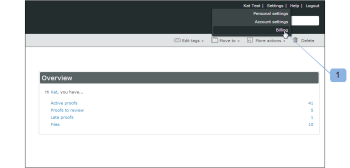

# を閉じる [!DNL Workfront Proof] アカウント

>[!IMPORTANT]
>
>この記事では、スタンドアロン製品の機能について説明します [!DNL Workfront Proof]. 内部での検証に関する情報 [!DNL Adobe Workfront]を参照してください。 [校正](../../../review-and-approve-work/proofing/proofing.md).

この節の手順を完了すると、お客様のアカウントは直ちに閉じられます。 アカウント内のすべてのデータが削除され、復元できません。

製品の改善に向けて継続的に取り組んでいます。 お客様のアカウントを閉鎖したい場合は、数分かかり、改善方法をお知らせいただければ幸いです。

お問い合わせ先： [!DNL support@proofhq.com] 君のコメントですべてのフィードバックを歓迎します。

1. を開きます。 [!UICONTROL 請求] ページを開く [!UICONTROL 設定] メニューと選択 **[!UICONTROL 請求]** (1)

   請求ページについて詳しくは、 [この [!DNL Workfront] 配達確認の請求ページ](../../../workfront-proof/wp-billingsettings/manage-your-billing/wp-billing-page.md).

   

1. 次をクリック： **[!UICONTROL アカウントを閉じる]** ボタン (3)

   

1. アカウントを閉じる理由を選択します。 (4)
1. 「 」をクリックして決定を確定します **[!UICONTROL 保存]**. (5)

   

1. パスワードを入力してアカウントを閉じます。 (6)

   
