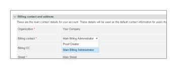
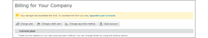

# [!DNL Workfront Proof] 請求ページ

>[!IMPORTANT]
>
>この記事では、[!DNL Workfront Proof] スタンドアロン製品の機能について説明します。[!DNL Adobe Workfront] 内でのプルーフについて詳しくは、[プルーフ](../../../review-and-approve-work/proofing/proofing.md)を参照してください。

## 請求ページ

[!UICONTROL 請求]ページにアクセスするには、画面右上の&#x200B;**[!UICONTROL 設定]**&#x200B;メニューを開き、ドロップダウンメニューで「**[!UICONTROL 請求]**」を選択します。

[!UICONTROL 請求]ページには次の情報が含まれます。

* アカウント名（1）
* アカウントリスト（例：サテライトアカウントを持っている場合）（2）
* プランの変更（3）
* 支払詳細の変更（4）
* 新しいサテライトアカウント（5）
* 口座のクローズ（6）
* 現在のプラン情報（7）
* 請求先および住所（8）
* 使用状況の統計（9）
* 請求履歴（10）
* 請求活動（11）

  

## [!UICONTROL 現在のプラン]

このセクション（7）では、次の内容を含む現在のプランの詳細を示します。

* プランの名前
* 現在の支払い方法
* 現在のプランの開始日と終了日
* 次のプランのタイプ
* 次のプランの支払い方法

  詳しくは、[ [!DNL Workfront Proof]](../../../workfront-proof/wp-billingsettings/manage-your-billing/choose-payment-method-in-wp.md) での支払い方法の選択を参照してください。

## [!UICONTROL 請求先および住所]

このセクション（8）では、アカウントの主な請求先と住所の詳細を示します。

請求連絡先は、アカウントで請求管理者として設定されているユーザーからのみ選択できます。サテライトアカウントでは、このフィールドに設定できるのは、メインアカウントの請求管理者のみです。

>[!NOTE]
>
> アカウントに複数の請求管理者を設定できますが、すべての請求通知とアカウント使用状況アラートを受信できるのは、「[!UICONTROL 請求連絡先]」フィールドで選択された 1 人だけです。

これには、次の通知メールが含まれます。

* プルーフの使用状況
* 請求書
* ダウングレード
* 遅延支払／アカウント停止アラート
* クレジットカードエラー

  

「[!UICONTROL 請求 CC]」フィールドでは、すべての請求関連メールにコピーするメールアドレスを追加することもできます。フィールドをクリックして取り込み編集を有効にし、選択したメールアドレスを入力します（既存のユーザーのメールアドレスでもかまいません）。

## [!UICONTROL 請求先住所]

このセクションでは取り込み編集を使用するので、フィールドをクリックするだけでテキストを入力または編集できます。

>[!NOTE]
>
> この住所はサブスクリプションの請求書に記載されるため、このデータが常に最新であることを確認してください。

## [!UICONTROL 使用状況の統計]

このセクションには、次の情報を含む、現在の請求期間内におけるアカウントの使用状況の統計が表示されます。

* 使用済みストレージ
* 使用したプルーフ
* 使用ユーザー数制限

### [!UICONTROL 使用状況の警告]

アカウントの請求先連絡先（1）として設定されている [!DNL Workfront] プルーフ](../../../workfront-proof/wp-acct-admin/account-settings/proof-perm-profiles-in-wp.md)の[[!UICONTROL プルーフ権限プロファイル]は、アカウントが次の状況に達するとメールで通知されます。

* ストレージ容量の 75％と 98％
* プルーフ制限の 75％と 100％

プルーフまたは保存の制限に達すると、[!UICONTROL 請求]ページの上部にもアラートが表示されます。

* プルーフの制限に達した場合

  

* ストレージの制限に達した場合

>[!NOTE]
>
>プルーフの数は、アカウントでプルーフを作成した時点で数えられ、プルーフを削除しても元に戻せません。

ストレージ容量は、プルーフとファイルを削除し、その後[!UICONTROL ゴミ箱]を空にすることで解放できます。

プルーフ、ストレージ、またはユーザー数がさらに必要な場合は、いつでもアカウントをアップグレードでき、すぐに有効になります。

## [!UICONTROL 請求履歴]

このセクションには、最近の請求期間のアクティビティが表示されます。また、このセクションから請求書をダウンロードすることもできます。

詳しくは、「[ [!DNL Workfront Proof] 請求書のダウンロード](../../../workfront-proof/wp-billingsettings/manage-your-billing/download-wp-invoice.md)」を参照してください。

## [!UICONTROL 請求アクティビティ]

このセクションには、[!DNL Workfront Proof] プランのサブスクリプション、アップグレード、ダウングレード、更新など、お支払い設定に対する最近の変更が表示されます。

計画をユーザー数の少ない計画（1）に変更した場合、新しい計画が開始する際に、新しい制限を超えるユーザーは自動的に無効化されます。このアクティビティは、アカウントログにも記録されます（2）。

