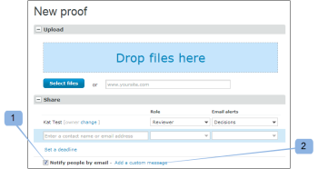

# 新規プルーフメール

>[!IMPORTANT]
>
>この記事では、スタンドアロン製品 [!DNL Workfront Proof] の機能について説明します。[!DNL Adobe Workfront] 内でのプルーフについて詳しくは、[プルーフ](../../../review-and-approve-work/proofing/proofing.md)を参照してください。

<!--

Make this article work better for PiW.

-->

新しいプルーフまたは新しいバージョンのプルーフを作成する場合、プルーフに新しいユーザーを追加する場合、またはプルーフにワークフローを追加する場合、次の記事で説明するように、レビュアーにメールを送信するかどうかを指定できます。

* [自動ワークフローを使用した高度なプルーフの作成](../../../review-and-approve-work/proofing/creating-proofs-within-workfront/create-automated-proof-workflow.md)
* [ [!DNL Workfront Proof] でプルーフを生成する](../../../workfront-proof/wp-work-proofsfiles/create-proofs-and-files/generate-proofs.md)

受信者が受け取るメールは、[!UICONTROL 新規プルーフ]メールと呼ばれます。このメールを制御できるのは、プルーフの作成者と、プルーフにレビュアーを追加する権限を持つユーザーだけです。受信者はこれを無効にできません。

新規プルーフに関するメールには、次の内容が含まれます。

* 個人メッセージ（メッセージを含める場合）
* 常に同じカスタムメッセージをレビュアーに送信する場合は、「[!UICONTROL プルーフのデフォルト]」タブの[!UICONTROL 個人設定]に保存することをお勧めします。詳細情報は、以下を参照してください。
* プルーフへの個人リンク
* 関連する [!DNL Workfront] オブジェクト（プロジェクト、タスク、イシューなど）に移動する&#x200B;**[!UICONTROL 詳細を表示]**&#x200B;リンク
* プルーフ画像のサムネール
* 次のプルーフの詳細：

   * プルーフ名
   * バージョン番号

     詳細情報は、以下を参照してください。

   * レビュアーとプルーフの進行状況のリスト
   * 他のユーザーとプルーフを共有するためのリンク

     これにより、元のファイルのプルーフ URL やダウンロードリンクを共有できます。これにより、レビュアーをプルーフに明示的に追加することはできません。パブリックのプルーフ URL のみ共有され、受信者はプルーフへの読み取り専用アクセス権を受け取ります。

     詳しくは、[ [!DNL Workfront Proof]](../../../workfront-proof/wp-work-proofsfiles/share-proofs-and-files/share-proof.md) でプルーフを共有を参照してください。

     このリンクを受信者のメールに表示したくない場合は、プルーフの[!UICONTROL パブリック共有]設定を無効にすることができます。

     （元のファイルとパブリック URL をダウンロード）。詳しくは、[ [!DNL Workfront Proof]](../../../workfront-proof/wp-work-proofsfiles/manage-your-work/manage-proof-details.md) でプルーフの詳細を管理を参照してください。

## アクティビティログ

[!UICONTROL 新規プルーフ]メールをレビュアーに送信すると、[!UICONTROL プルーフの詳細]ページの「[!UICONTROL アクティビティ]」セクションに記録されます。詳しくは、[ [!DNL Workfront Proof]](../../../workfront-proof/wp-work-proofsfiles/manage-your-work/manage-proof-details.md) で[!UICONTROL プルーフの詳細]を管理を参照してください。プルーフの作成時に[!UICONTROL 新規プルーフ]メールが有効になっているかどうかを確認できます。

>[!NOTE]
>
>* プルーフの作成者または所有者が、（個人設定の）デフォルトで[!UICONTROL プルーフ作成]に関するメールを無効にしている場合、[!UICONTROL プルーフ作成]に関するメールも、[!UICONTROL 新規プルーフ]に関するメールも受け取りません。新規プルーフページの「[!UICONTROL メールで担当者に通知]」ボックスがオンになっている場合も同様です。詳細情報は、以下を参照してください。
>* メール通知が[!UICONTROL アカウント設定]のデフォルトで無効に設定されている場合、プルーフの作成者または所有者は[!UICONTROL プルーフ作成]に関するメールも、[!UICONTROL 新規プルーフ]に関するメールも受け取りません。個人設定で有効になっている場合、および新規プルーフページの「メールで担当者に[!UICONTROL 通知]」ボックスがオンになっている場合も同様です。詳しくは、[[!UICONTROL プルーフ作成]メール](../../../workfront-proof/wp-emailsntfctns/proof-notifications-and-reminders/proof-made-email.md)を参照してください。
>

## [!UICONTROL 新規プルーフ]メールを有効にして、カスタムメッセージを含める

プルーフ作成時またはプルーフへのユーザー追加時に、プルーフに関するレビュアーにメールアラートを送信するかどうかを指定できます。

* [プルーフを作成する場合](#when-you-create-a-proof)
* [プルーフにレビュアーを追加する場合](#when-you-add-a-reviewer-to-a-proof)

### プルーフを作成する場合 {#when-you-create-a-proof}

「**[!UICONTROL 共有]**」セクションの下にある[!UICONTROL 新規プルーフ]ページで新規プルーフを作成する場合、メールアラートを送信するかどうかを選択できます。

* ここで、[!UICONTROL メールで担当者に通知]するかどうかを決定できます（1）。このオプションを選択解除した場合、プルーフのレビューの準備ができたことを知らせるメールをレビュアーが受け取ることはありません。
* また、メール通知にカスタムメッセージを含めることもできます（2）。
* 独自のカスタムメッセージを追加する場合は、カスタマイズした件名行（3）とメール本文（4）にメッセージを入れることができます。
* カスタムメッセージを破棄するには、リンクをクリックするだけです（5）。

  >[!NOTE]
  >
  >常に同じカスタムメッセージをレビュアーに送信する場合は、「[!UICONTROL プルーフのデフォルト]」タブの個人設定に保存することをお勧めします。詳細情報は、以下を参照してください。

### プルーフにレビュアーを追加する場合 {#when-you-add-a-reviewer-to-a-proof}

（上記と同様に）既存のプルーフに追加された新しいレビュアーに、プルーフの通知を送信するかどうかを選択できます。

* まず、新しいレビュアーを追加するには、**[!UICONTROL プルーフの詳細]**&#x200B;ページで「**[!UICONTROL このバージョンを共有]**」ボタンをクリックします（1）。

* 新しいレビュアーを追加できるボックスが表示されます。メールで通知を受け取るかどうかを決定し（2）、メールにカスタムメッセージを追加するかどうかを選択できます（3）。

* カスタムメッセージを追加する場合はボックスを展開し、カスタム件名の行を挿入し（4）、メールの本文にカスタムテキストを追加することができます（5）。また、リンクをクリックしてカスタムメッセージを破棄することもできます（6）。

