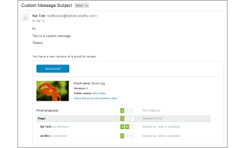

# [!UICONTROL 新しいバージョン]のメール

>[!IMPORTANT]
>
>この記事では、スタンドアロン製品 [!DNL [!DNL Workfront Proof]] の機能について説明します。[!DNL [!DNL Adobe Workfront]] 内のプルーフについて詳しくは、[プルーフ](../../../review-and-approve-work/proofing/proofing.md)を参照してください。

<!--

Does this apply to PiW?

-->

新しいバージョンのメールは、プルーフの[!UICONTROL 新しいバージョン]を作成すると送信されます。[!UICONTROL 新しいプルーフ]メールと同じ方法でカスタマイズしたり無効にしたりできます。

>[!NOTE]
>
>[!UICONTROL アカウント設定]でメール通知がデフォルトで無効になっている場合、新しいバージョンページで「[!UICONTROL メールで担当者に通知]」ボックスがオンになっていない限り、レビュアーは[!UICONTROL 新しいバージョン]のメールを受信しません。

