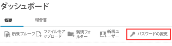

# Workfront Proof のログインとパスワードおよび電子メールの変更

>[!IMPORTANT]
>
>この記事では、スタンドアロン製品の機能について説明します [!DNL Workfront Proof]. 内部での検証に関する情報 [!DNL Adobe Workfront]を参照してください。 [校正](../../../review-and-approve-work/proofing/proofing.md).

## ログイン

1. に移動します。 [ログインページ](http://www.proofhq.com/login) ( または、  [www.proofhq.com](http://www.proofhq.com/)) をクリックします。

1. 次をクリック： [!UICONTROL ログイン] ボタンをクリックします。
1. 電子メールアドレスとパスワードを入力します。\
   パスワードを忘れた場合は、  [パスワードを忘れた場合](#when-you-forget-your-password) この記事の後半で説明します。

1. ログイン状態を維持する場合（無操作状態が 30 分間続いた後、セッションのタイムアウトを回避したい場合）は、 **[!UICONTROL ログイン状態を維持する]**.
1. クリック **[!UICONTROL ログイン]**.

この [!DNL Workfront Proof] 管理者は、 [!UICONTROL ログイン] ページ。 詳しくは、 [ブランド化 [!DNL Workfront Proof] サイト](../../../workfront-proof/wp-acct-admin/branding/brand-wp-site.md). または、 [!UICONTROL 大規模法人] または [!UICONTROL 無制限] エディションプラン (「  [ブランド化 [!DNL Workfront Proof] サイト — 詳細](../../../workfront-proof/wp-acct-admin/branding/brand-wp-site-advanced.md).

の場合 [!UICONTROL 大規模法人] および [!UICONTROL 無制限] プランでは、シングルサインオン (SSO) 機能を提供しています。この機能を使用すると、ユーザーはにログインできます。 [!DNL Workfront Proof] 組織のユーザー名とパスワードを使用する。 詳しくは、 [シングルサインオンの設定対象 [!DNL Workfront Proof] ユーザー](../../../workfront-proof/wp-acct-admin/account-settings/configure-sso-for-wp-users.md). を参照してください。

## ログアウト

1. クリック **[!UICONTROL ログアウト]** Workfront Proof の右上隅にある\
   ログアウトしたことを確認するメッセージが表示されます。 次をクリックできます。 **[!UICONTROL ログインページに戻る]** をクリックして、必要に応じて再度ログインします。\
   この [!DNL Workfront Proof] 管理者は、このメッセージ用にパーソナライズされたブランディングを設定できます。 詳しくは、 [ブランド化 [!DNL Workfront Proof] サイト](../../../workfront-proof/wp-acct-admin/branding/brand-wp-site.md). または、を使用している場合は [!UICONTROL 大規模法人] または [!UICONTROL 無制限] エディションプラン (「  [ブランド化 [!DNL Workfront Proof] サイト — 詳細](../../../workfront-proof/wp-acct-admin/branding/brand-wp-site-advanced.md).

## パスワードを忘れた場合 {#when-you-forget-your-password}

パスワードを忘れた場合、 [!DNL Workfront Proof] 電子メールには、リセットした電子メールメッセージが送信されます。

1. に移動します。 [ログインページ](http://www.proofhq.com/login) ( または、  [www.proofhq.com](http://www.proofhq.com/)) をクリックします。

1. クリック **[!UICONTROL パスワードを忘れた場合]**
1. 表示されるボックスに電子メールアドレスを入力し、 **[!UICONTROL リンクを取得]**.

## パスワードの変更

1. の [!UICONTROL ダッシュボード]をクリックし、 **[!UICONTROL パスワードを変更]**.\
   \
   次に、 [!DNL Workfront Proof] 管理者が特定のパスワード要件を設定した場合、それらは [!UICONTROL リセット] ページ。

## パスワードの詳細設定について

次を使用する場合、 [!UICONTROL 選択] または [!UICONTROL プレミアム] プラン、 [!DNL Workfront Proof] 管理者は、組織の IT およびセキュリティポリシーに準拠し、データのセキュリティを強化するために、特定のパスワード要件を設定できます。 詳しくは、この記事の「パスワードの詳細設定」を参照してください。

## アカウントへの電子メールアドレスの追加

複数の電子メールアドレスを [!DNL Workfront Proof] アカウント プライマリメールアドレスは、 [!DNL Workfront Proof] 配達確認通知を送信します。 また、このツールを使用して、にログインします。 [!DNL Workfront Proof]. プライマリメールアドレスを変更できます。

1. クリック **[!UICONTROL 設定]** > **[!UICONTROL 個人設定]**.

1. の下 **[!UICONTROL ユーザー E メールのエイリアス]**&#x200B;をクリックし、 **[!UICONTROL 新しい電子メールアドレス]**.

1. 内 **[!UICONTROL E メールのエイリアス]** 表示されるボックスに、追加する電子メールアドレスを入力し、 **[!UICONTROL 入力]**.\
   [!DNL Workfront Proof] 新しい電子メールアドレスに検証電子メールを送信します。

1. 受け取った検証 E メールで、確認リンクをクリックします。\
   電子メールの変更は、プロファイルに保存されます。 表示中のブラウザーを更新する必要が生じる場合があります [!DNL Workfront Proof] [!UICONTROL 個人設定] ページのページを開き、エイリアス E メールとして確認されていることを確認します。
1. （オプション）新しい電子メールアドレスをにプライマリ電子メールアドレスとするには [!DNL Workfront Proof]、 [!UICONTROL 詳細] （3 ドット）ボタンをクリックし、 **[!UICONTROL プライマリメールを作成]** をクリックします。
