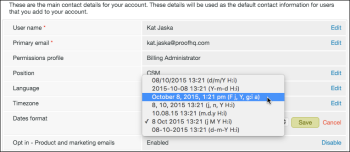

# [!DNL Workfront Proof] でのタイムゾーンの設定

>[!IMPORTANT]
>
>この記事では、スタンドアロン製品 [!DNL Workfront Proof] の機能について説明します。[!DNL Adobe Workfront] 内でのプルーフについて詳しくは、[プルーフ](../../../review-and-approve-work/proofing/proofing.md)を参照してください。

[!DNL Workfront Proof] は、プルーフが作成された日時と、プルーフに対するアクティビティ（期限、決定、コメントなど）が実行された日時を表示します。デフォルトでは、時刻は GMT で表示されます。

自分の [!DNL Workfront Proof] アカウントがあるユーザーは、個人設定でタイムゾーンを設定することができます。[!DNL Workfront] のすべての時間は、このタイムゾーンに表示されます。別のタイムゾーンのユーザーが作成したプルーフについても同様です。詳しくは、[個人設定](https://support.workfront.com/hc/ja-jp/sections/115000921168-Personal-settings)を参照してください。

すべてのゲストレビュアー（[!DNL Workfront Proof] アカウントがないユーザー）には、すべての時間がプルーフの所有者のタイムゾーンで表示されます。詳しくは、[ [!DNL Workfront Proof]](../../../workfront-proof/wp-mnguserscontacts/contacts/use-members-guests.md) でのユーザー、メンバー、ゲストについてを参照してください。

## 個人のタイムゾーンの設定

1. **[!UICONTROL 設定]**／**[!UICONTROL 個人設定]**&#x200B;をクリックし、「**[!UICONTROL 設定]**」タブを開きます。

1. （オプション）アカウントに表示される日付と時間の形式を変更するには、**[!UICONTROL 日付形式]**&#x200B;を編集します。\
   AM／PM 形式で表示される時刻を確認する場合は、必ずメニューから次のオプションを選択してください。

1. 

## 組織のデフォルトタイムゾーンの設定

アカウント管理者は、組織のデフォルトのタイムゾーンを設定できます。このタイムゾーンは、組織に追加されたすべての新規ユーザーに対してデフォルトで設定されます（ただし、個々のユーザーごとに変更できます）。

1. **[!UICONTROL 設定]**／**[!UICONTROL 個人設定]**、「**[!UICONTROL 設定]**」タブの順にクリックします。

1. **[!UICONTROL アカウントの詳細]**&#x200B;の下で、**[!UICONTROL タイムゾーンのデフォルト]**&#x200B;の右にある「[!UICONTROL 編集]」をクリックして、変更を加えます。
