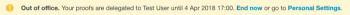

# [!DNL Workfront Proof] での一時的なプルーフ所有者の指定

>[!IMPORTANT]
>
>この記事では、スタンドアロン製品 [!DNL Workfront Proof] の機能について説明します。[!DNL Adobe Workfront] 内でのプルーフについて詳しくは、[プルーフ](../../../review-and-approve-work/proofing/proofing.md)を参照してください。

長期間不在にする場合は、アカウント内の別のユーザーにプルーフの所有権をデリゲートできます。

>[!NOTE]
>
>この機能は [!DNL Workfront Proof] でのみ使用できます。

一時的にプルーフの所有権を指定するには、次の操作を行います。

1. [!DNL Workfront Proof] 内で、**[!UICONTROL 個人設定]**&#x200B;に移動します。\
   

1. 「**[!UICONTROL 不在]**」タブをクリックします。次の設定を使用できます。

   * **[!UICONTROL プルーフをアカウント内の別のユーザーにデリゲート]**。
   * チェックボックスをオンまたはオフにして、**[!UICONTROL 不在]**&#x200B;機能を有効または無効にする。
   * **[!UICONTROL 開始日]**&#x200B;の選択。

     「**[!UICONTROL すぐに開始]**」オプションを選択すると、この機能をアクティブ化した直後にプルーフの所有権が選択したユーザーにデリゲートされます。

     特定の開始日時を設定した場合、機能は選択した日時に有効化されます。

   * **[!UICONTROL 終了日]**&#x200B;の選択。

     終了日を選択していない場合、機能が手動で無効化されるまでプルーフの所有権がデリゲートされます。

     特定の終了日時を設定した場合、機能は選択した日時に無効化されます。

     

1. プルーフがデリゲートされると、デリゲートされた所有者がプルーフの詳細ページの「**[!UICONTROL 詳細]**」セクションに表示されます。所有権のデリゲーションに関するメモは、プルーフの詳細ページの「**[!UICONTROL アクティビティ]**」セクションに表示されます。

   

   不在通知機能を有効にすると、[!UICONTROL 不在]通知が元のプルーフ所有者のアカウントにも表示されます。これは元の所有者に対するリマインダーとして機能し、デリゲーションをすぐに終了したり、[!UICONTROL 個人設定]に移動して調整したりすることもできます。

   

   プルーフの所有権が元の所有者に戻されると、デリゲートされた所有者がプルーフの詳細ページの「[!UICONTROL 詳細]」セクションに表示されなくなり、[!UICONTROL 不在]通知が元のプルーフ所有者のアカウントに表示されなくなります。プルーフの所有権が戻されたことを示すメモが、プルーフの詳細ページの「[!UICONTROL アクティビティ]」セクションに表示されます。

   >[!NOTE]
   >
   >デリゲートされた所有者は、手動で削除しない限り、プルーフのワークフローに残ります。

   ![[!UICONTROL activity-section-taken-back].png](assets/activity-section-taken-back-350x99.png)
