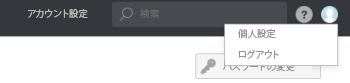

# での一時配達確認所有者の指定 [!DNL Workfront Proof]

>[!IMPORTANT]
>
>この記事では、スタンドアロン製品の機能について説明します [!DNL Workfront Proof]. 内部での検証に関する情報 [!DNL Adobe Workfront]を参照してください。 [校正](../../../review-and-approve-work/proofing/proofing.md).

長期間不在になる場合は、アカウント内の別のユーザーに配達確認の所有権を委任できます。

>[!NOTE]
>
>この関数は、 [!DNL Workfront Proof].

配達確認の一時的な所有権を指定するには：

1. 内 [!DNL Workfront Proof]に移動します。 **[!UICONTROL 個人設定]**.\
   

1. 次をクリック： **[!UICONTROL 不在]** タブをクリックします。 次の設定を使用できます。

   * **[!UICONTROL 配達確認を次に委任]** アカウント内の別のユーザー。
   * を有効または無効にします。 **[!UICONTROL 不在]** 関数内で使用する必要があります。
   * を選択します。 **[!UICONTROL 開始日]**.

      この **[!UICONTROL すぐに開始]** 「 」オプションを選択すると、配達確認の所有権は、機能をアクティブ化した直後に、選択したユーザーに委任されます。

      特定の開始日時が設定されている場合、機能は選択した日と選択した時間に有効化されます。

   * を選択します。 **[!UICONTROL 終了日]**.

      終了日を選択しない場合、機能が手動で無効になるまで、配達確認の所有権が委任されます。

      特定の終了日時が設定されている場合、機能は、選択された日と選択された時刻に無効になります。

      

1. 配達確認が委任されると、委任された所有者が **[!UICONTROL 詳細]** 」セクションに表示されます。 所有権委任メモが **[!UICONTROL アクティビティ]** 」セクションに表示されます。

   

   An [!UICONTROL 不在] この機能が有効になっている間は、元の配達確認所有者のアカウントにも通知が表示されます。 これは元の所有者に対するリマインダーとして機能し、また、委任を直ちに終了したり、 [!UICONTROL 個人設定] をクリックして調整します。

   

   配達確認の所有権が元の所有者によって取り戻されると、委任された所有者は、 [!UICONTROL 詳細] 配達確認の詳細ページの「 」セクションと [!UICONTROL 不在] 通知は、元の配達確認所有者のアカウントに表示されなくなりました。 配達確認の所有権が元に戻されたことを示す注記が [!UICONTROL アクティビティ] 」セクションに表示されます。

   >[!NOTE]
   >
   >委任された所有者は、手動で削除しない限り、配達確認ワークフローに残ります。

   ![[!UICONTROL activity-section-taken-back].png](assets/activity-section-taken-back-350x99.png)
