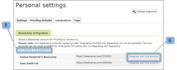

# 統合 [!DNL Workfront Proof] と [!DNL Basecamp]

>[!IMPORTANT]
>
>この記事では、スタンドアロン製品の機能について説明します [!DNL Workfront Proof]. 内部での検証に関する情報 [!DNL Adobe Workfront]を参照してください。 [校正](../../../review-and-approve-work/proofing/proofing.md).

次を使用する場合、 [!DNL Basecamp] プロジェクト管理では、 [!DNL Workfront Proof].

## について [!DNL Basecamp] との統合 [!DNL Workfront]

との統合 [!DNL Basecamp] ユーザーは、 [!DNL Basecamp]. ユーザーは配達確認を [!DNL Workfront Proof] アカウントを使用して、 [!DNL Basecamp] プロジェクト。 レビュー担当者は、 [!DNL Basecamp]:Basecamp メッセージに埋め込まれたミニ配達確認を使用します。

と統合されている場合 [!DNL Workfront Proof], [!DNL Basecamp] には次の校正機能があります。

* ユーザーは、 [!DNL Basecamp Classic].
* ユーザーは、すぐに使用できるレビューツールを持っています。
* プロジェクトレビューチームは、 [!DNL Basecamp] レビューおよび承認用のミニ配達確認を含む
* ユーザーは、レビューと承認のために、完全なページの配達確認に切り替えることができます。
* ユーザーは、ミニサイズとフルサイズの両方の配達確認にコメントとマークアップを追加できます。

   >[!NOTE]
   >
   >コメントの返信後は、コメントの編集や削除はできません。

* レビュー担当者は、他のレビュー担当者が作成したマークアップに応答できます。
* 新しいバージョンの配達確認が使用可能になると、ユーザーに警告が表示されます。
* 以下でないユーザー [!DNL Workfront Proof] ユーザーは、 [!DNL Basecamp].

の統合 [!DNL Workfront Proof] と [!DNL Basecamp] は次の 2 つのレベルで設定する必要があります。

* 設定 [!DNL Basecamp] in [アカウント設定：](https://support.workfront.com/hc/en-us/sections/115000912147-Account-settings) これにより、組織全体で Basecamp 統合が有効になります。 詳しくは、 [での Basecamp 統合の有効化 [!DNL Workfront Proof]](#enabling-the-basecamp-integration-with-workfront-proof).

* 設定 [!DNL Basecamp] in [個人設定](https://support.workfront.com/hc/en-us/sections/115000921168-Personal-settings):これにより、配達確認の作成者と所有者が、自分の Basecamp アカウントに接続し、承認できるようになります [!DNL Workfront Proof] にアクセスします。 詳しくは、 [個人設定の指定](#configuring-personal-settings).

統合可能な [!DNL Workfront] どちらか [!DNL Basecamp] または [!DNL Basecamp Classic]. の各バージョン [!DNL Basecamp] は異なる API を使用しているので、異なる設定手順が必要です。

設定に関する情報 [!DNL Basecamp Classic]を参照してください。 [統合 [!DNL Workfront Proof] と [!DNL Basecamp Classic].](https://support.workfront.com/knowledge/articles/115004234707/en-us?brand_id=662728&amp;return_to=%2Fhc%2Fen-us%2Farticles%2F115004234707)

## の有効化 [!DNL Basecamp] との統合 [!DNL Workfront Proof]

As a [の配達確認権限プロファイル [!DNL Workfront Proof]](../../../workfront-proof/wp-acct-admin/account-settings/proof-perm-profiles-in-wp.md) または [の配達確認権限プロファイル [!DNL Workfront Proof]](../../../workfront-proof/wp-acct-admin/account-settings/proof-perm-profiles-in-wp.md)を設定する場合、 [!DNL Basecamp] のアカウント全体の統合 [アカウント設定](https://support.workfront.com/hc/en-us/sections/115000912147-Account-settings).

1. In [!UICONTROL Basecamp]、次の情報を収集します。

   * の URL [!DNL Basecamp] アカウント
   * 「[!UICONTROL マイ情報]&quot;セクション

1. からログアウト [!DNL Basecamp].
1. クリック **[!UICONTROL アカウント設定]** 右上隅付近にある
1. 次をクリック： **[!UICONTROL 統合]** タブをクリックします。
1. 内 **[!UICONTROL [!DNL Basecamp]]** セクション（の右） **[!UICONTROL [!DNL Basecamp]統合]**&#x200B;をクリックし、 **[!UICONTROL 有効にする]**.

1. 次の隣 **[!UICONTROL [!DNL Basecamp]version]**、 **[!UICONTROL クラシックバージョン]** は、統合しているバージョンです。

1. （条件付き） [!DNL Basecamp] URL が表示されたら、 **[!UICONTROL 編集]**、 [!DNL Basecamp] アカウント (「http://」を含まない ) を選択し、「 **[!UICONTROL 保存]**.

1. ウィンドウの右上隅で、 **[!UICONTROL 設定]** > **[!UICONTROL 個人設定]**.

1. 次をクリック： **[!UICONTROL 統合]** タブをクリックします。
1. の下 **[!DNL Basecamp]**（の右） **[!UICONTROL Basecamp 統合]**&#x200B;をクリックし、 **[!UICONTROL 有効にする]**.

1. の右側にオプションが表示されます。 **[!UICONTROL [!DNL Basecamp]API トークン]**&#x200B;をクリックし、 **[!UICONTROL 編集]**.

1. 表示されるボックスに、「[!UICONTROL マイ情報]」セクション内の [!DNL Basecamp]を選択し、「 **[!UICONTROL 保存]**.\
   統合後 [!DNL Workfront Proof] と [!DNL Basecamp]を設定しない場合、ユーザーは個人設定を指定できます。 個人設定の設定について詳しくは、 [個人設定の指定](#configuring-personal-settings)

1. を有効にできない場合は、 [!DNL Basecamp] 統合、 [!DNL Workfront Proof] アカウント ID が、 [!DNL Basecamp].
1. 統合後 [!DNL Workfront Proof] と [!DNL Basecamp]を設定しない場合、ユーザーは個人設定を指定できます。 個人設定の設定について詳しくは、 [個人設定の指定](#configuring-personal-settings).

## 個人設定の指定

設定後 [アカウント設定](https://support.workfront.com/hc/en-us/sections/115000912147-Account-settings) 組織の場合、配達確認を作成または送信する各作成者が、  [個人設定。](https://support.workfront.com/hc/en-us/sections/115000921168-Personal-settings)

1. に移動します。 **[!UICONTROL 個人** &#x200B; **設定]**.

1. を開きます。 **[!UICONTROL 統合]** 」タブ (1) をクリックします。
1. を有効にするには、以下を実行します。 [!DNL Basecamp] 統合，クリック **[!UICONTROL 有効にする]** (2)
1. クリック **[!UICONTROL に接続 [!DNL Basecamp] アカウント]** (3)\
   

1. にログインします。 [!DNL Basecamp] アカウント (1)\
   

1. クリック **[!UICONTROL はい、アクセスを許可します]** 許可する [!DNL Workfront Proof] アカウントへのアクセス (2)\
   

1. （オプション）個人用統合がアクティブな場合 (3)、 [!DNL Basecamp] アカウント。

   1. クリック **[!UICONTROL 切り替え [!DNL Basecamp] アカウント]** (4)\

      \
      この [!UICONTROL Basecamp アカウントの切り替え] に移動します。 [!UICONTROL 個人設定] ページで、 [!DNL Basecamp] と統合するアカウント [!DNL Workfront Proof] アカウント

   1. クリック **[!UICONTROL と再統合[!DNL Basecamp]]** (5) 選択前に [!DNL Basecamp] アカウント\

      これにより、 [!UICONTROL 個人設定] ページに追加され、 [!DNL Basecamp] アカウント。

   1. クリック **[!UICONTROL このアカウントとの統合]** ～と結び付ける [!DNL Workfront Proof].\

      \
      配達確認を [!DNL Basecamp] プロジェクト。
