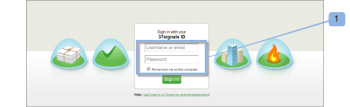

# [!DNL Workfront Proof] の [!DNL Basecamp] との統合

>[!IMPORTANT]
>
>この記事では、スタンドアロン製品 [!DNL Workfront Proof] の機能について説明します。[!DNL Adobe Workfront] 内でのプルーフについて詳しくは、[プルーフ](../../../review-and-approve-work/proofing/proofing.md)を参照してください。

[!DNL Basecamp] をプロジェクト管理に使用している場合は、[!DNL Workfront Proof] を使用することで、プロジェクトチームに、より機能の豊富なレビューツールや承認ツールを提供できます。

## [!DNL Basecamp] の [!DNL Workfront] との統合について

[!DNL Basecamp] と統合することで、ユーザーは、[!DNL Basecamp] 内でプルーフをすべて表示、レビュー、承認できるようになります。ユーザーはプルーフを [!DNL Workfront Proof] アカウントに送信し、[!DNL Basecamp] プロジェクトに結びつけることができます。レビュアーは Basecamp メッセージに埋め込まれたミニプルーフを使用して、[!DNL Basecamp] 経由でコメントし、決定を下すことができます。

[!DNL Workfront Proof] と統合すると、[!DNL Basecamp] で次のプルーフ機能を利用できます。

* ユーザーは [!DNL Basecamp Classic] 内でプルーフをレビューおよび承認できます。
* ユーザーにはいつでも使用できるレビューツールが用意されます。
* プロジェクトレビューチームは、レビューと承認のためのミニプルーフのメッセージを [!DNL Basecamp] で受信します。
* ユーザーは、フルページのプルーフに切り替えてレビューや承認を行うことができます。
* ユーザーは、ミニサイズとフルサイズの両方のプルーフにコメントやマークアップを追加できます。

  >[!NOTE]
  >
  >コメントの返信後に、コメントの編集や削除を行うことはできません。

* レビュアーは、他のレビュアーが作成したマークアップに応答できます。
* 新しいバージョンのプルーフが使用可能になると、ユーザーに警告が表示されます。
* [!DNL Workfront Proof] ユーザーでないユーザーは、[!DNL Basecamp] でプルーフの作業を行うことができます。

[!DNL Workfront Proof] と [!DNL Basecamp] の統合は、次の 2 つのレベルで設定する必要があります。

* [アカウント設定](https://support.workfront.com/hc/ja-jp/sections/115000912147-Account-settings) での [!DNL Basecamp] の設定：これにより、組織全体で Basecamp の統合が可能になります。詳しくは、[Basecamp と  [!DNL Workfront Proof]](#enabling-the-basecamp-integration-with-workfront-proof) の統合の有効化を参照してください。

* [個人設定](https://support.workfront.com/hc/ja-jp/sections/115000921168-Personal-settings)での [!DNL Basecamp] の設定：これにより、プルーフの作成者と所有者が個人の Basecamp アカウントに接続し、[!DNL Workfront Proof] アクセスを承認できるようになります。詳しくは、[個人設定の設定](#configuring-personal-settings)を参照してください。

[!DNL Workfront] を [!DNL Basecamp] または [!DNL Basecamp Classic] と統合できます。[!DNL Basecamp] の各バージョンは異なる API を使用しているので、異なる設定手順が必要です。

[!DNL Basecamp Classic] の設定について詳しくは、[ [!DNL Workfront Proof]  [!DNL Basecamp Classic] との統合](https://support.workfront.com/knowledge/articles/115004234707/en-us?brand_id=662728&amp;return_to=%2Fhc%2Fen-us%2Farticles%2F115004234707)を参照してください。

## [!DNL Basecamp] と [!DNL Workfront Proof] の統合の有効化

[ [!DNL Workfront Proof]](../../../workfront-proof/wp-acct-admin/account-settings/proof-perm-profiles-in-wp.md) のプルーフ権限プロファイルまたは[ [!DNL Workfront Proof]](../../../workfront-proof/wp-acct-admin/account-settings/proof-perm-profiles-in-wp.md) のプルーフ権限プロファイルとして、[アカウント設定](https://support.workfront.com/hc/ja-jp/sections/115000912147-Account-settings)でアカウント全体の [!DNL Basecamp] の統合を設定できます。

1. [!UICONTROL Basecamp] で、次の情報を収集します。

   * [!DNL Basecamp] アカウントの URL
   * 「[!UICONTROL 個人情報]」セクションにある URL

1. [!DNL Basecamp] からログアウトします。
1. 右上隅付近にある「**[!UICONTROL アカウント設定]**」をクリックします。
1. 「**[!UICONTROL 統合]**」タブをクリックします。
1. 「**[!UICONTROL [!DNL Basecamp]]**」セクションで、**[!UICONTROL [!DNL Basecamp]統合]**&#x200B;の右側にある「**[!UICONTROL 有効化]**」をクリックします。

1. **[!UICONTROL [!DNL Basecamp]バージョン]**&#x200B;の横にある&#x200B;**[!UICONTROL クラシックバージョン]**&#x200B;が統合対象のバージョンであることを確認します。

1. （条件付き）[!DNL Basecamp] URL が表示されない場合は、「**[!UICONTROL 編集]**」をクリックし、[!DNL Basecamp] アカウントの URL を「http://」を含めずに入力して、**[!UICONTROL 保存]**&#x200B;をクリックします。

1. ウィンドウの右上隅で、**[!UICONTROL 設定]**／**[!UICONTROL 個人設定]**&#x200B;をクリックします。

1. 「**[!UICONTROL 統合]**」タブをクリックします。
1. **[!DNL Basecamp]** の **[!UICONTROL Basecamp 統合]**&#x200B;の右側にある「**[!UICONTROL 有効化]**」をクリックします。

1. 表示されるオプションで、**[!UICONTROL [!DNL Basecamp]API トークン]**&#x200B;の右側にある「**[!UICONTROL 編集]**」をクリックします。

1. 表示されるボックスに、[!DNL Basecamp] の「[!UICONTROL 個人情報]」セクションにある URL を入力し、「**[!UICONTROL 保存]**」をクリックします。\
   [!DNL Workfront Proof] を [!DNL Basecamp] に統合した後、ユーザーは個人設定を実行できます。個人設定の実行について詳しくは、[個人設定の実行](#configuring-personal-settings)を参照してください。

1. [!DNL Basecamp] の統合を有効化できない場合は、[!DNL Workfront Proof] アカウント ID が、[!DNL Basecamp] で使用するアカウント ID と同じではない可能性があります。
1. [!DNL Workfront Proof] を [!DNL Basecamp] に統合した後、ユーザーは個人設定を実行できます。個人設定の実行について詳しくは、[個人設定の実行](#configuring-personal-settings)を参照してください。

## 個人設定の実行

組織の[アカウント設定](https://support.workfront.com/hc/ja-jp/sections/115000912147-Account-settings)を実行した後、プルーフを作成、送信する作成者はそれぞれ[個人設定](https://support.workfront.com/hc/ja-jp/sections/115000921168-Personal-settings)を実行する必要があります。

1. **[!UICONTROL 個人用****設定]**&#x200B;に移動します。

1. 「**[!UICONTROL 統合]**」タブを開きます (1)。
1. [!DNL Basecamp] 統合を有効にするには、「**[!UICONTROL 有効にする]**」をクリックします (2)。
1. 「**[!UICONTROL [!DNL Basecamp] アカウントに接続]**」をクリックします (3)。\
   

1. [!DNL Basecamp] アカウントにログインします (1)。\
   

1. 「**[!UICONTROL はい、アクセスを許可します]**」をクリックして、アカウントへの [!DNL Workfront Proof] のアクセスを承認します (2)。\
   

1. （オプション）個人用統合がアクティブな場合 (3)、[!DNL Basecamp] アカウント間は簡単に切り替えることができます。

   1. 「**[!UICONTROL [!DNL Basecamp] アカウントを切り替え]**」をクリックします (4)。

      \
      「[!UICONTROL Basecamp アカウントを切り替え]」をクリックすると、[!UICONTROL 個人用設定]ページが表示され、[!DNL Workfront Proof] アカウントと統合する [!DNL Basecamp] アカウントを選択できます。

   1. [!DNL Basecamp] アカウントを選択する前に、「**[!UICONTROL [!DNL Basecamp]]** と再統合」をクリックします (5)。

      これにより、[!UICONTROL 個人用設定]ページが更新され、[!DNL Basecamp] アカウントの最新のリストが表示されます。

   1. 「**[!UICONTROL このアカウントと統合]**」をクリックして、[!DNL Workfront Proof] に接続します。

      \
      これで、[!DNL Basecamp] プロジェクトにプルーフを追加できるようになりました。
