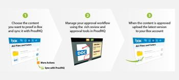

# [!DNL Workfront Proof] および [!DNL Box] の統合の概要

>[!IMPORTANT]
>
>この記事では、スタンドアロン製品の [!DNL Workfront Proof] の機能について説明します。[!DNL Adobe Workfront] 内のプルーフについて詳しくは、[プルーフ](../../../review-and-approve-work/proofing/proofing.md)を参照してください。

[!DNL Box] のオンラインファイル共有およびコンテンツ管理システムとの統合により、[!DNL Box] アカウント内のファイルから直接新しいプルーフと新しいプルーフバージョンを作成できます。[!DNL Box] の詳細については、www.box.com を参照してください。

アドビのフォルダー同期機能を使用すると、[!DNL Box] フォルダーを、[!DNL Workfront Proof] 内のフォルダーと同期させることができます。ファイルまたはファイルの新しいバージョンを [!DNL Box] の同期されたフォルダーに追加すると、そのファイルは Workfront Proof の関連フォルダーにも追加されます。詳しくは、[ [!DNL Workfront Proof]](../../../workfront-proof/wp-integrations/box/sycn-box-folder.md) との  [!DNL Box]  フォルダーの同期を参照してください。

## 主なメリット

* **共同レビューと承認の向上：**&#x200B;クリエイティブアセット上の共同作業を向上するために、豊富なマークアップ、コメント、ディスカッションツールをチームに提供します。
* **プロジェクトの配信の加速化：**&#x200B;レビューサイクルを短縮し、改訂数を削減することで、デザインプロジェクトの配信を 56％高速化します。合意と決定を迅速に行うことで、プロジェクトのターンアラウンドを速め、市場投入までの期間を短縮します。デザインの改訂が 29％削減されました。
* **管理時間を節約：**&#x200B;チームがコピーの印刷、メールコメント、改訂のルーティングに費やす時間が少ないと、プルーフの管理にかかる労力を平均で 59％削減できます。
* **コストの削減：**&#x200B;時は金なり。標準化されたワークフローにより、承認プロセスを合理化できます。効率、精度、速度が向上するので、コストも節約できます。
* **可視性と信頼性の向上：**&#x200B;追跡可能な監査証跡でタイムスタンプを使用して、ファイルのバージョン、コメントおよび決定を記録できます。これにより、レビュープロセスのあらゆる段階で完全な説明責任を果たすことができ、コンプライアンス要件を満たすことができます。\
   

## 主な特長

* クリエイティブファイルを [!DNL Box] アカウントから直接 [!DNL Workfront Proof] に送信します。
* [!UICONTROL ボックス]内のファイルへのリンクを含むメールで、新しいプルーフについてレビューチームに通知します。
* ユーザーに、[!DNL Workfront Proof] の豊富なマークアップ、コメント、ディスカッションツールを提供します。
* プロジェクトチームが共同作業を行い、印刷、デジタル、web、ビデオ、インタラクティブコンテンツなど、様々なメディア形式でリアルタイムに意思決定を行えるようにします。
* [!DNL Workfront Proof] を使用して、規制要件を満たし、プロセスの改善点を特定します。

## [!DNL Workfront Proof] 同期アプリを [!DNL Box] アカウントに追加

以下の簡単な手順に従って、アプリをボックスアカウントに追加します。

1. [!DNL Box] アカウントで、「**[!UICONTROL アプリ]**」セクションに移動します。
1. 検索バーに **[!DNL Workfront Proof]同期**&#x200B;と入力します。
1. 検索結果の **[!UICONTROL [!DNL Workfront Proof]同期]**&#x200B;をクリックします。
1. 「**[!UICONTROL 追加]**」をクリックして、[!DNL Workfront Proof] 同期アプリをボックスアカウントに追加します。
1. 表示される確認ボックスで、「**[!UICONTROL OK]**」をクリックします。

