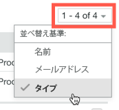

# で連絡先を管理 [!DNL Workfront Proof]

>[!IMPORTANT]
>
>この記事では、スタンドアロン製品の機能について説明します [!DNL Workfront Proof]. 内部での検証に関する情報 [!DNL Adobe Workfront]を参照してください。 [校正](../../../review-and-approve-work/proofing/proofing.md).

[ 連絡先 ] ページで、同僚、メンバー、ゲストを管理できます。

## 連絡先ページを開く

1. クリック **[!UICONTROL 連絡先]** （左側のナビゲーションサイドバー）。
1. （オプション）「 **[!UICONTROL ビューを変更]**&#x200B;次に、「 」オプションを選択して、連絡先別と会社別のどちらで表示するかを指定します。

## 連絡先の並べ替え

1. クリック **[!UICONTROL 連絡先]** （左側のナビゲーションサイドバー）。
1. 並べ替える列見出しをクリックします。
または、 **[!UICONTROL 並べ替え]** メニューを使用して、連絡先ページの右上隅に表示されます。

1. 

1. 列見出しの三角形は並べ替え順を示します。 上を向くと、昇順を示します。下向きは降順を示します。

## 連絡先のフィルタリング

1. クリック **[!UICONTROL 連絡先]** （左側のナビゲーションサイドバー）。
1. 次をクリック： **[!UICONTROL フィルター]** アイコンを使用して、列見出しの右端にある列見出しの下にフィルタリングオプションを表示できます。
1. 選択 [!UICONTROL フィルターオプション] ドロップダウンメニューから、各列ヘッダーの下に表示されるフィルターボックスに入力し、 **[!UICONTROL フィルター]** アイコンを再度クリックして、オプションを適用します。
1. 

1. または
1. 連絡先の名前の最初の文字を選択します。
1. 

## 1 つ以上の連絡先の管理

1. クリック **[!UICONTROL 連絡先]** （左側のナビゲーションサイドバー）。
1. 1 つ以上の連絡先のチェックボックスをオンにします。
1. 次のいずれかの操作を行います。

   * クリック **[!UICONTROL グループに追加]** 選択した連絡先をグループに追加します。

      

   * クリック **[!UICONTROL 削除]**&#x200B;をクリックし、ドロップダウンメニューの「 」オプションをクリックして、配達確認またはグループから連絡先を削除します。
   * クリック **[!UICONTROL 詳細]** > **[!UICONTROL 遅延配達確認に対するリマインダーを送信]** ：選択した連絡先に対して、遅延の配達確認に関するリマインダーメールを送信します。

   * クリック **[!UICONTROL 詳細]** > **[!UICONTROL 連絡先を CSV に書き出し]** 選択した連絡先を CSV ファイルに書き出す。

   * クリック **[!UICONTROL 連絡先の削除]** 選択した連絡先をリストから削除します。

      
連絡先を削除することは、ユーザーがアカウントから削除されたことを意味するわけではありません。ただし、管理者または請求管理者が連絡先リストから誰かを削除すると、その人は組織のアカウントから完全に削除されます。

   * 次をクリック： **[!UICONTROL 詳細]** 連絡先の行の最後にあるアイコンをクリックし、表示されるドロップダウンメニューのオプションを使用します。

      これらのオプションは、連絡先のタイプごとに異なります。 詳しくは、 [でのユーザー、メンバー、ゲストについて [!DNL Workfront Proof]](../../../workfront-proof/wp-mnguserscontacts/contacts/use-members-guests.md) を参照してください。

## 連絡先のインポート

連絡先は CSV ファイルからインポートできます。

1. クリック **[!UICONTROL 連絡先]** （左側のナビゲーションサイドバー）。
1. 連絡先ページで、 **[!UICONTROL 詳細]** > **[!UICONTROL 連絡先のインポート]** リストに連絡先を追加するには、以下を実行します。

1. 表示される顧客をインポートページで、 **[!UICONTROL ファイルを選択]**.
1. ファイル内のフィールド分離方法を選択します。
1. 「**[!UICONTROL 保存]**」をクリックします。

   * CSV ファイルには、「電子メール」という列（電子メールアドレスを含む）が少なくとも 1 つ必要です。
   * また、「名前」、「会社」、「電話」および「モバイル」の列を追加することもできます。
   * 「名」の代わりに、「名」と「姓」の 2 つの列を使用できます。 別の姓と名の列を使用する場合は、「名前」列も含めないようにする必要があります。
