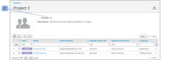

# [!DNL Workfront Proof] を使用してグループをプライベートにする

>[!IMPORTANT]
>
>この記事では、スタンドアロン製品 [!DNL Workfront Proof] の機能について説明します。[!DNL Adobe Workfront] 内でのプルーフについて詳しくは、[プルーフ](../../../review-and-approve-work/proofing/proofing.md)を参照してください。

グループをプライベートにすると、そのグループの表示、使用、編集、削除ができるのは自分だけになります。グループがプライベートでない場合、アカウント内のすべてのユーザーがそのグループを表示して使用できます。

## 新しいグループのプライベートへの設定

新しいグループをプライベートにするには、以下の手順を実行します。

1. 画面左側の&#x200B;**[!UICONTROL グループ]**&#x200B;に移動します。
1. グループを設定するときに、[!UICONTROL 新規グループ]ページで「**[!UICONTROL プライベート]**」オプションを選択します。（1）

## 既存のグループのプライベートへの設定

既存のグループをプライベートにするには、以下の手順を実行します。

1. 画面左側の&#x200B;**[!UICONTROL グループ]**&#x200B;に移動します。
1. グループの詳細ページで「**[!UICONTROL プライベート]**」オプションを有効にします。（2）

