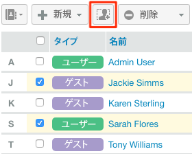

# 次を使用してグループを管理 [!DNL Workfront Proof]

>[!IMPORTANT]
>
>この記事では、スタンドアロン製品の機能について説明します [!DNL Workfront Proof]. 内部での検証に関する情報 [!DNL Adobe Workfront]を参照してください。 [校正](../../../review-and-approve-work/proofing/proofing.md).

As a [!DNL Workfront Proof] 管理者は、グループページで公開グループと非公開グループを管理できます。

## グループページを開く

1. クリック **[!UICONTROL グループ]** （左側のナビゲーションサイドバー）。
の [!UICONTROL グループ] ページでは、次の操作を実行できます。

   * すべてのパブリックグループとプライベートグループを表示します。
   * 新しいグループを作成します。 詳しくは、 [次を使用して校正グループを作成 [!DNL Workfront Proof]](../../../workfront-proof/wp-mnguserscontacts/groups/create-proofing-groups.md).
   * グループを CSV ファイルに書き出します。
   * グループのフィルターと並べ替え。
   * 1 つまたは複数のグループを選択した後、次の追加オプションを使用できます。

      * 選択したグループに担当者を追加します。

         

      * 選択したグループを非公開または公開にします。詳しくは、 [次を使用してグループを非公開にする [!DNL Workfront Proof]](../../../workfront-proof/wp-mnguserscontacts/groups/make-groups-private.md)
      * プライベートグループは、作成者のみに表示されます。
      * 選択したグループを削除します。

         
   * グループに対しても、グループごとに個別にアクションを実行できます **[!UICONTROL 詳細]** （3 ドット）メニュー：

      

      * グループの詳細を表示します。

         グループ名をクリックして、グループの詳細を表示することもできます。
      * ユーザーを追加する.
      * グループを公開/非公開にする。
      * グループの削除

## グループの並べ替え

グループ名、プライバシーステータスおよび説明でグループを並べ替えることができます。

1. 並べ替える列見出しをクリックします。
または、並べ替えメニューから並べ替えオプションを選択します。
   
列見出しの三角形は並べ替え順を示します。 上を向くと、昇順を示します。下向きは降順を示します。

## フィルターグループ

1. 次をクリック： **[!UICONTROL フィルター]** アイコンを使用して、列見出しの右端にある列見出しの下にフィルタリングオプションを表示できます。
   

1. 選択 [!UICONTROL フィルターオプション] ドロップダウンメニューから、各列ヘッダーの下に表示されるフィルターボックスに入力し、 **[!UICONTROL フィルター]** アイコンを再度クリックして、オプションを適用します。
または\
   グループ名の最初の文字を選択します。
   

## グループの詳細の表示と編集

1. 次をクリック： **[!UICONTROL 詳細]** ボタンをクリックし、 **[!UICONTROL グループの詳細を表示]** 」と入力します。
表示されるページで、グループに現在属しているすべての人物と、そのグループのデフォルトの役割および E メールアラートを表示できます。

1. 次のいずれかの操作を行い、グループの詳細を編集します。

   * グループ名と説明をクリックして入力し、編集します。 フィールドの外側をクリックすると、変更内容が保存されます。
   * クリック **[!UICONTROL プライバシー]** をクリックして、ドロップダウンメニューのグループプライバシー設定を変更します。
   * クリック **[!UICONTROL グループに追加]** 新しい担当者をグループに追加します。

      

   * クリック **[!UICONTROL グループを削除]** をクリックして、グループを削除します。\

      

   * グループメンバーの行の先頭にあるチェックボックスをクリックし、リストのすぐ上に表示される任意のオプションを使用します。
   * 次をクリック： **[!UICONTROL 詳細]** グループメンバーの行の最後にあるアイコンをクリックし、ドロップダウン・メニューのオプションを使用します。

      

## グループへの連絡先の追加

1. クリック **[!UICONTROL 連絡先]** 左側のナビゲーションパネルで、 **[!UICONTROL 連絡先]** ページ。

1. グループに追加する連絡先の名前の横にあるチェックボックスをオンにします。
1. 次をクリック： **[!UICONTROL グループに追加]** 」ボタンをクリックします。
   
この **[!UICONTROL グループに追加]** ダイアログボックスが表示されます。

1. 内 **[!UICONTROL 人]** セクション：

   1. ドロップダウン・メニューを使用して、メンバーの **役割** または **E メールアラート**. 詳しくは、 [での配達確認の役割の管理 [!DNL Workfront Proof]](../../../workfront-proof/wp-work-proofsfiles/share-proofs-and-files/manage-proof-roles.md) および  [での電子メール通知の設定 [!DNL Workfront Proof]](../../../workfront-proof/wp-emailsntfctns/email-alerts/config-email-notification-settings-wp.md).

   1. 以下を使用： **[!UICONTROL 連絡先名を入力]** または **[!UICONTROL 電子メールアドレス]** グループに連絡先を追加するためのフィールド。

1. 内 **[!UICONTROL グループ]** セクションで、連絡先を追加するグループを選択します。
1. クリック **[!UICONTROL グループに追加]**.
