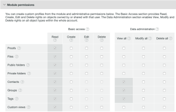
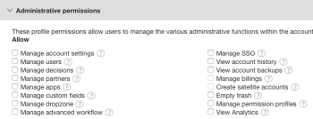
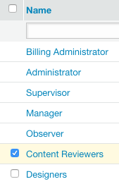
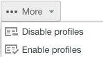
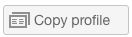
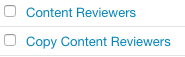
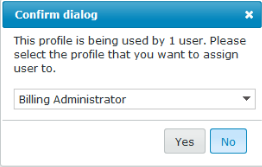

# [!DNL Workfront Proof] を使用したカスタムプロファイルの作成と管理

>[!IMPORTANT]
>
>この記事では、スタンドアロン製品 [!DNL Workfront Proof] の機能について説明します。 [!DNL Adobe Workfront] 内でのプルーフについて詳しくは、[プルーフ](../../../review-and-approve-work/proofing/proofing.md)を参照してください。

請求管理者および管理者は、カスタムプロファイルを作成および管理して、組織のアカウントおよびアカウント設定でユーザーが実行できる操作を指定できます。

この機能は Premium アカウントでのみ使用できます。

## モジュールの権限 {#module-permissions}

モジュールの権限を使用すると、ユーザー自身が所有する項目に対するアクセス権と、アカウント内の他のユーザーが所有する項目に対して持つアクセス権を設定できます。

「基本アクセス」セクションでは、ユーザーがアカウント内の自身の項目を読み取り、作成、編集および削除できるかどうかを指定します。

「[!UICONTROL データ管理]」セクションでは、アカウント内の他のユーザーが所有する項目に対するユーザーの権限を決定します。

どちらのセクションでも、アカウント内の次の項目に対する権限を付与できます。

* プルーフ
詳しくは、[&#x200B; [!DNL Workfront Proof]](../../../workfront-proof/wp-work-proofsfiles/create-proofs-and-files/generate-proofs.md) でプルーフを生成を参照してください。

* ファイル
詳しくは、[ファイルと web コンテンツを  [!DNL Workfront Proof]](../../../workfront-proof/wp-work-proofsfiles/create-proofs-and-files/upload-files-web-content.md) にアップロードを参照してください。

* 公開フォルダー
詳しくは、[&#x200B; [!DNL Workfront Proof]](../../../workfront-proof/wp-work-proofsfiles/organize-your-work/folder-permissions.md) でのフォルダー権限についてを参照してください。

* プライベートフォルダー
詳しくは、[&#x200B; [!DNL Workfront Proof]](../../../workfront-proof/wp-work-proofsfiles/organize-your-work/folder-permissions.md) でのフォルダー権限についてを参照してください。

* 連絡先
詳しくは、[連絡先](https://support.workfront.com/hc/ja-jp/sections/115000920808-Contacts)を参照してください。

* グループ
詳しくは、[&#x200B; グループ &#x200B;](https://support.workfront.com/hc/ja-jp/sections/115000920828-Groups)を参照してください。

* タグ
詳しくは、[&#x200B; [!DNL Workfront Proof]](../../../workfront-proof/wp-work-proofsfiles/organize-your-work/create-and-manage-tags.md) でのタグの作成と管理を参照してください。

* カスタムビュー
詳しくは、[&#x200B; [!DNL Workfront Proof]](../../../workfront-proof/wp-work-proofsfiles/manage-your-work/create-and-manage-custom-views.md) でのカスタムビューの作成と管理を参照してください。

## 管理権限 {#administrative-permissions}

このセクションでは、ユーザーに管理者権限を付与できます。 いくつかの権限はリンクしており、選択すると、タスクの実行に必要な他の権限が自動的に有効になります。 例えば、ユーザーが権限プロファイルを管理できるようにすると、アカウント内のユーザー管理が自動的に有効になります。

次の権限を付与できます。

* アカウント設定の管理
詳しくは、[&#x200B; アカウント設定](https://support.workfront.com/hc/ja-jp/sections/115000912147-Account-settings)を参照してください。

* ユーザーの管理
詳しくは、[&#x200B; ユーザー](https://support.workfront.com/hc/ja-jp/sections/115000911887-Users)を参照してください。

* 決定の管理
詳しくは、「[&#x200B; プルーフビューアでプルーフを決定する](../../../review-and-approve-work/proofing/reviewing-proofs-within-workfront/make-a-decision-on-a-proof/make-decisions-on-proof.md)」を参照してください。

* パートナーの管理
詳しくは、[&#x200B; パートナー](https://support.workfront.com/hc/ja-jp/sections/115000912107-Partner-accounts)を参照してください。

* アプリの管理
詳しくは、[統合](https://support.workfront.com/hc/ja-jp/categories/115000588707-Integrations)を参照してください。

* カスタムフィールドの管理
詳しくは、[&#x200B; カスタムフィールドの作成と管理 [!DNL Workfront Proof]](../../../workfront-proof/wp-acct-admin/account-settings/create-and-manage-custom-fields.md)を参照してください。

* ドロップゾーンの管理
詳しくは、[&#x200B; ドロップゾーン &#x200B;](../../../workfront-proof/wp-work-proofsfiles/create-proofs-and-files/dropzone.md)を参照してください。

* 高度なワークフローの管理
詳しくは、[自動ワークフローの概要](../../../review-and-approve-work/proofing/proofing-overview/automated-workflow.md)を参照してください。

* SSOの管理
詳しくは、 [!DNL Workfront Proof][&#128279;](../../../workfront-proof/wp-acct-admin/managing-security/single-sign-on-overview.md)の シングルサインオンを参照してください。

* アカウント履歴を表示
詳しくは、[&#x200B; アクティビティ監査証跡の概要](../../../workfront-proof/wp-work-proofsfiles/basic-features/activity-audit-trail.md)を参照してください。 [!DNL Workfront Proof] 

* アカウントのバックアップの表示
詳しくは、[&#x200B; データのバックアップ  [!DNL Workfront Proof] を参照してください。](../../../workfront-proof/wp-work-proofsfiles/organize-your-work/back-up-data.md)

* 請求の管理
詳しくは、[請求の管理](https://support.workfront.com/hc/ja-jp/sections/115000912187-Managing-your-billing)を参照してください。

* サテライトアカウントの作成
詳しくは、[&#x200B; サテライトアカウントの設定 [!DNL Workfront Proof]](../../../workfront-proof/wp-acct-admin/satellite-accounts/configure-sat-acct-in-wp.md)を参照してください。

* 空のゴミ箱
詳しくは、[でゴミ箱を復元して空にする [!DNL Workfront Proof]](../../../workfront-proof/wp-work-proofsfiles/manage-your-work/restore-and-empty-trash.md)を参照してください。

* 権限プロファイルの管理
詳しくは、 [!DNL Workfront Proof][&#128279;](../../../workfront-proof/wp-acct-admin/account-settings/proof-perm-profiles-in-wp.md)の プルーフ権限プロファイルを参照してください。

* 分析の表示

## 新しいカスタムプロファイルの作成

1. **[!UICONTROL アカウント設定]**&#x200B;に移動して、「**[!UICONTROL プロファイル]**」タブをクリックします。

1. 「**[!UICONTROL プロファイルを新規作成]**」をクリックします。

1. **[!UICONTROL プロファイルの詳細]**&#x200B;セクションで、次の操作を行います。

   1. 「**[!UICONTROL 名前]**」フィールドで、カスタムプロファイルの名前を指定します。
   1. 「**[!UICONTROL プロファイルを有効にする]**」を選択します。 

1. 「**[!UICONTROL モジュールの権限]**」セクションで、以下を行います。

   1. **基本アクセス**&#x200B;の権限を選択します。
   1. **データ管理**。 詳しくは、[モジュールの権限](#module-permissions)を参照してください。

1. 「**[!UICONTROL 管理権限]**」セクションで、管理機能の権限を選択します。

   詳しくは、[管理権限](#administrative-permissions)を参照してください。

1. 「**[!UICONTROL 作成]**」をクリックします。
新しいプロファイルは、**[!UICONTROL ユーザー]** タブで利用できるようになりました。

1. （オプション）新しいプロファイルを新規および既存のユーザーアカウントに割り当てます。
詳しくは、 [!DNL Workfront Proof][&#128279;](../../../workfront-proof/wp-acct-admin/account-settings/proof-perm-profiles-in-wp.md)の プルーフ権限プロファイルを参照してください。

## プロファイルの有効化と無効化 {#enabling-and-disabling-a-profile}

1. **[!UICONTROL アカウント設定]**&#x200B;に移動し、「**[!UICONTROL プロファイル]**」タブをクリックします。

1. 有効または無効にするプロファイルを選択します。
または
複数のプロファイルを同時に有効または無効にするには、プロファイルを手動で選択するか、**[!UICONTROL 名前]**&#x200B;を選択してすべてのカスタムプロファイルを選択します。
   

1. **[!UICONTROL その他]**&#x200B;ドロップダウンメニューをクリックし、プロファイルを有効または無効にするかに応じて、次のオプションのどちらかをクリックします。

   * **プロファイルを有効にする**：プロファイルがアクティブになり、[!DNL Workfront Proof] メニューに表示されます。
   * **プロファイルを無効にする**：確認ボックスが表示されます。 「**[!UICONTROL はい]**」を選択して確定します。 プロファイルが非アクティブになり、[!DNL Workfront Proof] メニューから削除されます。

     >[!NOTE]
     >
     >無効になったプロファイルは、アカウント内のユーザーに割り当てられなくなります。 そのようなプロファイルを持つユーザーがアカウントに存在する場合は、プロファイルを無効にする前に、そのようなユーザー向けに別のプロファイルを選択します。

     

## プロファイルのコピー

既存のプロファイルのコピーを作成すると、同様の権限を持つ複数のプロファイルを設定できます。

1. **[!UICONTROL アカウント設定]**&#x200B;に移動し、「**[!UICONTROL プロファイル]**」タブをクリックします。

1. プロファイルの名前をクリックし、「**[!UICONTROL プロファイルをコピー]**」ボタンをクリックします。

   

   コピーしたプロファイルがプロファイルリストに表示されるようになります。 元のプロファイル名の前に「コピー」という単語が付いています。

   

1. （オプション）コピーしたプロファイルを有効にするには、[プロファイルの有効化と無効化](#enabling-and-disabling-a-profile)を参照してください。
1. （オプション）コピーしたプロファイルを編集するには、[プロファイルの編集](#editing-a-profile)を参照してください。

## プロファイルの編集 {#editing-a-profile}

プロファイルを編集すると、そのプロファイルが現在割り当てられているすべてのユーザーに更新が適用されます。

1. 「**[!UICONTROL アカウント設定]**」に移動し、「**[!UICONTROL プロファイル]**」タブをクリックします。

1. 編集するプロファイル名をクリックします。
1. プロファイルの名前または権限に必要な変更を加えます。これらの変更は、自動的に保存および更新されます。
権限について詳しくは、[&#x200B; モジュール権限](#module-permissions)および[管理権限](#administrative-permissions)を参照してください。

>[!NOTE]
>
>デフォルトの [!DNL Workfront Proof] プロファイルは、プロファイルリストに表示されますが、変更はできません。

## プロファイルの削除

1. 「**[!UICONTROL アカウント設定]**」に移動し、「**[!UICONTROL プロファイル]**」タブをクリックします。

1. 削除する 1 つまたは複数のプロファイルを選択します。
1. ページの上部にある&#x200B;**[!UICONTROL ごみ箱]**&#x200B;アイコンをクリックします。

   

1. 表示される&#x200B;**[!UICONTROL 確認ダイアログ]**&#x200B;ボックスで「**[!UICONTROL はい]**」をクリックします。

1. このプロファイルがユーザーに割り当てられている場合は、ダイアログボックスのドロップダウンメニューを使用して、このユーザーに割り当てる別のプロファイルを選択します。 「**[!UICONTROL はい]**」をクリックして確定します。

   

>[!NOTE]
>
>アカウントから標準プロファイルを削除することはできません。 標準プロファイルをアカウントで使用しない場合は、無効にすることができます。

プロファイルの無効化について詳しくは、[プロファイルの有効化と無効化](#enabling-and-disabling-a-profile)を参照してください。
