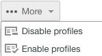

# を使用したカスタムプロファイルの作成と管理 [!DNL Workfront Proof]

>[!IMPORTANT]
>
>この記事では、スタンドアロン製品の機能について説明します [!DNL Workfront Proof]. 内部での検証に関する情報 [!DNL Adobe Workfront]を参照してください。 [校正](../../../review-and-approve-work/proofing/proofing.md).

請求管理者および管理者は、カスタムプロファイルを作成および管理して、組織のアカウントおよびアカウント設定でユーザーが実行できる操作を指定できます。

この機能は Premium アカウントでのみ使用できます。

## モジュール権限 {#module-permissions}

モジュールの権限を使用すると、ユーザーが自分のアイテムに対して持つアクセス権と、アカウント内の他のユーザーが所有するアイテムに対して持つアクセス権を決定できます。

基本的なアクセスセクションでは、ユーザーがアカウント内の自分の項目を読み取り、作成、編集および削除できるかどうかを指定します。

この [!UICONTROL データ管理] 「 」セクションでは、ユーザーがアカウント内の他のユーザーが所有する項目を超える権限を指定します。

どちらのセクションでも、アカウント内の次の項目に対する権限を付与できます。

* 配達確認について詳しくは、 [で配達確認を生成 [!DNL Workfront Proof]](../../../workfront-proof/wp-work-proofsfiles/create-proofs-and-files/generate-proofs.md).

* ファイル詳しくは、 [ファイルと Web コンテンツのアップロード先 [!DNL Workfront Proof]](../../../workfront-proof/wp-work-proofsfiles/create-proofs-and-files/upload-files-web-content.md).

* 公開フォルダーについて詳しくは、 [でのフォルダー権限について [!DNL Workfront Proof]](../../../workfront-proof/wp-work-proofsfiles/organize-your-work/folder-permissions.md).

* プライベートフォルダーについて詳しくは、 [でのフォルダー権限について [!DNL Workfront Proof]](../../../workfront-proof/wp-work-proofsfiles/organize-your-work/folder-permissions.md).

* 連絡先詳しくは、 [連絡先](https://support.workfront.com/hc/en-us/sections/115000920808-Contacts).

* グループ詳しくは、 [グループ](https://support.workfront.com/hc/en-us/sections/115000920828-Groups).

* タグ：詳しくは、 [でのタグの作成と管理 [!DNL Workfront Proof]](../../../workfront-proof/wp-work-proofsfiles/organize-your-work/create-and-manage-tags.md).

* カスタムビューについて詳しくは、 [でカスタムビューを作成および管理する [!DNL Workfront Proof]](../../../workfront-proof/wp-work-proofsfiles/manage-your-work/create-and-manage-custom-views.md).

## 管理権限 {#administrative-permissions}

この節では、ユーザーに管理者権限を付与できます。 一部の権限リンクを使用し、選択すると、タスクの実行に必要な他の権限が自動的に有効になります。 例えば、ユーザーが権限プロファイルを自動的に管理できるようにすると、アカウント内のユーザーを管理できます。

次の権限を付与できます。

* アカウント設定の管理 [アカウント設定](https://support.workfront.com/hc/en-us/sections/115000912147-Account-settings).

* ユーザーの管理について詳しくは、 [ユーザー](https://support.workfront.com/hc/en-us/sections/115000911887-Users).

* 決定の管理について詳しくは、 [校正ビューアで配達確認を決定する](../../../review-and-approve-work/proofing/reviewing-proofs-within-workfront/make-a-decision-on-a-proof/make-decisions-on-proof.md).

* パートナーの管理詳しくは、 [パートナー](https://support.workfront.com/hc/en-us/sections/115000912107-Partner-accounts).

* アプリの管理詳しくは、 [統合](https://support.workfront.com/hc/en-us/categories/115000588707-Integrations).

* カスタムフィールドの管理詳しくは、 [でのカスタムフィールドの作成と管理 [!DNL Workfront Proof]](../../../workfront-proof/wp-acct-admin/account-settings/create-and-manage-custom-fields.md).

* ドロップゾーンの管理詳しくは、 [ドロップゾーン](../../../workfront-proof/wp-work-proofsfiles/create-proofs-and-files/dropzone.md).

* 高度なワークフローの管理詳しくは、 [自動ワークフローの概要](../../../review-and-approve-work/proofing/proofing-overview/automated-workflow.md).

* SSO の管理の詳細は、 [シングルサインオン [!DNL Workfront Proof]](../../../workfront-proof/wp-acct-admin/managing-security/single-sign-on-overview.md).

* アカウント履歴の表示詳しくは、 [について [!DNL Workfront Proof] アクティビティ監査証跡](../../../workfront-proof/wp-work-proofsfiles/basic-features/activity-audit-trail.md).

* アカウントのバックアップを表示する詳細については、 [バックアップ [!DNL Workfront Proof] データ](../../../workfront-proof/wp-work-proofsfiles/organize-your-work/back-up-data.md).

* 課金の管理詳しくは、 [課金の管理](https://support.workfront.com/hc/en-us/sections/115000912187-Managing-your-billing).

* Satellite アカウントの作成詳しくは、 [での Satellite アカウントの設定 [!DNL Workfront Proof]](../../../workfront-proof/wp-acct-admin/satellite-accounts/configure-sat-acct-in-wp.md).

* ごみ箱を空にする詳しくは、 [でごみ箱を復元して空にする [!DNL Workfront Proof]](../../../workfront-proof/wp-work-proofsfiles/manage-your-work/restore-and-empty-trash.md).

* 権限プロファイルの管理詳しくは、 [の配達確認権限プロファイル [!DNL Workfront Proof]](../../../workfront-proof/wp-acct-admin/account-settings/proof-perm-profiles-in-wp.md).

* 分析を表示

## 新しいカスタムプロファイルの作成

1. に移動します。 **[!UICONTROL アカウント設定]**」、「 **[!UICONTROL プロファイル]** タブをクリックします。

1. クリック **[!UICONTROL 新しいプロファイルを作成]**.

1. 内 **[!UICONTROL プロファイルの詳細]** セクション：

   1. 内 **[!UICONTROL 名前]** 「 」フィールドで、カスタムプロファイルの名前を指定します。
   1. 選択 **[!UICONTROL プロファイルを有効にする]**. 

1. 内 **[!UICONTROL モジュール権限]** セクション：

   1. 権限の選択 **基本アクセス**.
   1. **データ管理**. 詳しくは、 [モジュール権限](#module-permissions)

1. 内 **[!UICONTROL 管理権限]** セクションで、管理関数の権限を選択します。

   詳しくは、 [管理権限](#administrative-permissions).

1. 「**[!UICONTROL 作成]**」をクリックします。これで、新しいプロファイルが **[!UICONTROL ユーザー]** タブをクリックします。

1. （オプション）新しいユーザーアカウントと既存のユーザーアカウントに新しいプロファイルを割り当てます。
詳しくは、 [の配達確認権限プロファイル [!DNL Workfront Proof]](../../../workfront-proof/wp-acct-admin/account-settings/proof-perm-profiles-in-wp.md).

## プロファイルの有効化と無効化 {#enabling-and-disabling-a-profile}

1. に移動します。 **[!UICONTROL アカウント設定]**&#x200B;をクリックし、 **[!UICONTROL プロファイル]** タブをクリックします。

1. 有効または無効にするプロファイルを選択します。
または、複数のプロファイルを同時に有効または無効にするには、手動でプロファイルを選択するか、 **[!UICONTROL 名前]** をクリックして、すべてのカスタムプロファイルを選択します。
   

1. 次をクリック： **[!UICONTROL 詳細]** ドロップダウンメニューから、プロファイルを有効または無効にするかに応じて、次のいずれかのオプションをクリックします。

   * **プロファイルの有効化：** プロファイルがアクティブになり、 [!DNL Workfront Proof] メニュー。
   * **プロファイルの無効化：** 確認ボックスが表示されます。 選択 **[!UICONTROL はい]** をクリックして確定します。 プロファイルが非アクティブになり、「 [!DNL Workfront Proof] メニュー。

      >[!NOTE]
      >
      >無効になったプロファイルは、アカウントのユーザーに割り当てられなくなります。 そのプロファイルを持つユーザーがアカウントに存在する場合は、プロファイルを無効にする前に、別のプロファイルを選択します。

      

## プロファイルのコピー

既存のプロファイルのコピーを作成して、同様の権限を持つ複数のプロファイルを設定します。

1. に移動します。 **[!UICONTROL アカウント設定]**」、「 **[!UICONTROL プロファイル]** タブをクリックします。

1. プロファイルの名前をクリックし、 **[!UICONTROL プロファイルをコピー]** 」ボタンをクリックします。

   

   コピーしたプロファイルがプロファイルリストに表示されます。 元のプロファイル名の前に「Copy」という単語が付いています。

   

1. （オプション）コピーしたプロファイルを有効にするには、 [プロファイルの有効化と無効化](#enabling-and-disabling-a-profile).
1. （オプション）コピーしたプロファイルを編集するには、 [プロファイルの編集](#editing-a-profile).

## プロファイルの編集 {#editing-a-profile}

プロファイルを編集すると、このプロファイルが現在割り当てられているすべてのユーザーに更新が適用されます。

1. に移動します。 **[!UICONTROL アカウント設定]**」、「 **[!UICONTROL プロファイル]** タブをクリックします。

1. 編集するプロファイル名をクリックします。
1. プロファイルの名前や権限を必要に応じて変更します。 これらの変更は自動的に保存され、更新されます。
権限について詳しくは、 [モジュール権限](#module-permissions) および [管理権限](#administrative-permissions).

>[!NOTE]
>
>デフォルト [!DNL Workfront Proof] プロファイルは、プロファイルのリストに表示されますが、変更できません。

## プロファイルの削除

1. に移動します。 **[!UICONTROL アカウント設定]**」、「 **[!UICONTROL プロファイル]** タブをクリックします。

1. 削除する 1 つ以上のプロファイルを選択します。
1. 次をクリック： **[!UICONTROL ごみ箱]** アイコンをクリックします。

   

1. クリック **[!UICONTROL はい]** 内 **[!UICONTROL 確認ダイアログ]** 」ボックスが表示されます。

1. プロファイルがユーザーに割り当てられている場合は、ダイアログボックスのドロップダウンメニューを使用して、別のプロファイルを選択し、このユーザーに割り当てます。 クリック **[!UICONTROL はい]** をクリックして確定します。

   

>[!NOTE]
>
>標準プロファイルをアカウントから削除することはできません。 標準プロファイルをアカウントで使用しない場合は、無効にすることができます。

プロファイルの無効化について詳しくは、 [プロファイルの有効化と無効化](#enabling-and-disabling-a-profile).
