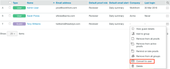

# [!DNL Workfront Proof] を使用したユーザーの作成

>[!IMPORTANT]
>
>この記事では、スタンドアロン製品の [!DNL Workfront Proof] の機能について説明します。 [!DNL Adobe Workfront] 内のプルーフについて詳しくは、[プルーフ](../../../review-and-approve-work/proofing/proofing.md)を参照してください。

[!DNL Workfront Proof] 管理者は、新規ユーザーを作成できます。

管理者権限について詳しくは、[ [!DNL Workfront Proof]](../../../workfront-proof/wp-acct-admin/account-settings/proof-perm-profiles-in-wp.md) のプルーフ権限プロファイルを参照してください。

>[!NOTE]
>
>お客様独自のアカウントにサードパーティを追加することはお勧めしません。

ユーザーは最初から作成することも、ゲストをライセンスを持つユーザーに変換することもできます。

## ユーザーを作成

1. ユーザーの作成を開始するには、次のいずれかの操作を行います。

   * **[!UICONTROL 新規プルーフ]**&#x200B;の横にあるドロップダウンメニューの矢印、「**[!UICONTROL 新規ユーザー]**」の順にクリックします。

   * **[!UICONTROL 設定]**／**[!UICONTROL アカウント設定]**／「**[!UICONTROL +新規ユーザー]**」をクリックします。

   * 左側のナビゲーションメニューの「**[!UICONTROL 連絡先]**」、「**[!UICONTROL +新規]**」、「**[!UICONTROL 新規ユーザー]**」の順にクリックします。
     * 新規ユーザーダイアログボックスが表示されます。

1. 表示される&#x200B;**[!UICONTROL 新規ユーザー]**&#x200B;ボックスに、ユーザーの情報を入力し、設定オプションを設定します。詳しくは、[ [!DNL Workfront Proof]](../../../workfront-proof/wp-mnguserscontacts/users/configure-user-info.md) を使用したユーザー情報の設定を参照してください。

1. 「**[!UICONTROL 作成]**」をクリックします。

## ゲストをユーザーに変換

ゲストとは、[!DNL Workfront Proof] アカウントのライセンスを持っていないユーザーです。 ゲストがライセンスを持つユーザーアカウントにアップグレードされた場合は、ゲストアカウントをライセンスを持つユーザーに手動で変換する必要があります。

ゲストとユーザーについて詳しくは、[ [!DNL Workfront Proof]](../../../workfront-proof/wp-mnguserscontacts/contacts/use-members-guests.md) でのユーザー、メンバーおよびゲストについてを参照してください。

1. 左側のナビゲーションメニューで「**[!UICONTROL 連絡先]**」をクリックします。
1. ユーザーに変換するゲストの右側の&#x200B;**[!UICONTROL その他]**&#x200B;アイコン、「**[!UICONTROL ユーザーに変換]**」の順にクリックします。
   

1. 表示される&#x200B;**[!UICONTROL 新規ユーザー]**&#x200B;ダイアログボックスで、ユーザーの設定オプションを設定します。詳しくは、[ [!DNL Workfront Proof]](../../../workfront-proof/wp-mnguserscontacts/users/configure-user-info.md) を使用したユーザー情報の設定を参照してください。

1. 「**[!UICONTROL ユーザーに変換]**」をクリックします。
