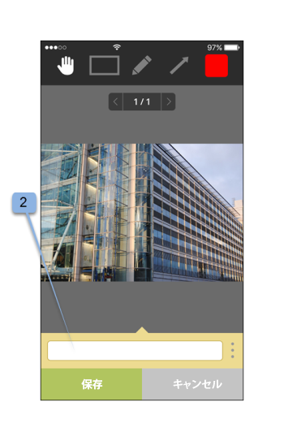
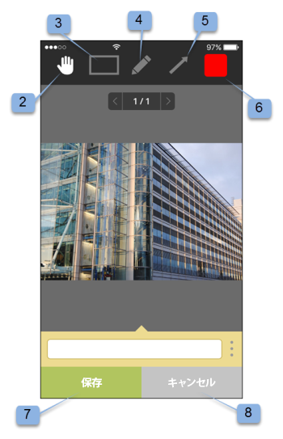

# Workfront Proof モバイルアプリ

>[!IMPORTANT]
>
>この記事では、スタンドアロン製品 [!DNL Workfront Proof] の機能について説明します。[!DNL Adobe Workfront] 内でのプルーフについて詳しくは、[プルーフ](../../../review-and-approve-work/proofing/proofing.md)を参照してください。

Apple App Store または Google ストアから [!DNL Workfront Proof] アプリをダウンロードすると、どこにいても生産性を高めることができます。iPhone および iPod Touch 版の [!DNL Workfront Proof] アプリには以下の機能があります。

* 静的プルーフとオーディオビジュアルプルーフの両方の表示、レビューおよび承認
* コメントの表示、追加および返信
* ダッシュボードとビューを使用したプルーフの管理

iOS アプリでプルーフをレビューし承認するには、[!DNL Workfront Proof] のユーザーである（つまり、独自のログイン資格情報を持っている）必要はありません。アプリを iOS デバイスにダウンロードし、iOS のメールアプリから個人用 URL にアクセスすれば、外出先でもレビューと承認を行うことができます。

## デバイス要件

iOS 7.0 以降。Android 4.0 以降。iPhone、iPad および iPod touch との互換性。

## アプリのダウンロードとインストール

>[!IMPORTANT]
>
>Workfront Proof モバイルアプリはサポートされなくなり、現状のものだけを使用できます。アプリの問題は修正されません。

iOS デバイスの場合は、新しいアプリをインストールする前に、iOS デバイス用の以前の [!DNL Workfront Proof] アプリを必ずアンインストールしてください。

[!DNL Workfront Proof] アプリは、ユーザーが使用しているデバイスのタイプを自動的に検出します。タブレットでアプリを使用する場合は、タブレット用 [[!DNL Workfront Proof] モバイルアプリ](../../../workfront-proof/wp-mobile/wp-mobile-apps/wp-mobile-app-tablet.md)を参照してください。

>[!NOTE]
>
>モバイルデバイスのソフトウェア制限のため、iOS デバイスでは SWF ファイルや MP3 などのオーディオファイルをレビューすることはできません。SWF ファイルまたはオーディオファイルから作成されたプルーフをモバイルデバイスでレビューする場合は、[!DNL Workfront Proof] にアップロードする前に、サポートされている形式に変換してください。

## アプリの使用開始

アプリの使用を開始するために、[!DNL Workfront Proof] ユーザーである必要はありません。デバイスにアプリをインストールし、メール通知内の「**[!UICONTROL プルーフに移動]**」リンクをクリックするだけです。アプリが自動的に起動し、プルーフを読み込みます。

[!DNL Workfront Proof] ユーザーの場合は、プルーフを開く前にアプリにログインできます。このアプリを使用すると、共有されているすべてのプルーフを参照し、それらを簡単に切り替えることができます。

1. アプリを開きます。
1. メールアドレスとパスワードを入力し、「**[!UICONTROL ログイン]**」をタップします。

   または

   [!DNL Workfront Proof] アカウントにシングルサインオンが設定されている場合は、シングルサインオンを使用します。

   パスワードを忘れた場合は、「**[!UICONTROL パスワードをお忘れですか？]**」オプションを使用できます。

## ダッシュボード

[!DNL Workfront Proof] アカウントにログインすると、ダッシュボードが表示されます。ここで、プルーフに簡単にアクセスできます。使用可能なビュー、自分のプルーフ、すべてのプルーフのいずれかを開くことができます。または、最近のプルーフのいずれかの名前をタップして、プルーフビューアに直接移動することもできます。

デフォルトでは、ダッシュボードに全プルーフのビューが開きます。このビューには、自分が所有している、または自分と共有されたすべてのプルーフが表示されます。ビューを変更するには、ページ上部のバーをタップしてドロップダウンメニューを開き「[!UICONTROL 予定通り]」、「[!UICONTROL 危険あり]」、「[!UICONTROL 遅延]」、「[!UICONTROL 最近使った]」のいずれかのオプションを選択します。任意のビューからプルーフを開くには、リストを下にスクロールして目的のプルーフを見つけ、その名前をタップしてプルーフビューアに移動します。

| **予定通りビュー** | アカウント内で、閲覧する権限があり、期限がない、または期限まで 24 時間を超えるアクティブなプルーフがすべて表示されます。 |
|---|---|
| **危険ありビュー** | 期限が 24 時間未満のプルーフをすべて表示します。 |
| **遅延の表示** | 期限が過ぎている、すべての未完了のアクションのすべてのプルーフを一覧表示します。 |
| **最近の表示** | 自分が最近アクセスし、所有しているプルーフが含まれ、プロファイル権限に従って表示する権限と、自分と共有しているプルーフが含まれます。このビューには、自身が開いたプルーフのみが表示されます（[!DNL Workfront Proof] ビューアーまたはプルーフの詳細ページを使用）。 |
| **メールのリンク** | メールからプルーフを開くには、メールアプリでメールを開き、「[!UICONTROL プルーフに移動]」ボタンのリンクをクリックするだけで（1）、[!DNL Workfront Proof] アプリのプルーフに移動できます。 |

{style="table-layout:auto"}

## アプリでの静的なプルーフをレビュー

モバイルアプリでプルーフを開く際に、次の操作を実行できます。

* 他のレビュアーが残したコメントを読んで返信します（1 - アイコンに表示される数字は、プルーフに残されたコメントの数を示します。プルーフにコメントが残されていない場合、このボタンは 0 となり、グレー表示されます）。
* コメントとマークアップを追加します（2）。
* 「コメントと決定」ボタンの表示／非表示は、プルーフのロールに応じて異なります。
* 決定を行います（3）。
* メニューに移動します（4）。
* 画面をつまんでプルーフを拡大・縮小します。
  

## コメントと返信を追加

1. プルーフを開いたら、**[!UICONTROL コメントを追加]** ボタンをタップします（1）。

   

1. コメントを入力します（2）。

   

1. 「**[!UICONTROL 保存]**」をクリックします。

## コメントを読んで返信

1. プルーフを開き、右上隅の吹き出しアイコンをタップしてコメントリストを表示し（1）、レビューするコメントを選択します。
1. ピンをタップして、関連付けられたコメントを開きます（2）。

   

1. 次のいずれかの操作を行います。

   * コメントに返信するには、「**[!UICONTROL 返信]**」ボタンをタップします（3）。
   * プルーフの画像に戻るには、[!UICONTROL 吹き出し]アイコンをタップします。
   * コメント全体とその返信を表示するには、コメント自体をタップします。

     

   * コメントにアクションを適用するには、以下の手順に従います。

      1. コメントを開きます。
      1. 「**[!UICONTROL 返信]**」をタップします。
      1. テキストフィールドの右側にある[!UICONTROL アクション]メニューを開きます（1）。
      1. 「**[!UICONTROL アクションを追加]**」をタップします（2）。

         

         アクションについて詳しくは、[プルーフコメントにアクションを使用](../../../review-and-approve-work/proofing/reviewing-proofs-within-workfront/comment-on-a-proof/use-actions-on-comments-in-viewer.md)を参照してください。

## マークアップを追加

マークアップを追加し（プルーフ上の領域をハイライト表示するボックスなど）、マークアップに添付するコメントを入力できます。マークアップを追加せずにコメントを作成することもできます。また、1 つのコメントに複数のマークアップを追加できます。

1. 開いたプルーフで、「**コメントを追加**」をタップします（1）。

   

1. [!UICONTROL パンモード]（2）、[!UICONTROL 長方形ツール]（3）、[!UICONTROL フリーハンド描画]（4）、または[!UICONTROL 矢印]ツール（5）から選択できます。

   また、マークアップの線の色を変更することもできます（6）。

1. プルーフにマークアップを描画するには、画面をタッチし、プルーフの上に指を移動します。

   マークアップを保存する場合は、テキストを追加する必要はありません（7）。

1. マークアップを破棄する場合は、「**[!UICONTROL キャンセル]**」をタップします（8）。

   

   プルーフの領域をマークアップすると、コメントフィールドが自動的に開きます。作成したマークアップを削除するには、マークアップの形状の横にあるバツ印をタップします（9）。

   

## プルーフの承認に関する判断

1. プルーフビューアーでプルーフを開き、「[!UICONTROL 決定]」ボタンをクリックします（1）。

   

1. 送信する決定をタップします（2）。
1. 「**[!UICONTROL 保存]**」をタップして、決定を送信します。

   

   >[!NOTE]
   >
   >* プルーフが作成されたアカウントで決定時ポップアップメッセージが設定されている場合は、プルーフに対して決定が行われると、iOS アプリにもポップアップメッセージが表示されます。
   >* 決定理由を設定した場合は、表示される[!UICONTROL 決定を送信]画面で選択できます。

   既に決定を送信済みで、その決定を変更または削除したい場合は、簡単に変更または削除できます。決定を送信した後に、新しい「**[!UICONTROL 決定を削除]**」オプション（6）が追加され、[!UICONTROL 決定を送信]画面に表示されます。

   

## アプリでのオーディオまたはビデオのプルーフを確認

iOS アプリでのオーディオビデオプルーフの確認は、静的ファイルの確認と同じくらい簡単です。

1. [!UICONTROL 再生/一時停止]ボタンをタップしてビデオを再生または一時停止します（1）。
1. ビデオに移動するには、「[!UICONTROL ナビゲーション]」をタップします（2）。
1. コメントを残すには、「**[!UICONTROL コメント]**」ボタンをクリックし（3）、上記の手順に従います。

   プルーフに残されたコメントやマークアップは、ナビゲーションバーに沿ってピンでマークされます（4）。

1. プルーフに残されたコメントを確認する場合は、「**[!UICONTROL コメント]**」ボタンをタップし（5）、上記の手順に従います。
1. 決定を下すには、「**[!UICONTROL 決定]**」ボタンをクリックし（6）、上記の手順に従います。

   
