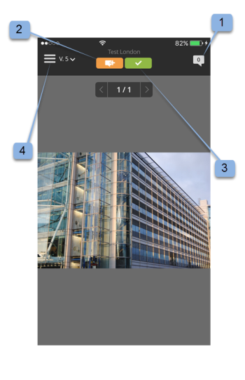
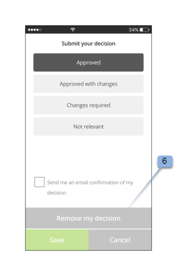

# Workfront Proof モバイルアプリ

>[!IMPORTANT]
>
>この記事では、スタンドアロン製品の機能について説明します [!DNL Workfront Proof]. 内部での検証に関する情報 [!DNL Adobe Workfront]を参照してください。 [校正](../../../review-and-approve-work/proofing/proofing.md).

をダウンロードします。 [!DNL Workfront Proof] Apple App StoreまたはGoogle Store のアプリを使用して、どこにいても生産性を高めることができます。 The [!DNL Workfront Proof] iPhoneおよび iPod Touch では、アプリに次の機能が備わっています。

* 静的な配達確認とオーディオビジュアル配達確認の両方を表示、確認および承認します
* コメントの表示、追加、返信を行う
* ダッシュボードとビューを使用した配達確認の管理

のユーザーである必要はありません。 [!DNL Workfront Proof] （つまり、独自のログイン資格情報を持っている）iOSアプリを使用して配達確認を確認し、承認します。 アプリをiOSデバイスにダウンロードし、iOS電子メールアプリから個人用 URL にアクセスする場合、外出先で確認と承認をおこなうことができます。

## デバイスの要件

iOS 7.0 以降が必要です。 Android 4.0 以降。 iPhone、iPad、iPod touch との互換性。

## デスクトップアプリケーションのダウンロードとインストール

>[!IMPORTANT]
>
>Workfront Proof モバイルアプリはサポートされなくなり、そのまま使用できます。  アプリで発生した問題は修正されません。

ダウンロード： [!DNL Workfront Proof] モバイルアプリを [Apple App Store](https://itunes.apple.com/us/app/workfront-proof/id1030372728?mt=8) または [Google Play Store](https://play.google.com/store/apps/details?id=com.proofhq.tabletapp).

iOSデバイスの場合は、必ず以前の [!DNL Workfront Proof] iOSデバイス用のアプリを使用してください。

The [!DNL Workfront Proof] アプリは、使用しているデバイスの種類を自動的に検出します。 タブレットでアプリを使用する場合は、 [[!DNL Workfront Proof] タブレット用モバイルアプリ](../../../workfront-proof/wp-mobile/wp-mobile-apps/wp-mobile-app-tablet.md).

>[!NOTE]
>
>モバイルデバイスのソフトウェア上の制限により、iOSSWF上の MP3 などのデバイスファイルやオーディオファイルを確認することはできません。 SWFファイルまたはモバイルデバイス上のオーディオファイルから作成した配達確認を確認する場合は、にアップロードする前に、サポートされている形式に変換してください。 [!DNL Workfront Proof].

## アプリの概要

あなたは a である必要はありません [!DNL Workfront Proof] ユーザーがデスクトップアプリケーションの使用を開始する際に使用します。 デバイスにアプリをインストールし、 **[!UICONTROL 配達確認に移動]** リンクをクリックします。 配達確認が自動的に開始されて読み込まれます。

次の場合、 [!DNL Workfront Proof] ユーザーは、配達確認を開く前にアプリにログインできます。 共有されているすべての配達確認を参照し、簡単に切り替えることができます。

1. アプリを開きます。
1. 電子メールアドレスとパスワードを入力して、をタップします。 **[!UICONTROL ログイン]**.

   または

   シングルサインオンが [!DNL Workfront Proof] アカウント。

   以下を使用すると、 **[!UICONTROL パスワードを忘れた場合]** オプションを使用します。

## ダッシュボード

ログイン後、 [!DNL Workfront Proof] アカウントを選択すると、ダッシュボードが表示されます。 ここでは、配達確認に簡単にアクセスできます。 使用可能な表示（「配達確認」、「すべての配達確認」）のいずれかを開くことができます。 または、最近使用した配達確認の名前をタップして、校正ビューアに直接移動します。

デフォルトでは、ダッシュボードに合計配達確認ビューが開きます。 このビューには、自分が所有している、または自分と共有されていたすべての配達確認が表示されます。 ページ上部のバーをタップして、 [!UICONTROL オンタイム], [!UICONTROL 危険な状態], [!UICONTROL 遅延] および [!UICONTROL 最近] オプション。 任意の表示で配達確認を開くには、リストを下にスクロールして目的の配達確認を探し、名前をタップして校正ビューアに移動します。

| **オンタイムビュー** | アカウント内で、閲覧する権限があり、期限がない、または期限まで 24 時間を超えるアクティブな配達確認がすべて表示されます。 |
|---|---|
| **リスクビューで** | 期限が 24 時間未満のすべての配達確認を表示します。 |
| **レイトビュー** | 期限が過ぎているすべてのアクションが完了していないすべての配達確認をリストします。 |
| **最近の表示** | 自分が最近アクセスし、所有している配達確認が含まれ、プロファイル権限に従って表示する権限と、自分が共有している配達確認が含まれます。 このビューには、( [!DNL Workfront Proof] 閲覧者または配達確認の詳細ページを使用 )。 |
| **電子メールリンク** | E メールから配達確認を開くには、E メールアプリで E メールを開き、 [!UICONTROL 配達確認に移動] ボタンのリンクをクリックすると (1) [!DNL Workfront Proof] アプリを使用します。 |

{style="table-layout:auto"}

## アプリでの静的な配達確認の確認

モバイルアプリで配達確認を開く際に、次の操作を実行できます。

* 他のレビュー担当者が残したコメントに対して読み取りと返信を行います（1 — アイコンに表示される数字は、配達確認に残ったコメントの数を示します。配達確認にコメントが残っていない場合、このボタンは 0 と表示され、灰色に表示されます）。
* 注釈 (2) を追加します。
* 「コメントと決定」ボタンの表示/非表示は、配達確認の役割に応じて異なります。
* (3) を決定します。
* メニューに移動します (4)。
* 画面をつまんで配達確認を拡大・縮小します。
  

## コメントと返信を追加

1. 配達確認を開いたら、 **[!UICONTROL コメントを追加]** ボタン (1) をクリックします。

   

1. コメントを入力します (2)。

   

1. 「**[!UICONTROL 保存]**」をクリックします。

## コメントを読み、返信します

1. 配達確認を開き、右上隅の引き出し線アイコンをタップしてコメントリスト (1) を表示し、レビューするコメントを選択します。
1. ピンをタップして、関連付けられたコメントを開きます (2)。

   

1. 次のいずれかの操作を行います。

   * コメントに返信するには、 **[!UICONTROL 返信]** ボタン (3) をクリックします。
   * 配達確認の画像に戻るには、 [!UICONTROL 吹き出し] アイコン。
   * 完全なコメントとその返信を表示するには、コメント自体をタップします。

     

   * コメントにアクションを適用するには：

      1. コメントを開きます。
      1. タップ **[!UICONTROL 返信]**.
      1. を開きます。 [!UICONTROL アクション] メニューを使用して、テキストフィールド (1) の右側に表示されます。
      1. タップ **[!UICONTROL アクションを追加]** (2)。

         

         アクションについて詳しくは、 [配達確認コメントに対するアクションの使用](../../../review-and-approve-work/proofing/reviewing-proofs-within-workfront/comment-on-a-proof/use-actions-on-comments-in-viewer.md).

## マークアップを追加

マークアップを追加し（配達確認上の領域をハイライト表示するボックスなど）、マークアップに添付するコメントを入力できます。 マークアップを追加せずにコメントを作成することもできます。 また、1 つのコメントに複数のマークアップを追加できます。

1. 開いた配達確認の場合は、 **コメントを追加** (1)。

   

1. 次の中から選択： [!UICONTROL パンモード] (2), [!UICONTROL 長方形ツール] (3) [!UICONTROL フリーハンド描画] (4)，又は [!UICONTROL 矢印] ツール (5) を使用します。

   また、マークアップの線の色を変更することもできます (6)。

1. 配達確認にマークアップを描画するには、画面をタッチし、配達確認の上に指を移動します。

   マークアップを保存する場合は、テキストを追加する必要はありません (7)。

1. タップ **[!UICONTROL キャンセル]** (8) マークアップを破棄する場合は、を選択します。

   

   配達確認の領域をマークアップすると、コメントフィールドが自動的に開きます。 作成したマークアップを削除するには、マークアップの形状の横にあるバツ印 (9) をタップします。

   

## 配達確認に関する決定

1. 配達確認ビューアで配達確認を開き、 [!UICONTROL 決定] ボタン (1) をクリックします。

   

1. 送信する決定をタップします (2)。
1. タップ **[!UICONTROL 保存]** をクリックして、決定を送信します。

   

   >[!NOTE]
   >
   >* 配達確認が作成されたアカウントで決定時ポップアップメッセージが設定されている場合は、配達確認に対して決定がおこなわれると、iOSアプリにも表示されます。
   >* 決定理由を設定した場合は、「 [!UICONTROL 決定を送信] 画面で選択できます。

   既に決定を送信済みで、その決定を変更または削除する場合は、簡単に変更できます。 決定を送信した後に、新しいオプションが追加され、 **[!UICONTROL 決定を削除]** (6) [!UICONTROL 決定を送信] 画面。

   

## アプリでのオーディオまたはビデオの配達確認の確認

iOSアプリでのオーディオビデオ配達確認の確認は、静的ファイルを確認するのと同じくらい簡単です。

1. をタップします。 [!UICONTROL 再生/一時停止] ボタンをクリックしてビデオを再生または一時停止します (1)。
1. ビデオに移動するには、 [!UICONTROL ナビゲーション] bar (2)
1. コメントを残すには、 **[!UICONTROL コメント]** ボタン (3) をクリックし、上記の手順に従います。

   配達確認に残されたコメントまたはマークアップは、ナビゲーションバー (4) に沿ってピンでマークされます。

1. 配達確認に残されたコメントを確認する場合は、 **[!UICONTROL コメント]** ボタン (5) をクリックし、上記の手順に従います。
1. 決定するには、 **[!UICONTROL 決定]** ボタン (6) をクリックし、上記の手順に従います。

   
