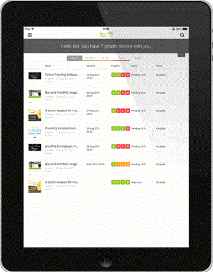

# [!DNL Workfront Proof] タブレット用モバイルアプリ

>[!IMPORTANT]
>
>この記事では、スタンドアロン製品の機能について説明します [!DNL Workfront Proof]. 内部での検証に関する情報 [!DNL Adobe Workfront]を参照してください。 [校正](../../../review-and-approve-work/proofing/proofing.md).

この [!DNL Workfront Proof] タブレットアプリを使用すると、外出中に簡単に配達確認を確認および承認できます。 アプリをすべてのユーザーがダウンロードできるので、 [!DNL Workfront Proof] ユーザーがタブレットや携帯電話で配達確認を確認できるようになりました。

ゲストは、 [!UICONTROL 配達確認に移動] ボタンをクリックすると、配達確認が開きます。

[!DNL Workfront Proof] ユーザーはアプリにログインし、ダッシュボードを使用して自分の作業を便利に管理できます。

## デバイスの要件

* iOSデバイス：iPad 3, iPad air, iPad mini
* Android デバイス：Android OS バージョン 4.4 以降、5 以降。Samsung Galaxy Tab 3+ （10.1 インチ）

これは、タブレット専用に作成されたアプリです。 を使用したい場合 [!DNL Workfront Proof] iPhoneで、iTunes Store からiOSアプリをダウンロードします。

## アプリをダウンロード

>[!IMPORTANT]
>
>Workfront Proof モバイルアプリはサポートされなくなり、そのまま使用できます。  アプリで発生した問題は修正されません。

この [!DNL Workfront Proof] タブレットアプリは、Apple App StoreとGoogle Play Store で使用できます。

1. 以下のリンクをクリックしてアプリをダウンロードし、デバイスにインストールします。

   

   

## ログイン

この [!DNL Workfront Proof] タブレットアプリを使用すると、注意が必要な配達確認を含むダッシュボードにアクセスできます。 ダッシュボードにアクセスするには：

1. 次のいずれかの操作を行います。

   * 次を使用してログイン： [!DNL Workfront Proof] 資格情報。

      配達確認の招待 E メールを受け取り、モバイルデバイスでで開くと、アプリ内の配達確認へのリンクが表示されます。 配達確認を確認するユーザーである必要はありません。ただし、デスクトップアプリケーションを表示するには、お使いのデバイスにアプリケーションをインストールする必要があります。

   * アカウントでシングルサインオンが有効になっている場合は、ログイン画面でそのオプションをタップします。

      ログインページが開き、電子メールアドレスを確認するメッセージが表示されます。 電子メールアドレスを入力すると、ID プロバイダのページにリダイレクトされ、パスワードを使用してログインできます。

      

## ダッシュボード

ログインし続ける場合 [!DNL Workfront Proof] アカウント：

1. 有効にする **[!UICONTROL ログイン状態を維持する]** の下のサイドバーメニュー **[!UICONTROL 設定]**:

この *[!UICONTROL ダッシュボード]* リンクをクリックすると、アプリ内の任意のビューからダッシュボードに戻ります。 また、これを使用してダッシュボードを再読み込みすることもできます。

ダッシュボードの他の要素は、配達確認名と、ワークロードを効果的に管理するのに役立つ様々な表示でアカウントを検索できる検索バーです。

## ダッシュボードビューを使用してワークロードを管理

Web アプリケーションのダッシュボードグラフと同様に、モバイルアプリでは、共有された配達確認のリストが表示されます。 ページ上部の「ようこそ」メッセージには、配達確認の合計数と、配達確認を次の中に分類した数が表示されます。 *オンタイム*, *危険な状態*、および *配達確認の遅延*.

* **時間の配達確認時** は、期限が設定されていないか、期限が 24 時間を超える配達確認です。
* **リスク配達確認時** は、期限が 24 時間以内になる場合です。進捗バーは、配達確認のオレンジ色になります。
* **配達確認の遅延** は、既に期限を過ぎた配達確認です。進捗バーは、配達確認の場合は赤色で表示されます。 期限に達した時 [!DNL Workfront Proof] は、遅れた意思決定者と配達確認の所有者にリマインダー用の E メールを自動で送信します。

これらの配達確認は別々の表示にグループ化され、期限を過ぎた配達確認から始めて、作業内容に優先順位を付けることができます。

他にも、最近の表示が役に立つ場合があります。最近の表示には、アプリで最近アクセスした配達確認が表示されます。同じ配達確認を再度表示したい場合は、そのリストで簡単に見つけることができます。

## アプリでの配達確認の確認

1. 配達確認の名前をクリックして、 [!DNL Workfront Proof] ビューア

   または

   E メール通知から配達確認を開くには、レビュー担当者が **[!UICONTROL 配達確認に移動]** リンクをクリックします。
次の場合、 [!DNL Workfront Proof] アカウントにログインし、ダッシュボードから配達確認にアクセスできます。

   >[!NOTE]
   >
   >で配達確認を確認するには、お使いのデバイスにアプリをインストールしておく必要があります [!DNL Workfront Proof]( [!DNL Workfront Proof] アカウント

   初めて配達確認を開いたときに、アプリでの配達確認のレビューを開始する際に役立つツアーが表示されます。

   

1. 配達確認内を移動する：

   * 配達確認の特定のページにジャンプするには、横にスワイプするか、 [!UICONTROL サムネール] リスト。

      また、ページの下部にある矢印を使用したり、特定のページ番号を入力したりすることもできます。

   * 別のバージョンの配達確認に移動するには、ページ上部のバージョンドロップダウンメニューを使用します。
   * ズームインするには、画面をピンチします。
   * パンするには、画像を押したまま移動し、正しい位置に移動します。

      モバイルアプリで配達確認を確認する方法は、 [!DNL Workfront Proof] ビューア 以下では、コメントやマークアップの追加、フィードバックの管理、意思決定について詳しく説明します。 また、アプリのサイドバーで利用できる様々なオプションについても説明します。

## アプリでのコメント

以下のビデオでは、モバイルアプリでのコメントの基本を示します。 コメントの作成方法、コメントへの返信の投稿方法、異なるマークアップの使用方法および削除方法、コメントの編集と削除方法を示します。

返信が投稿されていない場合は、コメントのみを編集および削除できます。 もし [!UICONTROL ごみ箱] アイコンが表示されている場合、このオプションが [!DNL Workfront Proof] 管理者。

アプリには 3 つのコメント表示オプションがあります。 コメントボタンをクリックして、両者を切り替えることができます。

* **[!UICONTROL リスト表示]** すべてのコメントのリストを表示します。 参照するには、各コメントをタップするか、上下の矢印をタップします。
* **[!UICONTROL 単一のコメント表示]** 一度に 1 つのコメントを表示します。 次のコメントに移動するには、ページ上部の矢印をタップします。
* **[!UICONTROL コメントビューを非表示]** すべてのコメントを非表示にします。

配達確認に残ったマークアップはすべて、画像にピンが配置されます。 ピンに関連付けられたコメントとマークアップを表示するには、ピンをタップします。 これは、コメント編集ボックスが閉じられている場合にのみ実行できます。 コメントボックスを閉じるには、 [!UICONTROL x] をクリックします。

## テキスト注釈ツール

外出先での校正テキストは本当に [!DNL Workfront Proof] タブレットアプリケーション。 オレンジ色の **[!UICONTROL コメントを追加]** 」ボタンをクリックします。

1. ツールを選択し、ハイライトする単語をタップします。
1. ハイライトが使用可能になるまで指で単語を押したまま、スライダを使用してマークアップする単語またはフレーズ全体をハイライトします。

   テキストツールには、次の 4 つのオプションがあります。

   | **[!UICONTROL ハイライト]** | テキストをハイライト表示し、コメントボックスにコピーします。 |
   |---|---|
   | **[!UICONTROL 置き換え]** | [[!UICONTROL 置換]] および [[!UICONTROL を使用]] をテキストと共にコメントボックスに挿入し、置き換えるテキストを簡単にレコメンデーションできるようにします。 |
   | **[!UICONTROL 削除]** | テキストを取り消し、 [DELETE] をコメントボックスに追加します。 |
   | **[!UICONTROL 後ろに挿入]** | 追加 [後ろに挿入] をコメントボックスに追加します。 |

   {style=&quot;table-layout:auto&quot;}

1. （オプション）タブレットに保存した別のドキュメントのテキストを貼り付けるには、コメントボックスの上で指をタップしたままにして、ドキュメントからコピーしたテキストを貼り付けるオプションが表示されるまで操作します。

## モバイルアプリでのコメントの管理

誰もがコメントやマークアップを配達確認に残した後、多くの場合、配達確認マネージャーはフィードバックを調べ、次のバージョンの配達確認に適用する変更を決定する必要があります。 In [!DNL Workfront Proof] 「コメントに対するアクション」を使用して、個々のコメントにフラグを設定し、アクションを実行するコメントにマークを付けることができます。

コメントに対するアクションは、 [!DNL Workfront Proof] 管理者とは、編集権限を持つユーザーのみが配達確認に使用できます。

次のバージョンの配達確認の準備に取り組んでいる場合は、コメントをいつでも確認できます。 コメントは、緑色のチェックマークで解決済みとマークされます。 コメントを再度開く必要がある場合は、コメントボックスの下部にある矢印をクリックします。

他のレビュー担当者がコメントスレッドに応答しないようにする場合は、ロックできます。 これをおこなうには、配達確認の編集権限が必要です。 コメントのスレッドのロックは非常に簡単です。必要な操作は、コメントボックスの下部にある南京錠アイコンをタップするだけです。

## ビデオ配達確認のレビュー

外出先でのビデオのレビューは、 [!DNL Workfront Proof] タブレットアプリケーション。 以下のビデオでは、アプリ内でコメント、マークアップ、および決定を行う方法を示します。

## 比較モード

タブレットアプリの比較モードでは、2 つの異なるバージョンの配達確認と、同じフォルダー内の 2 つの配達確認を簡単に比較できます。

>[!NOTE]
>
>iOSの制限により、2 つのビデオの比較は iPad では使用できません。 Android オペレーティングシステムのタブレットで使用できます。

画面の右上隅に比較モードが表示されます。

比較ツールは、配達確認の最新の 2 つのバージョンを表示します。

1. 比較するバージョンを変更するには、ページ上部にあるバージョンドロップダウンを使用します。
1. 同じフォルダーから異なる配達確認を選択するには、フォルダーブラウザー（ページ上部にあるフォルダーアイコン）を使用します。

   
   
比較ツールを使用すると、要求された変更がおこなわれたかどうかを確認するために、バージョンを並べて比較できます。 ナビゲーションのロックを解除すると、両方のバージョンの異なるページを比較できます。

   

   これで、現在表示している配達確認の様々なページを比較できます。 また、同じ配達確認の異なるページを比較できます。これは、配達確認のメッセージングとブランディングの一貫性を確認している場合に役立ちます。

   

## アプリでの決定

1. ページ上部の緑の決定ボタンをタップします。

   

   緑が見えない場合 **[!UICONTROL レビューを終了]** 」ボタンをクリックし、配達確認に関する決定を下す必要があると考える場合、 [!DNL Workfront Proof] 管理者は、配達確認の役割を更新できます。詳しくは、 [での配達確認の役割の管理 [!DNL Workfront Proof]](../../../workfront-proof/wp-work-proofsfiles/share-proofs-and-files/manage-proof-roles.md).

## 校正ビューアのサイドバー

サイドバーには、多くの便利な機能が含まれています。 配達確認に対する権限によっては、すべてが表示されない場合があります。 以下では、それらすべてについて詳しく説明します。

| ダッシュボード | モバイルアプリダッシュボードに戻ります。 |
|---|---|
| **[!UICONTROL ワークフロー]** | レビューステージの詳細を、レビュー担当者、期限、進行状況バー、決定、コメントおよび返信の数のリストと共に表示します。 |
| **[!UICONTROL 詳細]** | 配達確認、追加の共有オプション、アクティビティ監査記録に関する情報が表示されます。 |
| **[!UICONTROL 共有]** | 配達確認 URL と埋め込みコードを表示します。 |
| **[!UICONTROL 通知]** | 現在レビュー中の配達確認に関する E メールアラートを更新できます。 これによってデフォルト設定が変更されることはありません。 |
| **[!UICONTROL ロック]** | 配達確認をロックできます。 このオプションを表示するには、配達確認の編集権限が必要です。 |
| **[!UICONTROL 削除]** | 配達確認をごみ箱フォルダーに移動します。 配達確認を削除するには、その配達確認の編集権限が必要です。 |
| **[!UICONTROL 設定]** | ピンやマークアップを配達確認に表示するか、を有効にすることもできます [!UICONTROL ログイン状態を維持する] ：アプリからログアウトされるのを防ぐために使用します。 |
| **[!UICONTROL ヘルプ]** | アプリツアーを再度起動できます。 |
| **[!UICONTROL ログアウト]** | デスクトップアプリケーションとアカウントからログアウトします。 |
