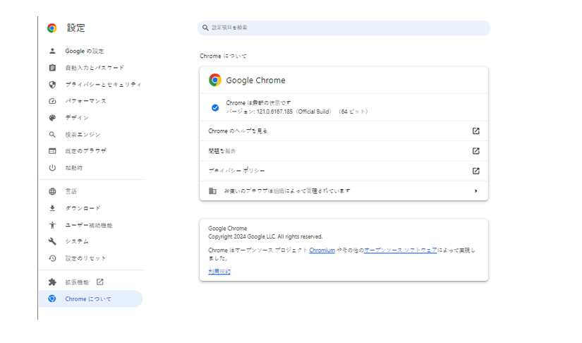
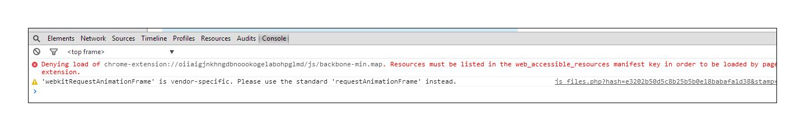

# トラブルシューティング — [!DNL Workfront Proof] 校閲者

<!-- Audited: 01/2024 -->

>[!IMPORTANT]
>
>この記事では、スタンドアロン製品の機能について説明します [!DNL Workfront Proof]. 内部での検証に関する情報 [!DNL Adobe Workfront]を参照してください。 [校正](../../../review-and-approve-work/proofing/proofing.md).

配達確認のコンテンツが読み込まれず、空の校正ビューアのみが表示される場合は、何かがこのアクションをローカルでブロックしている可能性が高くなります。 以下の考えられる解決策を試してみてください。

## ブラウザーを確認します。 <!--and [!DNL Flash Player]--> バージョンは最新です

すべての開発者は、常にアプリケーションに取り組み、製品の新機能や修正を定期的にリリースしています。 これは、ユーザーエクスペリエンスを向上させ、セキュリティレベルを維持するために、最新バージョンのみを使用することをお勧めします。 これは、アプリケーション間の競合を回避するのにも役立ちます。

<!--
### [!DNL Flash Player] Plugin Version

To check your current [!DNL Flash Player] version visit the [[!DNL Adobe] website](http://www.adobe.com/software/flash/about/).

If your version number differs from the one listed for your platform go to the [[!DNL Flash Player] download page](http://get.adobe.com/flashplayer/otherversions/) and get the latest version.

Please note: we do recommend using the original [!DNL Adobe] plugin, so if your browser uses a built-in solution deactivate it and install the [!DNL Adobe] solution.
-->

### ブラウザーのバージョン

通常、ほとんどのブラウザーは自動的に更新されますが、問題が発生した場合は、どのバージョンを使用しているかを確認し、必要に応じて更新を実行してください。

ブラウザーで、に移動します。 [!UICONTROL メニュー] をクリックし、 [!UICONTROL について] オプション ( 場合によっては、 [!UICONTROL ヘルプ] メニュー ) を参照してください。 Adobe Analytics の [!UICONTROL について] ポップアップには、現在のブラウザのバージョンに関する情報と、更新を更新または確認するオプションが表示されます。

例えば、Chrome の場合は次のようになります。

最新のブラウザーバージョンをインストールしたら、配達確認を再度開いて問題が解決したかどうかを確認します。

<!--
## Ensure Your Local [!DNL Flash] Storage is Available

Our [!DNL Workfront Proof] Viewer is based on Flash, and we store some data about the proofs (i.e., comments, proof tiles, [!DNL Workfront Proof] Viewer settings) on your computer using [!DNL Flash Player]. If the [!DNL Workfront Proof] Viewer opens, but there is no content inside you will want to make sure that the Flash Storage is available on your machine and that [!DNL Workfront Proof] is allowed to use it.

If there is some storage allocated, but you're working with the bigger proofs with multiple pages and comments try to increase the [!DNL Flash] Storage and re-load your proof.

Please see [Problems With Viewing Proofs - [!DNL Flash] Shared Objects Explained](../../../workfront-proof/wp-tech-corner/troubleshooting/view-proof-flash-shared-object.md) for the detailed instructions.
-->

## 問題の発生場所の特定

* 配達確認を別のブラウザーで開くか。
* 1 台のブラウザーを毎日使用していて、そこで配達確認を表示できない場合は、コンピューター上の別のブラウザーで同じ配達確認を開いてみてください。 これをおこなうには、メインブラウザーの URL バーから配達確認リンクをコピーし、別のブラウザーに貼り付けます。 配達確認が開いた場合は、メインのブラウザー設定、プラグインおよび拡張機能を確認します。これらは干渉している可能性があります。
* 優先ブラウザーはありませんが、現在のブラウザーでパフォーマンスの問題が発生している場合は、別のブラウザーに切り替えることをお勧めします。
* 配達確認が別のマシンで場所に表示されているか
お使いのコンピューター上のブラウザーで配達確認が開かれない場合は、別のコンピューターで、自分の場所の場所や場所の外で開いてみてください。 これにより、特定のコンピューターで問題が発生したか、問題がローカルネットワーク内にあるかを判断できます。
セキュリティレベルが高い場合は、 [!DNL Workfront Proof] 次のユーザーによってブロックされている可能性があります：

   * ローカルの AV ソフトウェア
   * ネットワークセキュリティソリューション
   * DNS、ファイアウォール、またはプロキシの設定
   * これらの設定は制御できません。 様々なセキュリティソリューションを利用できます。どのセキュリティソリューションがネットワークに実装されているのか、どのセキュリティソリューションが接続をブロックしているのかは判別できません。 [!DNL Workfront Proof]. また、次の項目にも依存しません。 [!DNL Workfront Proof] 内部セキュリティ設定を決定する場合。 場所やネットワークの複数のマシンで配達確認を開く際に問題が発生した場合は、IT チームに連絡して、ネットワーク設定を確認し、承認または [!DNL Workfront Proof] 必要に応じ許可リストに加えるて、に追加します。

* 接続先： [!DNL Workfront Proof] ネットワークで許可されているか？
配達確認ビューア内に、ページのタイル（ページのフラグメント）が読み込まれます。 このコンテンツがお客様の側で適切に読み込まれない場合は、 [!DNL Workfront Proof] はネットワーク内でブロックされています。 *.proofhq.comのすべての接続とすべてのコンテンツが確実にに追加されるようにする必要があり許可リストに加えるます。 IT チームがこの検証に役立てる必要があります。

## プラグインの確認

ブラウザーが最新で、ネットワークがへの接続をブロックしていない場合 [!DNL Workfront Proof]ブラウザーに、配達確認の表示に影響を与えている可能性があります。 多くの場合、ブラウザーには複数のプラグインや拡張機能が用意されています。一部のプラグインや拡張機能は、他のプラグインに干渉したり、他のプラグインと競合したりする可能性があります。

ベストプラクティスは、すべての不明なアドオンを削除し、使用するアドオンと信頼するアドオンのみを保持することです。 各ブラウザーには、プラグインや拡張機能を確認、変更、削除するオプションが用意されています。 ここでは、JavaScript を使用して [!DNL Workfront Proof] ビューアを参照してください。

配達確認の読み込みに干渉する特定のアドオンがある場合は、ブラウザーのコンソールで詳細を確認してみてください。

ほとんどの新しいブラウザーには、利用可能な開発者ツールが追加されており、より高度なトラブルシューティングに使用できます。

配達確認の表示で問題が発生した場合：

* ブラウザーのコンソールを開き、配達確認を再度読み込みます。
* コンソールにアラートまたはメッセージがあるかどうかを確認します。 これらの詳細は、問題の根本原因を特定するのに役立ちます。
* IT チームに結果を分析してもらう。 ローカルの問題の解決に関するアドバイスと支援を提供できるはずです。
* 結果をサポートチームに共有します。 喜んでお手伝いします。

## 混合コンテンツ設定を確認する

へのすべての接続 [!DNL Workfront Proof] は HTTPS 経由です。 ただし、 [!DNL Workfront Proof] ビューアは HTTP 経由でタイルを読み込み、データはトークンで保護されます。 これにより、一部のブラウザーやセキュリティソリューションがブロックしている（デフォルトまたは手動設定で）混合コンテンツが作成されます。

これが、配達確認がコンピューターで開かれない理由（ブラウザーのコンソールに関連するアラートが表示されるはず）の場合、次の接続を許可します： [!DNL Workfront Proof] または設定を変更して、コンピューター上のパッシブ混合コンテンツを許可します。 混合コンテンツは、正確な原因を特定するために、ブラウザー、AV ソフトウェア、またはネットワーク設定によってブロックされる場合があります。 IT チームやネットワーク管理者に連絡を取る必要があります。 また、お使いのコンピューターで混合コンテンツを有効にする際にも役立ちます。

