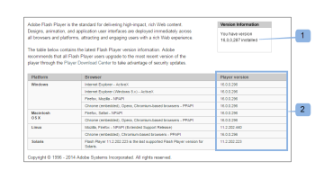
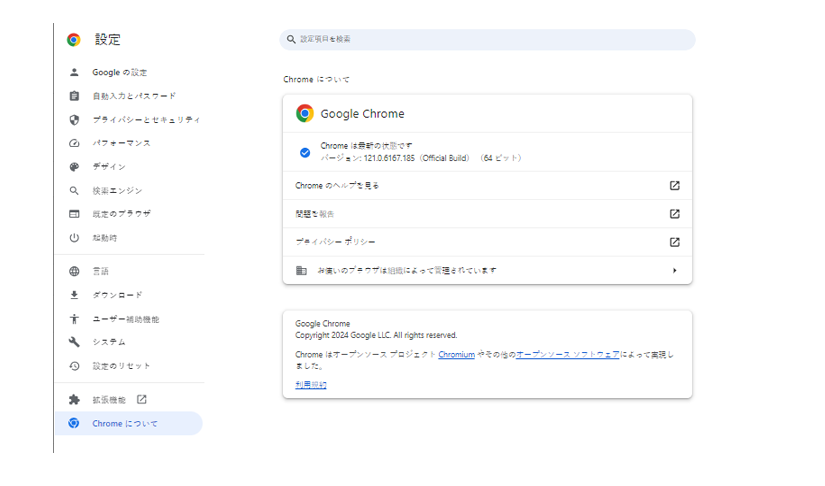

# トラブルシューティング - [!DNL Workfront Proof]プルーフビューア

<!-- Audited: 01/2024 -->

>[!IMPORTANT]
>
>この記事では、スタンドアロン製品 [!DNL Workfront Proof] の機能について説明します。 [!DNL Adobe Workfront] 内でのプルーフについて詳しくは、[プルーフ](../../../review-and-approve-work/proofing/proofing.md)を参照してください。

プルーフコンテンツが読み込まれず、空のプルーフビューアしか表示されない場合は、何かの原因でこのアクションがローカルでブロックされている可能性があります。 以下の考えられる解決策を試してください。

## ブラウザーの <!--and [!DNL Flash Player]--> のバージョンが最新であることを確認してください。

すべてのデベロッパーは常にアプリケーションの開発に取り組んでおり、製品の新機能や修正を定期的にリリースしています。 これはユーザーエクスペリエンスを向上させ、セキュリティレベルを維持するために、常に最新バージョンを使用することが最善です。 これは、アプリケーション間の競合を回避するのにも役立ちます。

<!--
### [!DNL Flash Player] Plugin Version

To check your current [!DNL Flash Player] version visit the [[!DNL Adobe] website](http://www.adobe.com/software/flash/about/).

If your version number differs from the one listed for your platform go to the [[!DNL Flash Player] download page](http://get.adobe.com/flashplayer/otherversions/) and get the latest version.

Please note: we do recommend using the original [!DNL Adobe] plugin, so if your browser uses a built-in solution deactivate it and install the [!DNL Adobe] solution.
-->

### ブラウザーのバージョン

通常ほとんどのブラウザーは自動的に更新されますが、問題が発生した場合は、使用しているバージョンを確認し、必要に応じてアップデートを実行してください。

ブラウザーの[!UICONTROL メニュー]で「[!UICONTROL ...について]」オプションを見つけます（[!UICONTROL ヘルプ]メニューの下に表示されることもあります）。 「[!UICONTROL ...について]」のポップアップには、現在のブラウザーのバージョンに関する情報および更新と確認のオプションが表示されます。

例えば、Chrome の場合は、次のようになります。

ブラウザーの最新バージョンをインストールしたらプルーフを再度開き、イシューが解決したかどうかを確認します。

<!--

## Ensure Your Local [!DNL Flash] Storage is Available

Our [!DNL Workfront Proof] Viewer is based on Flash, and we store some data about the proofs (i.e., comments, proof tiles, [!DNL Workfront Proof] Viewer settings) on your computer using [!DNL Flash Player]. If the [!DNL Workfront Proof] Viewer opens, but there is no content inside you will want to make sure that the Flash Storage is available on your machine and that [!DNL Workfront Proof] is allowed to use it.

If there is some storage allocated, but you're working with the bigger proofs with multiple pages and comments try to increase the [!DNL Flash] Storage and re-load your proof.

-->

## 問題の発生場所の特定

* プルーフは別のブラウザーで開いているか?
* 日常的に 1 つのブラウザーを使用していて、そのブラウザーでプルーフを表示するのに問題がある場合は、コンピューターの別のブラウザーで同じプルーフを開きます。 これを行うには、メインブラウザーの URL バーからプルーフのリンクをコピーし、別のブラウザーに貼り付けます。 そこでプルーフが正常に開く場合は、メインブラウザーの設定、プラグイン、拡張機能が干渉している可能性があるため、それらを確認します。
* 推奨ブラウザーはありませんが、現在のブラウザーでパフォーマンスの問題が発生している場合は、別のブラウザーに変更することをお勧めします。
* お住まいの地域の別のマシンでプルーフが開いていますか？
プルーフがコンピューターのブラウザーで開かない場合は、別のコンピューターでプルーフを開いてみてください。これにより、特定のマシン上の問題が発生しているか、ローカルネットワークに問題があるかどうかを判断できます。
セキュリティ レベルが高い場合は、次の方法で[!DNL Workfront Proof]への接続がブロックされる可能性があります：

   * ローカルの AV ソフトウェア
   * ネットワークセキュリティソリューション
   * DNS、ファイアウォールまたはプロキシの設定
   * これらの設定は Workfront Proof では制御できません。 様々なセキュリティソリューションを利用できますが、どのセキュリティソリューションがネットワークに実装されているのか、どのセキュリティソリューションが [!DNL Workfront Proof] への接続をブロックしているのかは判別できません。 また、[!DNL Workfront Proof] が内部セキュリティ設定を決定することもできません。 使用する場所やネットワークで複数のコンピューターでプルーフを開く際に問題が発生する場合は、IT チームと連絡を取ってネットワークの設定を確認し、必要に応じて [!DNL Workfront Proof] を承認するか、許可リストに追加することをお勧めします。

* [!DNL Workfront Proof]への接続はネットワークで許可されていますか？
プルーフビューア内で、ページのタイル – フラグメントを読み込みます。このコンテンツが最後に正しく読み込まれない場合は、[!DNL Workfront Proof]への一部の接続がネットワークでブロックされている可能性があります。*.proofhq.comからのすべてのコネクションとコンテンツが常に許可リストに追加されていることを確認します。IT部門が、その確認を支援する必要があります。

## プラグインの確認

ブラウザーが最新であり、ネットワークが [!DNL Workfront Proof] への接続をブロックしていない場合は、ブラウザーの何かがプルーフの表示に影響を与えている可能性があります。 ブラウザーに複数のプラグインや拡張機能が用意されていることもよくあり、それらが干渉したり競合している可能性があります。

ベストプラクティスは、すべての不明なアドオンを削除し、 使用中のアドオンや信頼できるアドオンのみを残すことです。 各ブラウザーには、プラグインや拡張機能を確認、変更、削除するオプションが用意されています。 [!DNL Workfront Proof] ビューアを読み込む際は JavaScript を使用します。そのため、これに影響を与える可能性のあるプラグインを特に確認する必要があります。

プルーフの読み込みに干渉する特定のアドオンがある場合は、ブラウザーのコンソールで詳細を確認します。

ほとんどの新しいブラウザーには、追加の開発者ツールが用意されており、より高度なトラブルシューティングに使用できます。

プルーフの表示で問題が発生した場合は、次の手順を実行します。

* ブラウザーのコンソールを開き、プルーフを再度読み込みます。
* コンソールにアラートまたはメッセージがあるかどうかを確認します。 これらの詳細は、問題の根本原因を特定するのに役立ちます。
* IT チームに結果の分析を依頼します。 ローカルの問題の解決に関するアドバイスと支援が得られるはずです。
* 結果をアドビのサポートチームと共有します。 サポートチームは喜んでお手伝いします。

## 混合コンテンツ設定の確認

[!DNL Workfront Proof] への接続はすべて HTTPS 経由です。 ただし、[!DNL Workfront Proof] ビューアでは、HTTP 経由でタイルを読み込み、データはトークンで保護されます。 これにより、一部のブラウザーやセキュリティソリューションが（デフォルトまたは手動設定で）ブロックしている可能性のある混合コンテンツが作成されます。

これが原因でプルーフがコンピューターで開かない場合、ブラウザーのコンソールに関連アラートが表示されるので、[!DNL Workfront Proof] に対する接続を許可するか、設定を変更してコンピューターの受動的な混合コンテンツを許可します。 混合コンテンツは、ブラウザー、AV ソフトウェアまたはネットワーク設定によってブロックされる可能性があり、正確な原因を特定する必要があります。 IT チームやネットワーク管理者に問い合わせる必要があります。 お使いのコンピューターで混合コンテンツを有効にするための支援も得られるはずです。

