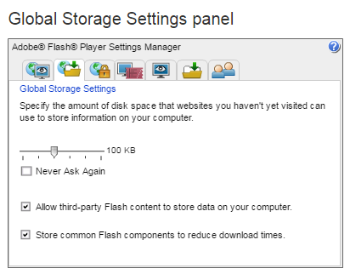

# 配達確認の表示に関する問題 — [!DNL Flash] 共有オブジェクトの説明

>[!IMPORTANT]
>
>この記事では、スタンドアロン製品の機能について説明します [!DNL Workfront Proof]. 内部での検証に関する情報 [!DNL Adobe Workfront]を参照してください。 [校正](../../../review-and-approve-work/proofing/proofing.md).

>[!NOTE]
>
>この記事の情報は、現在廃止され、次の場所から削除される機能を指します： [!DNL Workfront] を 2018 年に導入。 新しい Web 校正ビューアを使用することをお勧めします ( [Web 校正ビューアでの配達確認の確認](https://support.workfront.com/hc/en-us/sections/115000275214-Reviewing-Proofs-in-the-Web-Proofing-Viewer)) またはデスクトップ校正ビューア ( [デスクトップ校正ビューアでの配達確認の確認](https://support.workfront.com/hc/en-us/sections/360000686434-Reviewing-Proofs-in-the-Desktop-Proofing-Viewer)) をクリックします。

## [!DNL Flash] 共有オブジェクト

ローカルの共有オブジェクト (「[!DNL Flash] cookie」とは、訪問したサイトによってコンピューター上に作成できるデータファイルです。 共有オブジェクトは、Web 閲覧時の操作性を高めるために最もよく使用されます。 A [!DNL Flash] cookie は [!DNL Adobe Flash] を Web サーバーから Web ブラウザーに送信し、データファイルとしてブラウザーに保存します。

以降 [!DNL Workfront Proof] ビューアは [!DNL Flash]を使用する場合は、どのストレージが使用できるかを確認する必要があります。 [!DNL Flash] アプリケーションを使用しています。

## [!DNL Flash] 共有オブジェクト — 既知の問題

この [!DNL Flash] ストレージが 0 KB に設定されているか、別の設定でブロックされている [!DNL Flash] アプリケーションがデータをローカルに保存しない場合、 [!DNL Workfront Proof] ビューア：

* 「はじめに」のツアーポップアップが表示され続けますが、再び表示しないオプションが選択されました
* [!DNL Workfront Proof] 配達確認に追加されるコメント数が増えるので、ビューアのパフォーマンスが低下する
* 配達確認が読み込まれず、実際の画像ではなく「グレーの画面」が表示される

## 許可 [!DNL Flash] 共有オブジェクト

保存を確認します。 [!DNL Flash] 共有オブジェクトはコンピューター上で許可され、記憶域の制限が 0 ではありません。

共有オブジェクトが許可されているかどうかを確認するには：

1. を右クリックします。 [!DNL Workfront Proof] ビューア
1. 選択 **[!UICONTROL グローバル設定]** を選択します。
1. 次に移動： **[!UICONTROL ストレージ]** タブをクリックします。
1. 必ず **[!UICONTROL サイトがこのコンピューターに情報を保存することを許可する]** が選択されている (1)。
1. 

## 増加中 [!DNL Flash] ストレージ

デフォルト [!DNL Flash] アプリケーションは、ユーザーのドライブに最大 100 KB のデータを保存できますが、ユーザーが簡単に変更できます。 多くの人々のための解決策 [!DNL Flash] 関連する問題は、内部の [!DNL Flash] ストレージ。 これは、 [!DNL Workfront Proof] ビューア：

1. 配達確認を開きます。
1. 配達確認の右クリックメニューを開きます。
1. クリック **[!UICONTROL 設定]** 開く [!DNL Flash] 設定ポップアップ
1. 次に移動： **[!UICONTROL ローカル]** 「ストレージ」タブ
1. ストレージを最大 100 KB まで増やします（例： 1）。
1. 設定ポップアップを閉じ、配達確認を再度開きます。

