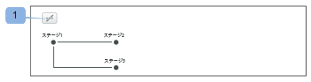
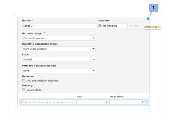

# で自動ワークフローを使用した配達確認の設定 [!DNL Workfront Proof]

>[!IMPORTANT]
>
>この記事では、スタンドアロン製品の機能について説明します [!DNL Workfront Proof]. 内部での検証に関する情報 [!DNL Adobe Workfront]を参照してください。 [校正](../../../review-and-approve-work/proofing/proofing.md).

自動ワークフローを使用すると、複雑なレビュープロセスがある場合や、同じグループのユーザーに定期的にレビュー用のコンテンツを送信する場合に、コンテンツのレビューと承認を容易に管理できます。

配達確認を作成すると、ステージからステージへと移動し、最終承認がおこなわれます。 承認が必要になった場合は、該当するユーザーに通知が送信されます。

ドキュメントのアップロード時またはドキュメントのアップロード後に、自動ワークフローを配達確認に追加できます。

## 自動ワークフローを使用した配達確認の作成

1. 配達確認の作成を開始します。
1. 内 **[!UICONTROL 共有]** セクションで、 **[!UICONTROL 自動ワークフローを使用]**.

   このオプションの選択を解除して、標準のワークフローに戻すことができます。

1. （オプション） [!DNL Workfront] 管理者が設定および共有している場合は、 **[!UICONTROL ワークフローテンプレートを選択]** ドロップダウンメニュー。

   >[!NOTE]
   >
   >テンプレートを変更できるかどうかは、 [!DNL Workfront] 管理者。 テンプレートを変更する機能が無効になっている場合、変更できるのはテンプレートの所有者だけです。

1. 次の情報を指定して、自動ワークフローの最初のステージを設定します。

   * **[!UICONTROL 名前]:** ステージ名は、ワークフローダイアグラムに表示され、レビュー担当者に送信される電子メール通知に含まれます。
   * **[!UICONTROL 期限]:** このフィールドの機能は、 **[!UICONTROL 期限の計算元]** 」ドロップダウンリストから選択できます。

   * **[!UICONTROL 配達確認の作成から]:** 配達確認の期限日を選択します。
   * **[!UICONTROL 開始ステージの有効化]:** 配達確認の期限を自動的に設定するために、ステージのアクティベーション日に追加される営業日数を選択します。
   * **[!UICONTROL ステージを有効化]:** ワークフローの各ステージで、いつ有効化するかを決定できます。 第 1 段階では、次のオプションを使用できます。

      * 配達確認の作成時
      * 特定の日時に
      * 手動\

         後続のステージでは、追加のオプションを使用できます。 これらのオプションには親ステージが必要です。 次のようになります。
      * 前の期限に達した後
      * すべての決定は「承認済み」または「承認済み」で、変更があります
      * すべての決定が承認されました
      * すべての決定がおこなわれます
   * **[!UICONTROL 期限の計算元]:** このドロップダウンリストで選択したオプションは、 **[!UICONTROL 期限]** フィールドに入力します。

   * **[!UICONTROL 配達確認の作成]:** 内 **[!UICONTROL 期限]** 「 」フィールドで、配達確認の期限日を選択します。

   * **[!UICONTROL ステージの有効化]:** 内 **[!UICONTROL 期限]** 「 」フィールドで、ステージのアクティベーション日に追加する営業日数を選択して、配達確認の期限を自動的に設定します。

   * **[!UICONTROL ステージをロック]:** ステージをロックできるタイミングを選択します。
   * **[!UICONTROL プライマリ意思決定者]:** ステージでプライマリの意思決定者を選択します。 意思決定者は、ステージにレビュー担当者を追加した後でのみ、ドロップダウンリストで使用できます。
   * **[!UICONTROL 1 つの決定のみが必要です]:** このオプションを選択すると、ある意思決定者が決定した後にレビューが完了します。\

      このオプションは、 **[!UICONTROL プライマリ意思決定者]** ドロップダウンメニュー。

   * **[!UICONTROL プライベートステージ]:** このオプションを選択すると、コメントや決定は、このステージに追加されていない人や、アカウントのスーパーバイザー、管理者、請求管理者ではない人には表示されません

1. （オプション）ステージにレビュー担当者を追加します。
1. レビュー担当者を追加する際は、次の点を考慮してください。

   * レビュー担当者は、1 回のみ配達確認に追加できます。 （同じ人物を配達確認の複数のステージに追加することはできません）。
   * 非公開ステージに追加されたレビュー担当者は、そのステージで行われた配達確認およびコメントに対して、自分が追加されたステージのみを表示できます。
   * デフォルトでは、ユーザーをステージに追加すると、配達確認の作成時からそのユーザーに対して配達確認を表示するアクセス権が付与されます。\

      システム管理者は、ユーザーが追加されたステージにワークフローが入るまで、ユーザーが配達確認にアクセスできないように校正システムを設定できます。 詳しくは、

1. （オプション）「 **[!UICONTROL 新しいステージ]**&#x200B;次に、手順 4 と手順 5 を繰り返して、自動ワークフローに複数のステージを追加します。
1. 必要な情報を [!UICONTROL 整理] および [!UICONTROL その他の設定] セクション [!UICONTROL 新しい配達確認] ページ、

## 自動ワークフロー図

配達確認のワークフローを設定する際に、ダイアグラムが作成されています。 配達確認に追加するすべてのステージがダイアグラムに表示され、ステージ間の依存関係を明確に示します。 プライベートステージには、キーアイコンが付きます。

図はフローティングされます。つまり、ページを下にスクロールしても表示されたままになります。

図を表示する必要がない場合は、図を非表示にできます (1)。

## ステージの追加

作成または変更中のワークフローにステージを追加できます。

1. 既存の配達確認にステージを追加する場合は、配達確認の詳細ページに移動します ( [で配達確認の詳細を管理 [!DNL Workfront Proof]](../../../workfront-proof/wp-work-proofsfiles/manage-your-work/manage-proof-details.md).
1. 内 **[!UICONTROL ワークフロー]** セクションで、 **[!UICONTROL 新しいステージ]**.

1. ステージの情報を、 [!UICONTROL 自動ワークフローを使用した配達確認の作成] 」の節を参照してください。
1. クリック **[!UICONTROL ステージを追加]**&#x200B;を選択し、「 **[!UICONTROL 完了]**.

## ステージの削除

1. ステージの右上隅にあるごみ箱アイコンをクリックします (1)。\
   このアイコンは、ステージ上にマウスポインターを置くと表示されます。\
   

## ステージ設定

* **[!UICONTROL ステージ名]**:ワークフローダイアグラムに表示され、レビュー担当者に送信される電子メール通知に含まれます。
* **[!UICONTROL ステージを有効化]**:ワークフローの各ステージで、いつ有効化するかを決定できます。 最初のステージでは、次のオプションを使用できます。

   * 配達確認の作成時
   * 特定の日時に
   * 手動
   * 最初のステージで使用できるオプションは、次の 3 つのみです。 その他のオプションは、第 2 ステージを追加すると使用可能になります。親ステージを選択する必要があります。
   * 前の期限に達した後（親ステージの選択が必要）
   * すべての決定は承認済みか、 [!UICONTROL 承認済み、変更あり] （親ステージの選択が必要）
   * すべての決定が承認済みです（親ステージの選択が必要です）
   * すべての決定がおこなわれます（親ステージの選択が必要です）

* **[!UICONTROL 期限]:** ワークフローの各ステージで、期限をどのように計算するかを決定できます。 オプションは次のとおりです。

   * 配達確認の作成から：内 [!UICONTROL deadline] フィールド (9) 配達確認の期限日を選択します。
   * ステージのアクティベーションから：内 [!UICONTROL deadline] ドロップダウンで、ステージのアクティベーション日に追加する営業日数を選択し、配達確認の期限を自動的に設定します。

* **[!UICONTROL ロック]:** ステージをロックできるタイミングを決定するオプションは多数あります。 オプションは次のとおりです。

   * 手動ロック
   * 実行しない
   * 次のステージが開始したとき
   * すべての決定がおこなわれたとき

**[!UICONTROL プライマリ意思決定者]**:ステージでプライマリの意思決定者を設定します。 使用可能な意思決定者は、レビュー担当者をステージに追加した後でのみ、リストに表示されます。

>[!NOTE]
>
>選択したプライマリの意思決定者は、このステージで使用できなくなります。

* **[!UICONTROL 1 つの決定のみが必要です]**:ステージでこのオプションを有効にすることができます。 つまり、レビューは、意思決定者の 1 人が決定した後に完了します。
* **[!UICONTROL プライバシー]:** 各ステージをプライベートにすることができます。 ステージが非公開の場合、コメントや決定は、このステージに追加されていない人や、アカウントのスーパーバイザー、管理者、請求管理者ではない人には表示されません。 詳しくは、 [自動ワークフローの概要](../../../review-and-approve-work/proofing/proofing-overview/automated-workflow.md) .

## ステージにレビュー担当者を追加する

1. 各ステージの下部にある「 」フィールドに連絡先名または E メールアドレスを入力します。
1. 緑のプラスアイコンをクリックして追加します。
1. 配達確認の役割を設定します。
1. 電子メールアラートを設定します。
1. 最初のステージを設定する際に、配達確認の「所有者」を変更することもできます。

   >[!NOTE]
   >
   >* レビュー担当者は、1 回のみ配達確認に追加できます。 同じ人物を配達確認の複数のステージに追加することはできません。
   >* 非公開ステージに追加されていないレビュー担当者は、そのステージで作成された配達確認またはコメントのステージを表示できません。

## 配達確認を自動ワークフローに変換

基本の配達確認を自動ワークフローに変換できます。

1. クリック **[!UICONTROL 自動ワークフローに変換]** の [!UICONTROL 配達確認の詳細] ページ。
配達確認を自動ワークフローに修正した後は、すべてのステージがアクティブで、公開され、 [!UICONTROL ステージをロック] オプションはデフォルトで「手動」に設定されています。 すべてのステージは、ユーザーとその設定に残ります。

   * 「ステージを有効化」は、すべてのステージで配達確認の作成時に設定されます。
   * 「期限」は、すべてのステージで「配達確認の作成」に設定されます。
   * 基本配達確認で 1 つの決定オプションのみが選択された場合、すべてのステージでその決定オプションが選択されます。
   * 基本の配達確認の場合 [!UICONTROL プライマリ意思決定者] が選択された場合、その受信者を持つステージがそのステージに設定され、他のすべてのステージは「なし」に設定されます。
   * ステージ名は変わりません。

## 既存の自動ワークフローにテンプレートを追加する

基本配達確認を自動ワークフローに変換した後、その配達確認にテンプレートを追加できます。

1. 配達確認の詳細ページの「ワークフロー」セクションで、 **[!UICONTROL テンプレートを追加].**

   * テンプレート設定によって、このテンプレートが追加された配達確認で実行できる処理が決まります。 例えば、テンプレートに [!UICONTROL ステージの追加とステージへの担当者の追加] オプション無効、ボタン [!UICONTROL ステージを追加] および [!UICONTROL 配達確認を共有] は表示されません。
   * If [!UICONTROL ステージオプションを追加] を [!UICONTROL テンプレートを追加] ボタンが表示されません。
   * 自動ワークフローテンプレートのステージに人物が追加され、配達確認にも既に存在する場合、このテンプレートが適用されると、その人物がステージから自動的に削除されます。 この特定のステージに他に誰も追加されていない場合は、次のエラーが表示されます。これは、空のステージをワークフローに追加することができないからです。

      
