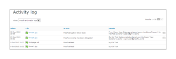

# [!DNL Workfront Proof] アクティビティ監査証跡について

>[!IMPORTANT]
>
>この記事では、[!DNL Workfront Proof] スタンドアロン製品の機能について説明します。 [!DNL Adobe Workfront] 内でのプルーフについて詳しくは、[プルーフ](../../../review-and-approve-work/proofing/proofing.md)を参照してください。

[!UICONTROL アクティビティ監査証跡]ページには、アカウントで行われたすべてのアクティビティの完全なリストが表示されます。

[!UICONTROL アクティビティ]ページにアクセスするには、次の手順に従います。

1. 左側のサイドバーで、「**[!UICONTROL アクティビティ]**」をクリックします。\
   \
   [!UICONTROL アクティビティ監査証跡]ページが表示されます。\
   

1. ビュードロップダウンメニューで、表示するビューを選択します。\
   次のビューから選択できます。

   * **[!UICONTROL プルーフとメディアのログ]**：アカウント内のプルーフとファイルに関するすべてのアクティビティが表示されます。
   * **[!UICONTROL フォルダーログ]：**&#x200B;アカウント内のフォルダーに関するすべてのアクティビティが表示されます。
   * **[!UICONTROL プロファイルログ]：**&#x200B;個人プロファイルに加えられたすべての変更が表示されます。
   * **[!UICONTROL アカウントログ]：**&#x200B;アカウント設定のすべての変更が表示されます。 このビューは、管理者権限を持つユーザーのみが使用できます。
   * **[!UICONTROL 認証ログ]：**&#x200B;アカウント上のすべてのログインアクティビティが表示され、成功した試行と失敗した試行の両方が表示されます。
   * **[!UICONTROL 請求ログ]：**&#x200B;アカウントの請求履歴が表示されます。 このビューは、請求管理者権限を持つユーザーのみが使用できます。
   * **[!UICONTROL メールログ]：**&#x200B;アカウントから送信されたすべてのメールが表示されます。
