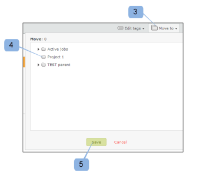
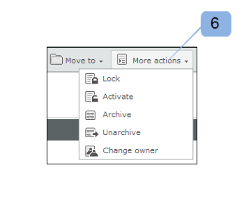
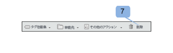

# ダッシュボード ( [!DNL Workfront Proof]

>[!IMPORTANT]
>
>この記事では、スタンドアロン製品の機能について説明します [!DNL Workfront Proof]. 内部での検証に関する情報 [!DNL Adobe Workfront]を参照してください。 [校正](../../../review-and-approve-work/proofing/proofing.md).

ダッシュボードは、 [!DNL Workfront Proof] アカウント このリストには、 [!DNL Workfront Proof] のアカウントと、内の他のセクションや機能へのクイックリンクを提供します。 [!DNL Workfront Proof].

ダッシュボードには次の情報が含まれます。

* 組織のロゴ (1)
* 上部ナビゲーション (2)
* 検索 (3)

* ヘッダーメニュー (4)
* 新しいメニュー (5)
* サイドバー (6)
* ようこそ (7)
* 概要 (8)
* 最近アクセスした項目 (9)
* 最近のアクティビティ (10)

>[!NOTE]
>
>ダッシュボードで表示および使用できるメニューやリンクは、ユーザープロファイルと権限によって異なります。

アカウントにブランディングを設定して、組織のロゴ、色、カスタムリンクなどを表示できます。 詳しくは、 [ブランド化 [!DNL Workfront Proof] サイト](../../../workfront-proof/wp-acct-admin/branding/brand-wp-site.md).&quot;

アカウントにブランディングを設定しない場合、 [!DNL Workfront Proof] ロゴと標準色が表示されます。

## ヘッダーメニュー

### ユーザー名

選択したユーザー名 (2) がここに表示されます。 これは、個人設定で変更できます。

### 設定

ここ (3) で、以下にアクセスできます。

* 個人設定
* アカウント設定
* 請求

>[!NOTE]
>
>上記のメニューの表示は、プロファイルによって異なります。 詳しくは、ユーザープロファイルと権限を参照してください。

### ヘルプ

ここ (4) で、次の項目にアクセスできます。

* ヘルプ記事
* デモムービー

>[!NOTE]
>
>Select および Premium のプランでは、ユーザーが自分のコンテンツを参照できるようにヘルプオプションを設定できます。 詳しくは、アドバンスブランディングオプションを参照してください。

### ログアウト

アカウントからログアウトするには、ここをクリックします。

## 新しいメニュー

「新規」メニューを開くには、

1. ドロップダウン矢印 (7) をクリックします。

   この **[!UICONTROL 新規]** メニューには次のオプションがあります。

   * 新しい配達確認 (8)
   * ファイルをアップロード (9)
   * 新しいフォルダ (10)
   * 新規ゲスト (11)
   * 新しいユーザー (12)
   * 新しいグループ (13)

## ダッシュボードメニュー

ダッシュボードメニューには、次のメニューが含まれています。

* タグを編集
* 指定の場所に移動
* その他のアクション
* 削除

## タグを編集

この [!UICONTROL タグを編集] メニュー (1) を使用すると、次のことができます。

* 項目にタグを適用する
* 新しいタグを作成
* タグの管理 (2)

## 指定の場所に移動

この関数を使用すると、配達確認とファイルをいずれかのフォルダーに移動できます。 手順は次のとおりです。

1. 該当する項目のチェックボックスをオンにします。
1. クリック **[!UICONTROL 移動先]** (3) をクリックし、該当するフォルダ (4) を選択します。
1. クリック **[!UICONTROL 保存]** (5)

   

### その他のアクション

内 [!UICONTROL その他のアクション] メニュー (6) 次の操作を実行できます。

* ロック（配達確認のみ）
* アクティブ化
* アーカイブ（配達確認のみ）
* アーカイブ解除（配達確認のみ）
* 所有者の変更

### 削除

項目を削除するには：

1. 項目の左側にあるチェックボックスを選択し、 **[!UICONTROL 削除]** (7)

1. 表示される確認画面で、詳細を確認し、「 **[!UICONTROL はい]** (8)

### サイドバー

サイドバーには次のページへのリンクがあります。

* ダッシュボード (1)
* ビュー (2)
* ワークフロー (3) （プレミアムプランのみ）
* ドロップゾーン (4) （Select および Premium プラン）
* 連絡先 (5)
* グループ (6)
* アクティビティ (7)
* ごみ箱 (8)
* マイフォルダー (9) （サイドバーから各個々のフォルダーにアクセスすることもできます）
* その他の組織のフォルダ (10)（他の組織が共有している項目を検索できます）
* タグ (11)

サイドバーは、サイドバーのヘルプページで詳しく説明されています。

### [!UICONTROL ようこそ] セクション

この [!UICONTROL ようこそ] セクションには、次の便利なリンクがあります。

* デモムービーを見る (1)
* ヘルプページ (2)
* サポートの連絡先の詳細 (3)
* 「今後、ようこそセクションを表示しない」リンク (4)

### 概要

この節では、次のクイックリンクを示します。

* 新しい配達確認の作成ファイルのアップロード
* 新しいフォルダーを作成
* 新しいユーザーを追加
* パスワードの変更

「概要」セクションには、事前にフィルターされた情報も表示されます。 以下が該当します。

* 管理する配達確認 — 自分が所有し、自分に委任されたアクティブな配達確認の合計数
* 決定待ちの配達確認 — 決定を必要とするアクティブな配達確認の合計数

   

ここでは、自分またはレビュー担当者からの即時のアクションが必要な配達確認の数をすぐに確認できます。

* 合計
* 期限切れ — 期限切れの配達確認または期限切れまでに 24 時間を超える配達確認
* リスクがある — 期限が 24 時間未満の配達確認
* 遅延 — 一部のアクションが完了し、期限を過ぎた配達確認を含む

>[!NOTE]
>
>グラフの値はクリック可能で、簡単に項目の詳細なリストに移動できます。

### 最近アクセスした項目

この [!UICONTROL 最近アクセスした項目] 「 」セクションには、最近アクセスした項目が表示されます。 これには、所有している項目、プロファイル権限に従って表示する権限を持っている項目、共有されていた項目が含まれます。 このセクションには、( [!DNL Workfront Proof] 閲覧者または配達確認の詳細ページを使用 )。

この [!UICONTROL 最近アクセスした項目] 「 」セクションには、最近の配達確認とファイルに関する次の情報が表示されます。

* 名前
* 進捗状況
* ステータス
* 決定
* 所有者

概要（この情報はデフォルトで折りたたまれます。配達確認の左側にある展開/折りたたみボタンをクリックして、配達確認の概要を開きます）

アクションメニュー

この節で使用できる様々なレイアウトオプションについては、ページレイアウトを参照してください。

>[!NOTE]
>
>配達確認の名前をクリックする ( [!UICONTROL 最近アクセスした項目] 「 」セクションを選択すると、配達確認ビューアの配達確認に直接移動します。

配達確認の詳細ページにアクセスするには：

1. をクリックします。 **[!UICONTROL アクション]** 配達確認名の右側にあるメニュー (1)
1. 選択 **[!UICONTROL 配達確認の詳細を表示]** (2) を選択します。

### 最近のアクティビティ

このセクションには、アカウント内の最近のアクティビティに関する次の詳細が表示されます。

* 配達確認/ファイル名の日時
* アクション
* 詳細

また、アイテムの [ アクション ] メニューを開き、[ 詳細の表示 ] を選択して、アイテムの [ 詳細 ] ページに移動することもできます。 アカウント内のアクティビティの詳細については、「アクティビティ監査記録」を参照してください。

>[!NOTE]
>
>「 [!UICONTROL 最近のアクティビティ] 「 」セクションを選択すると、配達確認ビューアで配達確認が開きます。

配達確認の詳細ページに移動するには、次の手順に従います。

1. をクリックします。 **[!UICONTROL アクション]** メニュー (1)
1. 選択 **[!UICONTROL 配達確認の詳細を表示]** (2) を選択します。

   
