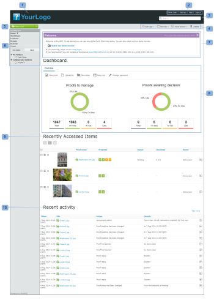

# [!DNL Workfront Proof] のダッシュボード

>[!IMPORTANT]
>
>この記事では、スタンドアロン製品 [!DNL Workfront Proof] の機能について説明します。[!DNL Adobe Workfront] 内でのプルーフについて詳しくは、[プルーフ](../../../review-and-approve-work/proofing/proofing.md)を参照してください。

ダッシュボードは、[!DNL Workfront Proof] アカウントにログインすると最初に表示されるページです。ここには、[!DNL Workfront Proof] アカウントでのアクティビティの概要が表示され、[!DNL Workfront Proof] 内の他のセクションや機能へのクイックリンクがあります。

ダッシュボードには以下が含まれています。

* 組織のロゴ (1)
* トップナビゲーション (2)
* 検索 (3)

* ヘッダーメニュー (4)
* 新規メニュー (5)
* サイドバー (6)
* 「ようこそ」セクション (7)
* 概要 (8)
* 最近アクセスした項目 (9)
* 最近使ったアクティビティ (10)

>[!NOTE]
>
>ダッシュボードで表示および使用できるメニューやリンクは、ユーザープロファイルと権限によって異なります。

アカウントをブランド化して、組織のロゴ、カラー、カスタムリンクなどを表示できます。詳しくは、[ [!DNL Workfront Proof] サイトのブランド化](../../../workfront-proof/wp-acct-admin/branding/brand-wp-site.md)を参照してください。

アカウントをブランド化しない場合、[!DNL Workfront Proof] ロゴと標準カラーが表示されます。

## ヘッダーメニュー

### ユーザー名

選択したユーザー名 (2) がここに表示されます。 これは、個人用設定で変更できます。

### 設定

ここ (3) では、以下にアクセスできます。

* 個人用設定
* アカウント設定
* 請求

>[!NOTE]
>
>上記メニューの表示は、プロファイルによって異なります。詳しくは、「ユーザーのプロファイルと権限」を参照してください。

### ヘルプ

ここ (4) では、以下にアクセスできます。

* ヘルプ記事
* デモムービー

>[!NOTE]
>
>Select プランと Premium プランでは、自分のコンテンツをユーザーが参照するようにヘルプオプションを設定できます。詳しくは、詳細ブランディングオプションを参照してください。

### ログアウト

アカウントからログアウトするには、ここをクリックします。

## 新規メニュー

新規メニューを開くには、

1. ドロップダウン矢印 (7) をクリックします。

   **[!UICONTROL 新規]**&#x200B;メニューには次のオプションがあります。

   * 新規プルーフ (8)
   * ファイルをアップロード (9)
   * 新規フォルダー (10)
   * 新規ゲスト (11)
   * 新規ユーザー (12)
   * 新規グループ (13)

## ダッシュボードメニュー

ダッシュボードメニューには、次のメニューが含まれています。

* タグを編集
* 指定の場所に移動
* その他のアクション
* 削除

## タグを編集

[!UICONTROL タグを編集]メニュー (1) を使用すると、次のことができます。

* 1 つまたは複数の項目にタグを適用
* 新規タグを作成
* タグを管理 (2)

## 指定の場所に移動

この機能を使用すると、プルーフやファイルをいずれかのフォルダーに移動できます。手順は次のとおりです。

1. 該当する項目のチェックボックスをオンにします。
1. 「**[!UICONTROL 指定の場所に移動]**」(3) をクリックし、該当するフォルダー (4) を選択します。
1. 「**[!UICONTROL 保存]**」(5) をクリックします。

   

### その他のアクション

[!UICONTROL その他のアクション]メニュー (6) では、次の操作を実行できます。

* ロック（プルーフのみ）
* アクティブ化
* アーカイブ（プルーフのみ）
* アーカイブ解除（プルーフのみ）
* オーナーを変更

### 削除

項目を削除するには、次の手順に従います。

1. 項目の左側にあるチェックボックスをオンにし、「**[!UICONTROL 削除]**」(7) をクリックします。

1. 表示される確認画面で、詳細を調べて、「**[!UICONTROL はい]**」(8) をクリックして確定します。

### サイドバー

サイドバーには、以下のページへのリンクがあります。

* ダッシュボード (1)
* ビュー (2)
* ワークフロー (3)（Premium プランのみ）
* ドロップゾーン (4)（Select プランと Premium プラン）
* 連絡先 (5)
* グループ (6)
* アクティビティ (7)
* ごみ箱 (8)
* マイフォルダー (9)（サイドバーから個々のフォルダーにアクセスすることもできます）
* その他の組織のフォルダー (10)（他の組織と共有した項目が見つかります）
* タグ (11)

サイドバーについて詳しくは、サイドバーのヘルプページを参照してください。

### 「[!UICONTROL ようこそ]」セクション

「[!UICONTROL ようこそ]」セクションには、次の便利なリンクがあります。

* デモムービーを見る (1)
* ヘルプページ (2)
* サポートの連絡先の詳細 (3)
* 「今後、「ようこそ」セクションを表示しない」リンク (4)

### 概要

このセクションには、以下の操作を起動するクイックリンクがあります。

* 新規プルーフの作成／ファイルのアップロード
* 新規フォルダーの作成
* 新規ユーザーの追加
* パスワードの変更

「概要」セクションには、事前にフィルタリングされた情報も表示されます。以下が該当します。

* 管理対象のプルーフ - 自分が所有したり自分に委任されたりしたアクティブなプルーフの合計数
* 決定待ちのプルーフ - 決定を必要とするアクティブなプルーフの合計数

  

ここでは、自分またはレビュアーによる直接的なアクションが必要なプルーフの数をすぐに確認できます。

* 合計
* 予定通り - 期限なしのプルーフまたは期限までに 24 時間以上あるプルーフ
* 危険あり - 期限まで 24 時間未満のプルーフ
* 遅延 - 一部のアクションのみ完了し、期限を過ぎたプルーフ

>[!NOTE]
>
>グラフの値はクリック可能で、項目の詳細リストに簡単に移動できます。

### 最近アクセスした項目

「[!UICONTROL 最近アクセスしたアイテム]」セクションには、最近アクセスしたアイテムが表示されます。これには、自分が所有するアイテム、プロフィール権限に従って自分に表示権限があるアイテムおよび自分と共有されたアイテムが含まれます。このセクションには、（[!DNL Workfront Proof] ビューアまたはプルーフの詳細ページを使用して）自分で開いたアイテムのみが含まれます。

「[!UICONTROL 最近アクセスしたアイテム]」セクションには、最近のプルーフとファイルに関する次の情報が表示されます。

* 名前
* 進捗状況
* ステータス
* 決定
* 所有者

概要（この情報はデフォルトでは折りたたまれています。関連するプルーフの左側にある展開／折りたたみ用ボタンをクリックして、プルーフの概要を開きます)

アクションメニュー

このセクションで使用できる様々なレイアウトオプションについては、「ページレイアウト」を参照してください。

>[!NOTE]
>
>「[!UICONTROL 最近アクセスしたアイテム]」セクションでプルーフ名をクリックすると、プルーフビューアのプルーフに直接移動します。

プルーフの詳細ページにアクセスするには、次の手順に従います。

1. プルーフ名の右側にある&#x200B;**[!UICONTROL アクション]**&#x200B;メニュー (1) をクリックします。
1. メニューから「**[!UICONTROL プルーフの詳細を表示]**」(2) を選択します。

### 最近使ったアクティビティ

このセクションには、アカウントでの最近のアクティビティに関する次の詳細が表示されます。

* 日時プルーフ／ファイル名
* アクション
* 詳細

アイテムのアクションメニューをクリックして開き、「詳細を表示」を選択して、アイテムの詳細ページに移動することもできます。アカウントでのアクティビティについて詳しくは、「アクティビティ監査証跡」を参照してください。

>[!NOTE]
>
>「[!UICONTROL 最近のアクティビティ]」セクションでプルーフの名前をクリックすると、そのプルーフがプルーフビューアで開きます。

そのプルーフのプルーフの詳細ページに移動するには、次の手順に従います。

1. **[!UICONTROL アクション]**&#x200B;メニュー (1) をクリックします。
1. ドロップダウンメニューから「**[!UICONTROL プルーフの詳細を表示]**」(2) を選択します。

   
