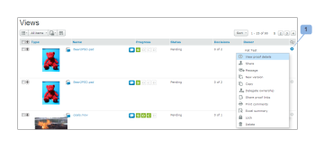

# ページレイアウト ( [!DNL Workfront Proof]

>[!IMPORTANT]
>
>この記事では、スタンドアロン製品の機能について説明します [!DNL Workfront Proof]. 内部での検証に関する情報 [!DNL Adobe Workfront]を参照してください。 [校正](../../../review-and-approve-work/proofing/proofing.md).

ページのレイアウトは [!UICONTROL 件数] タブをクリックします。 次のレイアウトオプションを使用できます。

## リスト

* 配達確認またはファイル名と標準ビューの列を表示します
* The [!UICONTROL 配達確認のアクション] メニューは、ライン (1) の右側にあります。

  

## サムネイル リスト

* 配達確認の画像/ファイルアイコン、配達確認またはファイル名、および標準ビューの列を表示します
* The [!UICONTROL 配達確認のアクション] メニューは、ライン (1) の右側にあります。
* これは既定の標準ビューです。

  

## サムネール

* 配達確認の画像/ファイルアイコンと配達確認/ファイル名のみを表示
* The [!UICONTROL 配達確認のアクション] 各配達確認の右上隅にメニューが表示されます (1)

  

## ページレイアウトの変更

ダッシュボードまたはごみ箱ページのページレイアウトを変更するには、ページ上部の表示ボタンの 1 つをクリックして、目的のビューを選択します。

アカウント内の他のすべてのビューページのページレイアウトを変更するには、ページ上部のドロップダウンメニューを展開し、目的のページレイアウトをクリックします。

