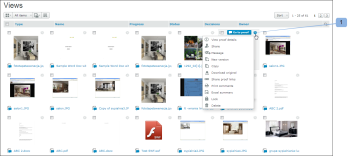

# [!DNL Workfront Proof] の「ビュー」タブのページレイアウト

>[!IMPORTANT]
>
>この記事では、スタンドアロン製品 [!DNL Workfront Proof] の機能について説明します。 [!DNL Adobe Workfront] 内でのプルーフについて詳しくは、[プルーフ](../../../review-and-approve-work/proofing/proofing.md)を参照してください。

ページのレイアウトは「[!UICONTROL ビュー]」タブで調整できます。 次のレイアウトオプションを使用できます。

## リスト

* プルーフまたはファイル名と標準ビューの列の表示
* [!UICONTROL プルーフアクション]のメニューは、線（1）の右側にあります

  

## サムネイル リスト

* プルーフの画像／ファイルアイコン、プルーフまたはファイル名および標準ビューの列の表示
* [!UICONTROL プルーフアクション]のメニューは、線（1）の右側にあります
* これはデフォルトの標準ビューであることに注意してください。

  

## サムネール

* プルーフの画像／ファイルアイコンとプルーフ／ファイル名のみを表示
* [!UICONTROL プルーフアクション]のメニューは、各プルーフ（1）の右上隅にメニューが表示されます

  

## ページレイアウトの変更

ダッシュボードまたはごみ箱ページのページレイアウトを変更するには、ページ上部の表示ボタンの 1 つをクリックして、目的のビューを選択します。

アカウント内の他のすべてのビューページのページレイアウトを変更するには、ページ上部のドロップダウンメニューを展開し、目的のページレイアウトをクリックします。

