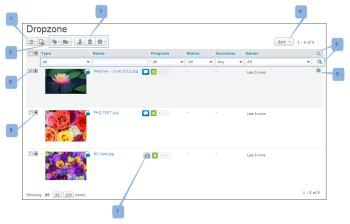

# ドロップゾーン

>[!IMPORTANT]
>
>この記事では、スタンドアロン製品 [!DNL Workfront Proof] の機能について説明します。[!DNL Adobe Workfront] 内でのプルーフについて詳しくは、[プルーフ](../../../review-and-approve-work/proofing/proofing.md)を参照してください。

エンタープライズプランをご利用の場合は、ドロップゾーンを使用して、アカウントにログインしなくても、新しいプルーフや新しいバージョンのプルーフをアカウントに送信できます。

ドロップゾーンでプルーフを送信すると、そのプルーフは [!DNL Workfront Proof] アカウントのドロップゾーンページに表示されます。ここから、ワークフローにルーティングできます。

## ドロップゾーン URL を使用した新規プルーフの送信

1. ブラウザーで、固有のドロップゾーン URLに移動します（[ [!DNL Workfront Proof]](../../../workfront-proof/wp-acct-admin/account-settings/configure-dropzone-in-wp.md) でのドロップゾーンの設定を参照）。
1. メールアドレスを入力します。
1. 「**[!UICONTROL ファイルを選択]**」または「**[!UICONTROL Web ページをキャプチャ]**」をクリックし、アップロードするファイルまたは web ページを選択します。

1. セキュリティコードを入力し、「**[!UICONTROL 次へ]**」をクリックします。\
   アップロードの進行状況がプログレスバーに表示されます。\
   次の画面で、プルーフの詳細を追加できます。\
   このセクションは、ドロップゾーン設定で有効になっている場合にのみ表示されます。

1. 詳細を入力したら、「**[!UICONTROL 次へ]**」をクリックします。
1. プルーフに追加されたレビュアーは、プルーフをアクティベーションしたときにのみ通知メールを受け取ります（以下を参照）。
1. プルーフは、ドロップゾーンに送信した後、次の状態に進みます。

   * 最初にファイルをドロップゾーンにアップロードすると、プルーフはドラフトとして表示されます。
   * 送信が完了すると、プルーフがドロップゾーンで「送信済み」と表示されます。
   * プルーフをアクティベートしてロックを解除すると、ドロップゾーンに「アクティブ」と表示されます。
   * プルーフがロックされている場合は、ドロップゾーンに「ロック」と表示されます。

## ドロップゾーン URL を使用した既存のプルーフの新しいバージョンの送信

1. ブラウザーで、固有のドロップゾーン URL に移動します（[ [!DNL Workfront Proof]](../../../workfront-proof/wp-acct-admin/account-settings/configure-dropzone-in-wp.md) でのドロップゾーンの設定を参照）。
1. メールアドレスを入力します。
1. チェックボックスを選択して、既存のプルーフの新しいバージョンをアップロードすることを示します。\
   プルーフの新しいバージョンの作成について詳しくは、次を参照してください。
1. 「**[!UICONTROL ファイルを選択]**」または「**[!UICONTROL Web ページをキャプチャ]**」をクリックし、アップロードするファイルまたは web ページを選択します。

1. セキュリティコードを入力し、「**[!UICONTROL 次へ]**」をクリックします。\
   アップロードの進行状況がプログレスバーに表示されます。\
   Workfront Proof から、検証用のメールが送信されます。

1. メール内のリンクをクリックします。\
   ブラウザーでドロップゾーンウィンドウが開きます。メール通知内のリンクは 24 時間有効です。
1. 以前のバージョンのプルーフを選択します（作成または送信したプルーフのみが表示されます）。\
   次の画面で、プルーフの詳細を追加できます。\
   このセクションは、ドロップゾーン設定で有効になっている場合にのみ表示されます。

1. 詳細を入力して、「**[!UICONTROL 次へ]**」をクリックします。

   >[!NOTE]
   >
   >プルーフに追加されたレビュアーは、プルーフをアクティベーションしたときにのみ通知メールを受け取ります（以下を参照）。

   プルーフは、ドロップゾーンに送信した後、次の状態に進みます。

   * 最初にファイルをドロップゾーンにアップロードすると、プルーフはドラフトとして表示されます。
   * 送信が完了すると、プルーフがドロップゾーンで「送信済み」と表示されます。
   * プルーフをアクティベートしてロックを解除すると、ドロップゾーンに「アクティブ」と表示されます。
   * プルーフがロックされている場合は、ドロップゾーンに「ロック」と表示されます。

## ドロップゾーンへのプルーフのメール送信

>[!NOTE]
>
>ドロップゾーンへのプルーフのメール送信はサポートされなくなりました。

## 送信の完了

送信者は、Workfront から送信の完了を知らせるメールを受け取り、ファイルが新しいプルーフか新しいバージョンかを確認するよう求められます。メール通知内のリンクは 24 時間有効です。

1. リンクをクリックし、新しいプルーフか既存のプルーフの新しいバージョンかに応じて、上記の手順に従います。

## プルーフのアクティベーション

ドロップゾーンの所有者には、新しいプルーフがドロップゾーンに送信されたことを知らせる通知メールが届きます。

* プルーフは、アカウントのドロップゾーンページに表示されます（ドロップゾーンページにアクセスするには、左側のナビゲーションサイドバーにあるリンクをクリックします）。
* プルーフには、ドロップゾーンの所有者（またはスーパーバイザープロファイルを持つユーザー）がアクセスできます。所有者は、ドロップゾーン設定内で変更できます（請求管理者または管理者のみが変更できます）。
* プルーフは、処理される前に、ドロップゾーンの所有者（またはスーパーバイザープロファイル以上を持つユーザー）によってアクティブ化／ロック解除される必要があります。プルーフのステータスは、アクティブ化／ロック解除されるまで「送信済み」と表示されます。

プルーフをアクティブ化するには：

1. プルーフの右側にあるドロップダウンメニューに移動し、「**[!UICONTROL アクティブ化]**」をクリックします。
1. プルーフがアクティブ化／ロック解除されると、次のようになります。

   * プルーフのステータスが「アクティブ」に変わります。
   * プルーフに追加されたユーザーには、レビュー用の新しいプルーフがあることを知らせる通知メールが送信されます。（プルーフがアクティブ化／ロック解除されるまで、メールは送信されません）。
   * プルーフは通常どおりに作業できます
   * また、送信者が自分自身をプルーフに明示的に追加した場合、新しいプルーフメールは送信されません。詳しくは、[新規プルーフメール](../../../workfront-proof/wp-emailsntfctns/proof-notifications-and-reminders/new-proof-email.md)を参照してください。

## ドロップゾーンの管理

ドロップゾーンページを使用すると、ドロップゾーンへの送信を簡単に管理できます。ドロップゾーンページには次のオプションと機能が含まれています。

* ページレイアウト（1）
* ビューにアーカイブしたプルーフを含める／除外する（2）
* アクションボタン（3）
* 並べ替え（4）
* フィルター（5）
* プルーフアクションメニュー（6）
* プルーフのアーカイブ解除（7）
* プルーフの概要を展開または折りたたむ（8）
* プルーフを選択（9）

ページのレイアウトと並べ替えおよびフィルターのオプションは、[!DNL Views] リストと同じです。詳しくは、[ [!DNL Workfront Proof]](../../../workfront-proof/wp-work-proofsfiles/manage-your-work/manage-items-on-views-page.md) のビューページでの項目を管理を参照してください。

