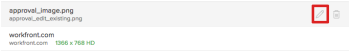
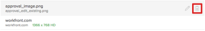
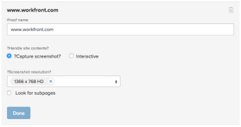

# [!DNL Workfront Proof] でプルーフを生成

<!-- Audited: 4/2025 -->

>[!IMPORTANT]
>
>この記事では、スタンドアロン製品 [!DNL Workfront Proof] の機能について説明します。 [!DNL Adobe Workfront] 内でのプルーフについて詳しくは、[プルーフ](../../../review-and-approve-work/proofing/proofing.md)を参照してください。

[!DNL Workfront Proof] を使用すると、ドキュメントまたは web サイトからプルーフを作成し、作成したプルーフを他のユーザーと共有できます。 次の手順では、使用可能な様々な設定オプションについて説明します。

## ドキュメントからプルーフを生成

1. 次のいずれかの操作を行って、**[!UICONTROL 新しいプルーフ]** ページを開きます。

   * ページの左上隅にある「**[!UICONTROL 新しいプルーフ]**」ボタンをクリックします。
   * ドロップゾーン（エンタープライズ機能）経由で送信します。

1. 1つ以上のドキュメントをプルーフするには、次のいずれかの方法でプルーフするドキュメントを追加します（複数のドキュメントを追加する場合は、このプロセスを繰り返します）。

   * ファイルシステムからドキュメントを&#x200B;**[!UICONTROL ファイルを追加]** エリアのドラッグ&amp;ドロップ領域にドラッグします。
   * **[!UICONTROL ファイルを追加]** エリアで、**参照** リンクをクリックして、ワークステーションのファイルシステムからアップロードするドキュメントを検索して選択します。

     

1. Web サイトをプルーフするには、**[!UICONTROL ファイルを追加]**&#x200B;領域にWeb サイトのURLを入力し、**[!UICONTROL Enter]**&#x200B;を押します。 この手順を繰り返して、複数のweb サイトをプルーフに追加します。

   Web サイトのプルーフに関する詳細情報は、[URL のプルーフの生成](#generate-a-proof-for-a-url)を参照してください。

   

1. （オプション）アップロードしたファイルのファイル名を変更します。

   1. 文書リストで、変更する文書名にカーソルを合わせ、**[!UICONTROL 編集]** アイコンをクリックします。

      

   1. **[!UICONTROL プルーフ名]**&#x200B;フィールドで新しい名前を指定し、「**[!UICONTROL 完了]**」をクリックします。

   1. （オプション）アップロードからファイルを削除するには、ドキュメントリストで削除するドキュメントにカーソルを合わせ、**[!UICONTROL 削除]** アイコンをクリックします。

      

   1. （オプション）「**[!UICONTROL すべての互換性のあるファイルを単一のプルーフに結合]**」オプションを有効にします。

      **このオプションが有効な場合：**&#x200B;すべての静的なファイルと web サイトは単一のプルーフで使用でき、一度に最大 50 個のファイルをアップロードすることができます。

      >[!NOTE]
      >
      >ビデオやインタラクティブ web サイトを含むインタラクティブファイルを結合して、単一のプルーフにすることはできません。

      **このオプションが無効な場合：**&#x200B;すべてのドキュメントおよび web サイトは個別のプルーフとして生成され、一度に 20 個までのファイルをアップロードできます。

      アップロードされたすべてのファイルと web サイトを単一のプルーフに組み合わせるには、以下のようにします。

      1. 「**[!UICONTROL 互換性のあるすべてのファイルを単一のプルーフに結合]**」オプションを有効にします。
      1. 「**[!UICONTROL プルーフ名]**」フィールドに、結合されたプルーフの新しい名前を入力します。
      1. **[!UICONTROL ファイルを追加]**&#x200B;エリアで、ファイルを希望の順序にドラッグして、含まれるファイルの順序を変更します。 ファイルの順序は、組み合わせたプルーフのページ順です。 組み合わせプルーフの作成に関して詳しくは、[複数ページのプルーフを作成](../../../review-and-approve-work/proofing/creating-proofs-within-workfront/create-multi-page-proof.md)を参照してください。

1. （オプション）複数のステージを含む自動ワークフローを使用する場合は、**[!UICONTROL ワークフロー]** セクションの次のオプションから選択します。

   * **基本：**&#x200B;プルーフの作成直後にそのプルーフへのアクセス権を持つユーザーを指定するには、このオプションを選択します。 プルーフを複数のユーザーと共有することができます。

     プルーフの共有について詳しくは、[ プルーフを [!DNL Adobe Workfront]](../../../review-and-approve-work/proofing/managing-proofs-within-workfront/share-a-proof-in-workfront.md)内で共有するを参照してください。

   * **自動：**&#x200B;複雑なレビュープロセスがある場合や、レビュー用のコンテンツを同じグループの同じ人々に定期的に送信する場合、このオプションを選択して、コンテンツのレビューと承認を管理します。 自動化されたワークフローにより、プルーフは最終承認までステージからステージへと移動します。 関連するユーザーには、承認を行う必要があるときにいつでも通知されます。

     自動ワークフローの作成に関して詳しくは、[自動ワークフローを使用してプルーフを設定 [!DNL Workfront Proof]](../../../workfront-proof/wp-work-proofsfiles/automated-workflow/set-up-proof-auto-workflow.md#create2)を参照してください。

1. 前の手順で選択したユーザーに、メール通知とカスタムメッセージを送信するかどうかを選択します。

   * **このプルーフについて受信者に通知する：**&#x200B;ユーザーにメール通知を送信する場合は、このオプションを選択します。 **[!UICONTROL 基本共有]**&#x200B;が&#x200B;**[!UICONTROL ワークフロー]**&#x200B;セクションで選択されている場合、プルーフの作成時にメール通知が送信されます。 **[!UICONTROL 自動ワークフロー]**&#x200B;が&#x200B;**[!UICONTROL ワークフロー]**&#x200B;セクションで選択されている場合、ユーザーが関連付けられている自動ワークフローのステージにプルーフが入力されると、メール通知が送信されます。

   * **カスタムメッセージの追加：**&#x200B;通知にカスタムメッセージを含める場合は、このオプションを選択します。 件名とメッセージ本文を指定できます。 メッセージ本文には、太字、箇条書き記号、ハイパーリンクなどのリッチテキスト書式を含めることができます。

1. 以下のプルーフ設定のいずれかを選択します。

   <table style="table-layout:auto"> 
    <col> 
    <col> 
    <tbody> 
     <tr> 
      <td role="rowheader">ログインが必要 このプルーフを他のユーザーと共有することはできません</td> 
      <td> 
このオプションを選択した場合：
 
       <ul> 
        <li>ユーザーは、プルーフにログインしてプルーフに追加されていない限り、プルーフを表示することはできません。</li> 
        <li>購読を有効にできません。</li> 
       </ul> 
       
このオプションはデフォルトでは無効になっています。
 
       </td> 
     </tr> 
     <tr> 
      <td role="rowheader">校正判断に電子サインを必須にする</td> 
      <td>
このオプションを選択した場合、ユーザーはプルーフに関する決定を行う際に、ユーザー名とパスワードを指定する必要があります。

      
このオプションはデフォルトでは無効になっています。

      </td> 
     </tr> 
     <tr> 
      <td role="rowheader">すべての必要な決定が行われた時点でプルーフをロックする</td> 
      <td> 
この設定を有効にすると、すべての決定が行われた後、プルーフのステートがロックされます。 最終承認者が決定を下すと、ステートは自動的にロック解除からロックに変更されます。
 
      
このオプションはデフォルトでは無効になっています。
 </td> 
     </tr> 
     <tr> 
      <td role="rowheader">オリジナル ファイルのダウンロードを許可する</td> 
      <td> 
<strong></strong> このオプションを選択すると、レビューアは、プルーフの作成元のファイルをダウンロードできます。
 
このオプションの選択を解除すると、ダウンロードアイコンは表示されなくなります。

      
このオプションは、デフォルトで有効になっています。
 </td> 
     </tr> 
     <tr> 
      <td role="rowheader">パブリック URL または埋め込みコード経由によるプルーフの共有を許可する</td> 
      <td>
このオプションを選択した場合、プルーフは公開 URL または埋め込みコード経由で共有できます。

       
このオプションは、デフォルトで有効になっています。

      </td> 
     </tr> 
     <tr> 
      <td role="rowheader">パブリック URLまたは埋め込みコードを使用したプルーフの購読を許可</td> 
      <td> 
このオプションを選択すると、プルーフに追加されていないユーザーはプルーフを購読できます。 プルーフを購読しているユーザーには、次の設定で定義した役割とメールが付与されます。
 
       <ul> 
        <li><strong>サブスクライバーの役割</strong>：プルーフに登録するすべてのレビュー担当者に割り当てられる、デフォルトのプルーフの役割です。</li> 
        <li><strong>サブスクライバーのメールアラート設定</strong>：プルーフに登録するすべてのレビュー担当者に割り当てられる、デフォルトのメールアラートです。</li> 
        <li> 
<strong>メールのリンクからプルーフにアクセスする必要があります</strong>：プルーフへのリンクを含むメールをサブスクライバーが受信するかどうかを設定します。 <strong>電子メールなし</strong> （電子メールリンクはプルーフへのアクセスに必要ありません）、<strong> プルーフ通知メールのみ</strong> （購読者は確認なしで電子メールでプルーフへのリンクを受け取ります）、または<strong>検証とプルーフ通知メール </strong>を選択できます（購読者は電子メールでプルーフへのリンクを受け取り、リンクをクリックしてプルーフにアクセスアクセス必要があります。 このオプションの目的は、ユーザーがアクセスできる正しいメールアドレスを入力したことを確認することです）。
 
注意：プルーフに自動ワークフローが添付されている場合、すべての購読はプルーフ所有者に確認メールを生成し、そのユーザーがどのステージに追加するかを決定できるようにします。
 </li> 
       </ul> 
        
このオプションはデフォルトでは無効になっています。

       </td> 
     </tr> 
    </tbody> 
   </table>

1. 「**[!UICONTROL プルーフを作成]**」をクリックします。 Workfrontは、選択したドキュメントまたはweb サイトのプルーフを生成します。

   ドキュメントのアップロード時のラグ時間は、ファイルサイズとタイプによって異なります。 大きなファイルの生成には時間がかかります。 Workfrontでファイルの生成を続行すると、ページから移動できます。 アップロードできるファイルの最大サイズは 4GB です。

## URLを使用した静的プルーフの生成 {#generate-a-proof-for-a-url}

Web サイトのURLを使用して、静的プルーフを生成できます。

>[!NOTE]
>
>[!DNL Workfront] 環境が [!DNL Workfront Proof] プレミアムアカウントと統合されている場合にのみ、URL のインタラクティブなプルーフを生成できます。 この節で説明したようにプルーフを使用できない場合は、Workfront管理者にお問い合わせください。

1. 次のいずれかの操作を行って、**[!UICONTROL 新しいプルーフ]** ページを開きます。

   * ページの左上隅にある「**[!UICONTROL 新しいプルーフ]**」ボタンをクリックします。
   * ドロップゾーン（エンタープライズ機能）経由で送信します。

1. **新しいプルーフ** ページで、**[!UICONTROL ファイルを追加]**&#x200B;領域にプルーフを作成するweb サイトのURLを入力し、キーボードの&#x200B;**[!UICONTROL Enter]**&#x200B;または&#x200B;**[!UICONTROL Return]**&#x200B;を押します。

1. （オプション）このプロセスを繰り返して、複数のweb サイトをプルーフに追加します。

   

1. **[!UICONTROL ファイルを追加]** エリアで、URLの右側にある&#x200B;**編集** アイコンをクリックして、web サイトのプルーフの詳細を開きます。

   

1. **[!UICONTROL プルーフ名]**&#x200B;を入力します。 デフォルトでは、プルーフ名はサイトの URL と同じです。

1. 次のいずれかの&#x200B;**[!UICONTROL サイトコンテンツの処理]** オプションを選択します。

   <table style="table-layout:auto"> 
    <col> 
    <col> 
    <tbody> 
     <tr> 
      <td role="rowheader">スクリーンショットのキャプチャ</td> 
      <td>URL のトップページの静的画像のプルーフを作成します。</td> 
     </tr> 
     <tr> 
      <td role="rowheader">対話型</td> 
      <td> 
レビュー担当者がサイト内を移動したり、HTML 5 画像、Flash 要素などを表示したりできるプルーフを作成します。
 
インタラクティブプルーフを作成するには、web サイトをセキュアプロトコル（https）でホストする必要があります。 さらに、iframeに埋め込むことができないweb サイトは、インタラクティブプルーフとして生成することはできません（iframeの埋め込み制限は、埋め込もうとしているweb サイトによって制御されます）。
 
最初のプルーフを作成した後、それに続くバージョンを作成する場合は、この設定を変更できません。
 
インタラクティブなプルーフについて詳しくは、<a href="#generate-a-proof-for-interactive-content" class="MCXref xref">インタラクティブなコンテンツのプルーフを生成</a>を参照してください。
 </td> 
     </tr> 
     <tr> 
      <td role="rowheader">スクリーンショットの解像度</td> 
      <td> 
（このオプションは、インタラクティブなプルーフには使用できません）。 コンテンツが表示される解像度を調整したり、複数の解像度を選択したりできます。
 
これにより、プルーフを確認するユーザーは、携帯電話、タブレット、モニターなどの様々なサイズのデバイスで、コンテンツがどのように表示されるかを確認できます。
 
複数の解像度を選択した場合は、選択した解像度ごとに別々のプルーフが作成されます。
 
ユーザーがプルーフにコメントする際、現在の画面の解像度がコメントに自動的に表示され、コメントが関連付けられている解像度を他のユーザーが認識できるようになります。
 </td> 
     </tr> 
     <tr> 
      <td role="rowheader">サブページの検索</td> 
      <td>（このオプションは、インタラクティブなプルーフには使用できません）。 このオプションを選択すると、Web サイトのページ内を移動できます。 Web サイトは、メインページから最大 2 レベルまで展開できます。 ページにマウスポインターを置いて、ページのURLを表示し、プルーフするページのみを選択します。 選択した各ページは、デフォルトで個々のプルーフとして作成されます。 または、<strong>互換性のあるすべてのファイルを単一のプルーフに結合</strong> オプションを有効にすることもできます。</td> 
     </tr> 
    </tbody> 
   </table>

1. （オプション）プルーフの共有、自動ワークフローの追加、アクセス設定やサブスクリプション設定など、その他のプルーフオプションを設定します。 これらのオプションについて詳しくは、次の記事を参照してください。

   * [ [!DNL Adobe Workfront] でプルーフを共有する](../../../review-and-approve-work/proofing/managing-proofs-within-workfront/share-a-proof-in-workfront.md)
   * [ [!DNL Workfront Proof] で自動ワークフローを使用したプルーフを設定する](../../../workfront-proof/wp-work-proofsfiles/automated-workflow/set-up-proof-auto-workflow.md)
   * [プルーフのアクセスおよびサブスクリプション設定を行う](../../../review-and-approve-work/proofing/managing-proofs-within-workfront/configure-access-subscription-settings-proof.md)

1. 「**[!UICONTROL 完了]**」をクリックします。

1. 「**[!UICONTROL プルーフを作成]**」をクリックします。

## インタラクティブコンテンツのプルーフの生成 {#generate-a-proof-for-interactive-content}

<!--A Pro Workfront Plan or higher is required to use this feature. For more information about the various plans available, see [Workfront Plans](https://www.workfront.com/plans).-->

インタラクティブコンテンツについて詳しくは、[インタラクティブコンテンツのプルーフの概要](../../../review-and-approve-work/proofing/proofing-overview/interactive-content-proofs.md)を参照してください。

* [インタラクティブコンテンツを URL として追加](#add-interactive-content-as-a-url)
* [インタラクティブコンテンツを ZIP ファイルとして追加](#add-interactive-content-as-a-zip-file)

### インタラクティブコンテンツを URL として追加 {#add-interactive-content-as-a-url}

インタラクティブ URL プルーフの追加方法について詳しくは、[URLのプルーフの生成](#generate-a-proof-for-a-url)を参照してください。

### インタラクティブコンテンツを ZIP ファイルとして追加 {#add-interactive-content-as-a-zip-file}

1. .zip バンドルファイルを作成して、コンテンツを準備します。

   .zip バンドルされたファイルの仕様について詳しくは、[ インタラクティブコンテンツプルーフの概要](../../../review-and-approve-work/proofing/proofing-overview/interactive-content-proofs.md)を参照してください。

1. 次のいずれかの操作を行って、**[!UICONTROL 新しいプルーフ]** ページを開きます。

   * ページの左上隅にある「**[!UICONTROL 新しいプルーフ]**」ボタンをクリックします。
   * ドロップゾーン（エンタープライズ機能）経由で送信します。

1. **[!UICONTROL 新しいプルーフ]** ページで、インタラクティブな.zip バンドルを&#x200B;**[!UICONTROL ファイルを追加]**&#x200B;領域にドラッグ&amp;ドロップします。

1. （オプション）プルーフの共有、自動ワークフローの追加、アクセス設定やサブスクリプション設定など、その他のプルーフオプションを設定します。 これらのオプションについて詳しくは、次の記事を参照してください。

   * [ [!DNL Adobe Workfront] 内でプルーフを共有](../../../review-and-approve-work/proofing/managing-proofs-within-workfront/share-a-proof-in-workfront.md)
   * [プルーフのアクセスおよびサブスクリプション設定を行う](../../../review-and-approve-work/proofing/managing-proofs-within-workfront/configure-access-subscription-settings-proof.md)

1. 「**[!UICONTROL プルーフを作成]**」をクリックします。 Workfrontは、zip ファイルのプルーフを生成します。

   ドキュメントのアップロードのラグ時間は、zip ファイルサイズによって異なります。 Workfrontでファイルの生成を続行すると、ページから移動できます。 アップロードできるファイルの最大サイズは 4GB です。
