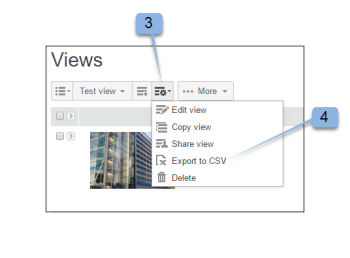

# [!DNL Workfront Proof] でのカスタムビューの作成および管理

>[!IMPORTANT]
>
>この記事では、スタンドアロン製品 [!DNL Workfront Proof] の機能について説明します。[!DNL Adobe Workfront] 内でのプルーフについて詳しくは、[プルーフ](../../../review-and-approve-work/proofing/proofing.md)を参照してください。

ファイルとプルーフのカスタムビューを作成して、必要な項目を希望の形式で一覧表示できます。また、カスタムビューに情報をレポート（CSV、コンマ区切り値、ファイル形式）として書き出すこともできます。

>[!NOTE]
>
>カスタムビューは、Select プランおよび Premium プランでのみ利用できます。見積もりについて詳しくは、セールスチームにお問い合わせください。

## カスタムビューの作成

カスタムビューを作成する場合は、次の項目を選択できます。

* プルーフ、ファイルまたはその両方を含めるかどうか
* どの列を表示するか
* どの列を並べ替えるか
* 列の並べ替え順（昇順または降順）
* ビューに含まれる情報の決定に使用するフィルターのタイプ

カスタムビューは、作成後すぐに使用できます。新しいビューの名前は、マイカスタムビュー（標準ビューの下）の見出し下のドロップダウンメニューにも表示されます。

カスタムビューを作成するには、次の手順に従います。

1. **[!UICONTROL ビュー]**&#x200B;ページに移動します。
1. ビューについて詳しくは、[ [!DNL Workfront Proof]](../../../workfront-proof/wp-work-proofsfiles/manage-your-work/manage-items-on-views-page.md) のビューページでの項目の管理を参照してください。
1. 新しいカスタムビューを最初から作成するか、既存の標準ビューに基づいて新しいカスタムビューを作成するかに応じて、次のいずれかの操作を行います。

   * 既存の標準ビューに基づいて新しいカスタムビューを作成するには、ドロップダウンメニューから、新しいカスタムビューの基盤として使用する既存の標準ビューを選択します。**[!UICONTROL ビューの設定]**&#x200B;アイコンをクリックし、「**[!UICONTROL コピー]**」をクリックして新しいカスタムビューにコピーします。

   * 

   * 新しいカスタムビューを最初から作成するには、**[!UICONTROL 新規ビュー]**&#x200B;アイコンをクリックします。
   * 

1. 「**[!UICONTROL 詳細]**」セクションで、次の情報を指定します。

   * **[!UICONTROL 名前]**（必須）：新規ビューの名前。一意の名前を使用して、ユーザーがビューのドロップダウンメニューからカスタムビューを簡単に見つけられるようにします。
   * **[!UICONTROL 項目]**：プルーフとファイル、プルーフのみまたはファイルのみをビューに含めるかどうかを選択します。デフォルトでは、プルーフとファイルの両方が含まれます。

1. 「**[!UICONTROL 列]**」セクションでは、カスタムビューに含める列を決定します。

   1. 右向き矢印アイコンをクリックします。
   1. 

   1. 選択した列の名前をダブルクリックします。
   1. 1 つ以上の列を選択する必要があります。1 つの列は 1 回だけ追加できます。
   1. 新規ビューに含める列を&#x200B;**[!UICONTROL 使用可能な列]**&#x200B;エリアから選択します。
   1. 列が&#x200B;**[!UICONTROL 使用可能な列]**&#x200B;リストから&#x200B;**[!UICONTROL 選択した列]**&#x200B;リストに移動します。

   1. 標準の列から選択するか、カスタムフィールドと決定理由をカスタムビューの列に選択できます。（お使いのアカウントで設定済みの場合は、使用可能な列エリアの標準リストに表示されます。）
   1. 含めることができる標準列

      <table style="table-layout:auto">
      <thead>

      </thead>
      <tbody>  
      <tr>   
      <td><strong>アクティブなステージ名</strong></td>   
      <td>自動ワークフロー内のアクティブなステージの名前。</td>  
      </tr>  
      <tr>   
      <td><strong>コメント</strong></td>   
      <td>受け取ったコメントの数。</td>
      </tr>  
      <tr>   
      <td><strong>カウンター</strong></td>
      <td>アカウントにアップロードされたプルーフの数を表示します（アカウント設定で「プルーフカウンター」オプションを有効にする必要があります）。</td>
      </tr>
      <tr>
      <td><strong>作成日時</strong></td>
      <td>項目が作成された日時。</td>
      </tr>
      <tr>
      <td><strong>作成者</strong></td>
      <td>項目を作成したユーザー。</td>
      </tr>
      <tr>
      <td><strong>[!UICONTROL Date added to proof]</strong></td>
      <td>プルーフに追加された日付。 </td>
      </tr>
      <tr>
      <td><strong>期限</strong></td>
      <td>プルーフ全体の期限。</td>
      </tr>
      <tr>
      <td><strong>決定</strong></td>
      <td>期待される決定の数のうち、決定された数（0 / 1、1 / 1 など）</td>
      </tr>
      <tr>
      <td><strong>[!UICONTROL Downloads]</strong></td>
      <td>元のファイルがダウンロードされた回数。</td>
      </tr>
      <tr>
      <td><strong>ファイル名</strong></td>
      <td>ファイルまたはプルーフの名前。</td>
      </tr>
      <tr>
      <td><strong>フォルダー</strong></td>
      <td>アイテムを含むフォルダー。</td>
      </tr>
      <tr>
      <td><strong>直近のアクティビティ</strong></td>
      <td>アイテムに対する直近のアクティビティ日時。</td>
      </tr>
      <tr>
      <td><strong>最新の決定日時</strong></td>
      <td>直近に行った決定の日時。</td>
      </tr>
      <tr>
      <td><strong>期限</strong></td>
      <td>レビュー担当者または承認者として明示的に追加されたプルーフに対する自分の期限（対象である場合）。</td>
      </tr>
      <tr>
      <td><strong>所有者</strong></td>
      <td>アイテムの所有者。</td>
      </tr>
      <tr>
      <td><strong>所有者の国</strong></td>
      <td>プルーフの所有者についてシステムに登録された国。 </td>
      </tr>
      <tr>
      <td><strong>親プルーフ</strong></td>
      <td>親プルーフの名前。</td>
      </tr>
      <tr>
      <td><strong>進捗状況</strong></td>
      <td>
進捗バー開始、開封、コメント、決定が未実施のプルーフを表示します。

この情報は並べ替えられません。
</td>
      </tr>
      <tr>
      <td><strong>プルーフ名</strong></td>
      <td>プルーフの名前。</td>
      </tr>
      <tr>
      <td><strong>プルーフのタイプ</strong></td>
      <td>
プルーフのタイプ：静的ファイル、静的 web ページ、インタラクティブ web（.zip アップロード）、インタラクティブ web ページ（https）、ビデオ、オーディオ、その他。 

組み合わされたプルーフは、「組み合わされたプルーフのタイプ」として識別されます。プルーフのファイルタイプ。
</td>
      </tr>
      <tr>
      <td><strong>ファイルサイズ（MB）</strong></td>
      <td>
プルーフのファイルサイズ（ディスク使用量の割り当て量に関係します）。

この情報は、現バージョンのプルーフに対して提供されます。現在のバージョンがない場合は、最新のバージョンが使用されます。
</td>
      </tr>
      <tr>
      <td>
 

<strong>アクティブなステージの期限</strong>
</td>
      <td>自動ワークフローのステージの期限。</td>
      </tr>
      <tr>
      <td><strong>ステージ名</strong></td>
      <td>自動ワークフローの各ステージの名前。これには、過去のステージ、アクティブなステージ、将来のステージが含まれます。</td>
      </tr>
      <tr>
      <td><strong>状態</strong></td>
      <td>アクティブ、ロック、ドラフト、送信済み。</td>
      </tr>
      <tr>
      <td><strong>ステータス</strong></td>
      <td>保留中、変更が必要、変更して承認済み、承認済み、関連なし。</td>
      </tr>
      <tr>
      <td><strong>タグ</strong></td>
      <td>アイテムに添付されたタグ。</td>
      </tr>
      <tr>
      <td><strong>今後のステージ名</strong></td>
      <td> 自動ワークフローでまだ開始していない各ステージの名前。 </td>
      </tr>
      <tr>
      <td><strong>バージョンカウンター</strong></td>
      <td> アイテムのバージョン数。 </td>
      </tr>
      <tr>
      <td><strong>プルーフのバージョン番号</strong></td>
      <td><i>プルーフのバージョン番号。</i></td>
      </tr> 
      </tbody>
      </table>

   1. （オプション）次のいずれかの操作を行って、列を&#x200B;**[!UICONTROL 選択された列]**&#x200B;エリアに移動し、新しいビューに含まれるようにします。

      * **[!UICONTROL 選択された列]**&#x200B;リスト内の列を並べ替えます。
      * **[!UICONTROL 選択された列]**&#x200B;リストに列が表示される順序によって、カスタムビューで列が表示される順序が決まります。
      * 列は、**[!UICONTROL 使用可能な列]**&#x200B;リストから追加した順序で、**[!UICONTROL 選択された列]**&#x200B;リストに表示されます。

      * **[!UICONTROL 選択された列]**&#x200B;リストの列の順序を変更するには、列の名前を選択し、リスト内で上または下にドラッグします。

      * **[!UICONTROL 選択された列]**&#x200B;リストから列を削除するには、選択した列の名前をクリックし、**[!UICONTROL 左]**&#x200B;矢印をクリックします。または、選択した列の名前をダブルクリックすることもできます（列は&#x200B;**[!UICONTROL 使用可能な列]**&#x200B;リストに戻ります）。

      * 列は 1 回のみ追加できます。例えば、コメント列を[!UICONTROL 利用可能]から[!UICONTROL 選択した列]リストに移動させると、この列の名前は[!UICONTROL 使用可能な列]リストに表示されなくなります。

1. 「**[!UICONTROL 並べ替え]**」セクションで、次の情報を指定します。

   * **並べ替え基準：**&#x200B;カスタムビューで項目を表示する順番を設定したい場合は、「[!UICONTROL 並べ替え]」タブを使用します。並べ替えの列を選択しない場合、デフォルトでは「列なし」（特別な並べ替え列や並べ替え順はありません）になります。
   * 「[!UICONTROL 列]」タブで選択した列のみが、[!UICONTROL 列で並べ替え]ドロップダウンリストに表示されます。
   * **昇順または降順：**&#x200B;デフォルトで列を昇順または降順に並べ替えるかどうかを選択します。

1. 「**[!UICONTROL フィルター]**」セクションを使用して、カスタムビューに含める項目を選択するための 1 つ以上の条件を定義します。フィルターは、カスタムビューをレポートとして使用する場合に特に便利です。
1. すべての項目をカスタムビューに含めるには、「**[!UICONTROL フィルター]**」セクションをスキップします。
1. 使用可能なフィルター：

   * **フィールド：**&#x200B;このフィルターのフィールドを選択します（デフォルトのフィールドはコメントです）。フィールドリストには、すべての標準フィールド（「[!UICONTROL 列]」タブと同様）が含まれます。リストは、表示用に選択した列に限りません。
   * **演算子：**&#x200B;フィルターに使用できる演算子は、選択したフィールドのタイプによって異なります。フィールドと値フィールドの間の関係を表示する演算子を選択します。この情報は後で入力します。
   * **値：**&#x200B;選択したフィールドと演算子に従って、このフィールドで選択した値を選択または入力します。選択した演算子に応じて、値フィールドが 1 つある場合と、値が 2 つまたは「なし」の場合があります。次の例を参照してください。
   * **フィルターは次のロジックを使用して適用されます。**&#x200B;異なるフィールド間のフィルター条件では、AND 演算子が使用されます。同じフィールドを使用する複数のフィルター条件では、同じフィールドに対して OR 演算子が使用されます。

     コメントのないプルーフのみを表示する場合は、次の値を選択します。

      * フィールド：コメント
      * 演算子：次と等しい
      * 値フィールド：0

     2 つ以上のコメントを含むプルーフのみを表示する場合は、次の値を選択します。

      * フィールド：コメント
      * 演算子：より大きいか等しい
      * 値フィールド：2

     コメントが 1～4 のプルーフのみを表示する場合は、次の値を選択します。

      * フィールド：コメント
      * 演算子：範囲
      * 値フィールド（最初のフィールド）：1
      * 値フィールド（2 番目のフィールド）：4

        カスタムビューに追加したフィルターを問題なく変更したり、必要に応じて[!UICONTROL 設定]フィルターの横にあるクロスアイコンをクリックして削除できます。

        フィールドリストは、「[!UICONTROL 列]」タブで選択した列に限定されないので、カスタムビューで表示するために選択しなかった列を含むフィルターを作成する場合には注意が必要です。例えば、次の表示フィルターを使用すると、バージョンカウンター値が 2 以上のすべてのプルーフが選択されます。

         * フィールド = バージョンカウンター
         * 演算子 = 次よりも大きいか等しい
         * 値フィールド = 2

           >[!NOTE]
           >
           >カスタムビューに追加したフィルターを問題なく変更したり、必要に応じて[!UICONTROL 設定]フィルターの横にあるクロスアイコンをクリックして削除できます。

1. 「**[!UICONTROL 共有]**」セクションで、アカウント内のどのユーザーがカスタムビューを表示できるかを選択します。
1. カスタムビューは、作成者に固有の表示です。デフォルトでは、新しいカスタムビューは作成者に対してのみ表示されますが、次のいずれかのオプションを選択して、カスタムビューを共有することもできます。

   * **自分のみがこのカスタムビューを表示できます**（デフォルト）：カスタムビューを自分だけに表示する場合は、このオプションを選択します。
   * **すべてのユーザーがこのカスタムビューを表示できます**：このオプションを選択すると、アカウントのすべてのユーザーがカスタムビューを利用できるようになります。
   * **このカスタムビューを表示できるユーザーを選択**：特定のユーザーのみがカスタムビューを利用できるようにするには、このオプションを選択します。
   * カスタムビューにアクセスするユーザーの名前またはメールアドレスを入力し、ドロップダウンリストに表示されたら名前をクリックします。
   * この時点で他のユーザーとビューを共有しないように選択した場合は、後でカスタムビューを編集して共有できます。

1. 「**[!UICONTROL 作成]**」をクリックします。
1. カスタムビューが表示され、[!DNL Views] ページで利用できます。ビューについて詳しくは、[ [!DNL Workfront Proof]](../../../workfront-proof/wp-work-proofsfiles/manage-your-work/manage-items-on-views-page.md) の  [!DNL Views]  ページで項目を管理を参照してください。

## カスタムビューの編集

カスタムビューは簡単に編集できます。カスタムビューの編集方法

1. **[!UICONTROL ビュー]**&#x200B;ページに移動します。\
   ビューについて詳しくは、[ [!DNL Workfront Proof]](../../../workfront-proof/wp-work-proofsfiles/manage-your-work/manage-items-on-views-page.md) のビューページで項目を管理を参照してください。

1. 「[!UICONTROL ビュー]」ボタンをクリックします。（1）
1. 編集するビューをドロップダウンメニューから選択します。\
   

1. 「**[!UICONTROL 表示オプション]**」ボタンをクリックし、「**[!UICONTROL ビューを編集]**」を選択します。\
   \
   カスタムビューページを編集が表示されます。

1. 「[!UICONTROL アクション]」メニューをクリックします。（3）\
   このボタンは、ビュー内にプルーフ名の列を含める場合にのみ使用できます。
1. メニューから「[!UICONTROL ビューを編集]」を選択します。（4） \
   

1. カスタムビューページを編集が表示されます。

>[!NOTE]
>
>カスタムビューを編集すると、選択した列の一覧の列は、自動的にアルファベット順に並べられます。ビューを更新する前に、必要に応じて並べ替える必要があります。

## カスタムビューのコピー

ビューをコピー機能を使用すると、既存のカスタムビューを簡単にコピーできます。これは、例えば、すべてのデザイナーに対して個別のビューを設定し、各ビューがプルーフの所有者（デザイナー）を除いて同じである場合に、非常に便利です。

カスタムビューのコピー方法

1. **[!UICONTROL ビュー]**&#x200B;ページに移動します。\
   ビューについて詳しくは、[ [!DNL Workfront Proof]](../../../workfront-proof/wp-work-proofsfiles/manage-your-work/manage-items-on-views-page.md) のビューページで項目を管理を参照してください。

1. 「**[!UICONTROL ビュー]**」ボタンをクリックします。（1）
1. リストからカスタムビューを選択します。（2）
1. 「**[!UICONTROL アクション]**」メニューをクリックします。（3）\
   このボタンは、ビュー内にプルーフ名の列を含める場合にのみ使用できます。

1. メニューから[!UICONTROL コピー]を選択します。（4）\
   

1. カスタムビューのコピーページでは、元の設定がすべて入力されます。お好みでカスタムビューを変更し、「**[!UICONTROL ビューをコピー]**」ボタンをクリックします。新しいビューにすぐに移動します。\
   

## カスタムビューの共有

ビューを共有機能を使用すると、ビューの「共有」セクションで他のユーザーをまだ選択していない場合、そのビューをアカウント内の他のユーザーと共有できます。カスタムビューを他のユーザーと共有すると、そのビューは「ビュー」ドロップダウンメニューの「[!UICONTROL マイカスタムビュー]」セクションに表示されます。

カスタムビューを他のユーザーと共有するには：

1. **[!UICONTROL ビュー]**&#x200B;ページに移動します。\
   ビューについて詳しくは、[ [!DNL Workfront Proof]](../../../workfront-proof/wp-work-proofsfiles/manage-your-work/manage-items-on-views-page.md) のビューページでの項目の管理を参照してください。

1. 「**[!UICONTROL ビュー]**」ボタンをクリックします。（1）
1. リストからカスタムビューを選択します。（2）
1. **[!UICONTROL アクション]**&#x200B;メニューをクリックします。（3）\
   このボタンは、ビュー内にプルーフ名の列を含める場合にのみ使用できます。

1. メニューから[!UICONTROL ビューを共有]を選択します。（4）
1. カスタムビューの編集ページが表示されます。
1. 「[!UICONTROL 共有]」セクションで、ビューを共有するユーザーを選択し、「**[!UICONTROL ビューを更新]**」をクリックします。

   

## カスタムビューの CSV ファイルへの書き出し

カスタムビューから CSV ファイルにデータを書き出すには：

1. **[!UICONTROL ビュー]**&#x200B;ページに移動します。\
   ビューについて詳しくは、[ [!DNL Workfront Proof]](../../../workfront-proof/wp-work-proofsfiles/manage-your-work/manage-items-on-views-page.md) のビューページでの項目の管理を参照してください。

1. 「**[!UICONTROL ビュー]**」ボタンをクリックします。（1）
1. リストからカスタムビューを選択します。（2）
1. **[!UICONTROL アクション]**&#x200B;メニューをクリックします。（3）\
   このボタンは、ビュー内にプルーフ名の列を含める場合にのみ使用できます。

1. [!UICONTROL CSV に書き出し]を選択します。（4）\
   \
   別のブラウザーウィンドウに、「レポートの生成：100%」とレコード数（カスタムビューからレポートに含まれる項目の数）が表示されます。

1. （条件付き）レポートのダウンロードが現在ブロックされていることを示すセキュリティメッセージが表示された場合は、クリックしてダウンロードを続行します。
1. ファイルのダウンロードウィンドウが表示され、ファイルを開くか保存するかを尋ねられたら、「**[!UICONTROL 保存]**」をクリックします。
1. コンピューター上の場所を選択し、ファイルを保存します。

## カスタムビューの削除

カスタムビューは簡単に削除できます。手順は次のとおりです。

1. **[!UICONTROL ビュー]**&#x200B;ページに移動します。\
   ビューについて詳しくは、[ [!DNL Workfront Proof]](../../../workfront-proof/wp-work-proofsfiles/manage-your-work/manage-items-on-views-page.md) のビューページでの項目の管理を参照してください。

1. 「**[!UICONTROL ビュー]**」ボタンをクリックします。
1. リストからカスタムビューを選択します。
1. **[!UICONTROL アクション]**&#x200B;メニューをクリックします。（3）\
   このボタンは、ビュー内にプルーフ名の列を含める場合にのみ使用できます。

1. メニューから「[!UICONTROL 削除]」を選択します。（4）\
   

1. 「**[!UICONTROL 削除]**」をクリックして (5)、現在のカスタムビューを削除することを確認します。\
   

1. デフォルトの「すべてのアイテム」ビューが表示され、削除したカスタムビューは、**[!UICONTROL ビュー]**&#x200B;ドロップダウンメニューに表示されなくなります。
