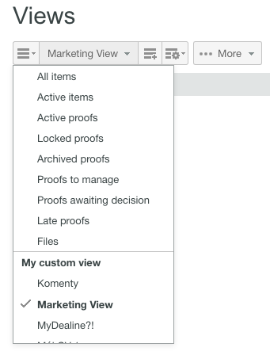

# でカスタムビューを作成および管理する [!DNL Workfront Proof]

>[!IMPORTANT]
>
>この記事では、スタンドアロン製品の機能について説明します [!DNL Workfront Proof]. 内部での検証に関する情報 [!DNL Adobe Workfront]を参照してください。 [校正](../../../review-and-approve-work/proofing/proofing.md).

ファイルと配達確認のカスタムビューを作成して、必要な項目を希望の形式でリスト表示できます。 また、カスタムビューに情報をレポートとして書き出すこともできます（CSV、コンマ区切り値、ファイル形式）。

>[!NOTE]
>
>カスタムビューは、Select プランと Premium プランでのみ利用できます。 見積もりについては、セールスチームにお問い合わせください。

## カスタムビューの作成

カスタムビューを作成する場合は、次の項目を選択できます。

* 配達確認、ファイル、またはその両方を含めるかどうか
* 表示する列
* 並べ替える列
* 列の並べ替え順（昇順または降順）
* ビューに含まれる情報の決定に使用するフィルターのタイプ

カスタムビューは、作成後すぐに使用できます。 新しいビューの名前は、My custom views （Standard ビューの下）という見出しの下のドロップダウンメニューにも表示されます。

カスタムビューを作成するには：

1. 次に移動： **[!UICONTROL 件数]** ページ。
1. ビューの詳細については、 [のビューページで項目を管理 [!DNL Workfront Proof]](../../../workfront-proof/wp-work-proofsfiles/manage-your-work/manage-items-on-views-page.md).
1. 新しいカスタムビューを最初から作成するか、既存の標準ビューに基づいて新しいカスタムビューを作成するかに応じて、次のいずれかの操作を行います。

   * 既存の標準ビューに基づいて新しいカスタムビューを作成するには：ドロップダウンメニューから、新しいカスタムビューの基礎として使用する既存の標準ビューを選択します。 次をクリック： **[!UICONTROL 設定を表示]** アイコンをクリックし、 **[!UICONTROL コピー]** を新しいカスタムビューに追加します。

   * 

   * 新しいカスタムビューを最初から作成するには、次の手順を実行します。次をクリック： **[!UICONTROL 新しいビュー]** アイコン
   * 

1. 内 **[!UICONTROL 詳細]** セクションで、次の情報を指定します。

   * **[!UICONTROL 名前]** （必須）:新しいビューの名前。 一意の名前を使用して、ユーザーがビューのドロップダウンメニューからカスタムビューを簡単に見つけられるようにします。
   * **[!UICONTROL 項目]**:配達確認とファイル、配達確認のみ、またはファイルのみをビューに含めるかどうかを選択します。 デフォルトでは、配達確認とファイルの両方が含まれます。

1. 内 **[!UICONTROL 列]** セクションで、カスタムビューに含める列を指定します。

   1. 右矢印アイコンをクリックします。
   1. 

   1. 選択した列の名前をダブルクリックします。
   1. 1 つ以上の列を選択する必要があります。1 つの列は 1 回だけ追加できます。
   1. 列を **[!UICONTROL 使用可能な列]** 新しいビューに含める領域。
   1. 列が **[!UICONTROL 使用可能な列]** リストを **[!UICONTROL 選択した列]** リスト。

   1. 標準の列から選択するか、カスタムフィールドと決定理由をカスタムビューの列に選択できます。 （お使いのアカウントで設定済みの場合は、「使用可能な列」領域の標準リストに表示されます）。
   1. 含めることができる標準列

      <table style="table-layout:auto">
      <thead>

      </thead>
      <tbody>  
      <tr>   
      <td><strong>アクティブなステージ名</strong></td>   
      <td>自動ワークフロー内のアクティブなステージの名前。</td>  
      </tr>  
      <tr>   
      <td><strong>コメント</strong></td>   
      <td>受け取ったコメントの数。</td>
      </tr>  
      <tr>   
      <td><strong>カウンター</strong></td>
      <td>アカウントにアップロードされた配達確認の数を表示します（「アカウント設定」で「配達確認カウンター」オプションを有効にする必要があります）。</td>
      </tr>
      <tr>
      <td><strong>作成日時</strong></td>
      <td>項目が作成された日時。</td>
      </tr>
      <tr>
      <td><strong>作成者</strong></td>
      <td>項目を作成したユーザー。</td>
      </tr>
      <tr>
      <td><strong>[!UICONTROL 配達確認に追加された日付 ]</strong></td>
      <td>配達確認に追加された日付。 </td>
      </tr>
      <tr>
      <td><strong>期限</strong></td>
      <td>配達確認全体の期限です。</td>
      </tr>
      <tr>
      <td><strong>決定</strong></td>
      <td>期待された数から与えられた決定の数（0/1、1/1 など）</td>
      </tr>
      <tr>
      <td><strong>[!UICONTROL ダウンロード ]</strong></td>
      <td>元のファイルがダウンロードされた回数。</td>
      </tr>
      <tr>
      <td><strong>ファイル名</strong></td>
      <td>ファイルまたは配達確認の名前。</td>
      </tr>
      <tr>
      <td><strong>フォルダー</strong></td>
      <td>項目を含むフォルダー。</td>
      </tr>
      <tr>
      <td><strong>最後のアクティビティ</strong></td>
      <td>項目の最後のアクティビティの日時。</td>
      </tr>
      <tr>
      <td><strong>に関する最新の決定</strong></td>
      <td>最後におこなった決定の日時。</td>
      </tr>
      <tr>
      <td><strong>期限</strong></td>
      <td>レビュー担当者/承認者として明示的に追加された配達確認に対する自分の期限（適用されている場合）。</td>
      </tr>
      <tr>
      <td><strong>所有者</strong></td>
      <td>項目の所有者。</td>
      </tr>
      <tr>
      <td><strong>所有者の国</strong></td>
      <td>配達確認の所有者に対してシステムに登録された国。 </td>
      </tr>
      <tr>
      <td><strong>親の配達確認</strong></td>
      <td>親配達確認の名前。</td>
      </tr>
      <tr>
      <td><strong>進捗状況</strong></td>
      <td>
プログレスバー まだ開始、開封、コメント、または決定されていない配達確認を表示します。

この情報は並べ替えられません。
</td>
      </tr>
      <tr>
      <td><strong>プルーフ名</strong></td>
      <td>配達確認の名前。</td>
      </tr>
      <tr>
      <td><strong>配達確認のタイプ</strong></td>
      <td>
配達確認のタイプ：静的ファイル、静的 Web ページ、インタラクティブ Web（.zip アップロード）、インタラクティブ Web ページ (https)、ビデオ、オーディオおよびその他。 

組み合わせた配達確認は、「組み合わせた配達確認タイプ」として識別されます。 配達確認のファイルタイプ。
</td>
      </tr>
      <tr>
      <td><strong>ファイルサイズ (MB)</strong></td>
      <td>
配達確認のファイルサイズ（ディスク使用量の割り当てに関連）。

この情報は、配達確認の現在のバージョンに対して提供されます。 現在のバージョンがない場合は、最新のバージョンが使用されます。
</td>
      </tr>
      <tr>
      <td>
 

<strong>アクティブステージの期限</strong>
</td>
      <td>自動ワークフローのステージの期限。</td>
      </tr>
      <tr>
      <td><strong>ステージ名</strong></td>
      <td>自動ワークフローの各ステージの名前。 これには、過去のステージ、アクティブなステージ、将来のステージが含まれます。</td>
      </tr>
      <tr>
      <td><strong>状態</strong></td>
      <td>アクティブ、ロック済み、ドラフト、送信済み。</td>
      </tr>
      <tr>
      <td><strong>ステータス</strong></td>
      <td>保留中、変更が必要、承認済みが変更済み、承認済みまたは関連なし。</td>
      </tr>
      <tr>
      <td><strong>タグ</strong></td>
      <td>項目に添付されるタグ。</td>
      </tr>
      <tr>
      <td><strong>今後のステージ名</strong></td>
      <td> 自動ワークフローでまだ開始していない各ステージの名前。 </td>
      </tr>
      <tr>
      <td><strong>バージョンカウンター</strong></td>
      <td> 項目のバージョン数。 </td>
      </tr>
      <tr>
      <td><strong>配達確認のバージョン番号</strong></td>
      <td><i>配達確認のバージョン番号。</i></td>
      </tr> 
      </tbody>
      </table>

   1. （オプション）次のいずれかの操作を実行して、列を **[!UICONTROL 選択した列]** 領域を新しいビューに含める：

      * 列の並べ替え **[!UICONTROL 選択した列]** リスト。
      * 列が **[!UICONTROL 選択した列]** リストは、カスタムビューで列を表示する順序を決定します。
      * 列は、 **[!UICONTROL 選択した列]** リストを **[!UICONTROL 使用可能な列]** リスト。

      * 列を **[!UICONTROL 選択した列]** リストで、列の名前を選択し、リスト内で上下にドラッグします。

      * 列を **[!UICONTROL 選択した列]** リストを表示するには、選択した列の名前をクリックし、 **[!UICONTROL 左]** 矢印。 または、選択した列の名前をダブルクリックして、 **[!UICONTROL 使用可能な列]** リスト )。

      * 列は 1 回だけ追加できます。 例えば、次の場所からコメント列を移動する場合： [!UICONTROL 利用可能] から [!UICONTROL 選択した列] リスト内で、この列の名前が次の場所に表示されなくなります： [!UICONTROL 使用可能な列] リスト。

1. 内 **[!UICONTROL 並べ替え]** セクションで、次の情報を指定します。

   * **並べ替え基準：** 以下を使用： [!UICONTROL 並べ替え] カスタムビューで項目が表示される順序を設定する場合は、「 」タブを使用します。 並べ替えの列を選択しない場合、デフォルトでは「列なし」（特別な並べ替え列や並べ替え順はありません）になります。
   * 選択した列のみ [!UICONTROL 列] タブが [!UICONTROL 列で並べ替え] 」ドロップダウンリストに表示されます。
   * **昇順または降順：** デフォルトで列を昇順または降順に並べ替えるかどうかを選択します。

1. 以下を使用： **[!UICONTROL フィルター]** 「 」セクションを使用して、カスタムビューに含める項目を選択するための 1 つ以上の条件を定義します。 フィルターは、カスタムビューをレポートとして使用する場合に特に便利です。
1. すべての項目をカスタムビューに含めるには、 **[!UICONTROL フィルター]** 」セクションに入力します。
1. 使用可能なフィルター：

   * **フィールド：** このフィルターの「フィールド」を選択します（「コメント」がデフォルトのフィールドです）。 フィールドリストには、すべての標準フィールドが含まれます ( [!UICONTROL 列] 」タブ ) をクリックします。 リストは、表示用に選択した列に限定されません。
   * **演算子：** フィルターに使用できる演算子は、選択したフィールドのタイプによって異なります。 「フィールド」と「値」フィールドの関係を表示する演算子を選択します。 この情報は後で入力します。
   * **値：** 選択したフィールドと演算子に従って、このフィールドで選択した値を選択または入力します。 選択した「演算子」に応じて、「値」フィールドが 1 つある場合と、「値が 2 つ」または「なし」の場合があります。 以下の例を参照してください。
   * **フィルターは次のロジックを使用して適用されます。** 異なるフィールド間のフィルター条件では、AND 演算子が使用されます。 同じフィールドを使用する複数のフィルター条件では、同じフィールドに対して OR 演算子が使用されます。

      コメントのない配達確認のみを表示する場合は、次の値を選択します。

      * フィールド：コメント
      * 演算子：次と等しい
      * 値フィールド：0

      2 つ以上のコメントを含む配達確認のみを表示する場合は、次の値を選択します。

      * フィールド：コメント
      * 演算子：以上
      * 値フィールド：2

      コメントが 1 ～ 4 の配達確認のみを表示する場合は、次の値を選択します。

      * フィールド：コメント
      * 演算子：期間
      * 値フィールド（最初のフィールド）:1
      * 値フィールド（2 番目のフィールド）:4

         カスタムビューに追加したフィルターは、問題なく変更したり、 [!UICONTROL 設定] 必要に応じてフィルターします。

         フィールドリストは [!UICONTROL 列] 「 」タブでは、カスタムビューで表示するために選択していない列を含むフィルターを作成する際に注意が必要です。 例えば、次の表示フィルターを使用すると、バージョンカウンター値が 2 以上のすべての配達確認が選択されます。

         * フィールド=バージョンカウンター
         * 演算子=次よりも大きいか等しい
         * 値フィールド= 2

            >[!NOTE]
            >
            >カスタムビューに追加したフィルターは、問題なく変更したり、 [!UICONTROL 設定] 必要に応じてフィルターします。

1. 内 **[!UICONTROL 共有]** 」セクションで、アカウント内のどのユーザーがカスタムビューを表示できるかを選択します。
1. カスタムビューは、作成者に固有のビューです。 デフォルトでは、新しいカスタムビューは作成者に対してのみ表示されます。ただし、次のいずれかのオプションを選択して、カスタムビューを共有することもできます。

   * **このカスタムビューを表示できるのは自分だけです** （デフォルト）:カスタムビューを自分だけに表示する場合は、このオプションを選択します。
   * **すべてのユーザーがこのカスタムビューを表示できます**:このオプションを選択すると、アカウントのすべてのユーザーがカスタムビューを利用できるようになります。
   * **このカスタムビューを表示できるユーザーを選択**:特定のユーザーのみがカスタムビューを利用できるようにするには、このオプションを選択します。
   * カスタムビューにアクセスするユーザーの名前または電子メールアドレスを入力し、ドロップダウンリストに表示されたら名前をクリックします。
   * この時点で他のユーザーとビューを共有しないように選択した場合は、後でカスタムビューを編集して共有できます。

1. 「**[!UICONTROL 作成]**」をクリックします。
1. カスタムビューが表示され、 [!DNL Views] ページ。 ビューの詳細については、 [項目を [!DNL Views] ページイン [!DNL Workfront Proof]](../../../workfront-proof/wp-work-proofsfiles/manage-your-work/manage-items-on-views-page.md).

## カスタムビューの編集

カスタムビューは簡単に編集できます。 カスタムビューを編集するには：

1. 次に移動： **[!UICONTROL 件数]** ページ。\
   ビューの詳細については、 [のビューページで項目を管理 [!DNL Workfront Proof]](../../../workfront-proof/wp-work-proofsfiles/manage-your-work/manage-items-on-views-page.md).

1. をクリックします。 [!UICONTROL 件数] ボタン (1)
1. 編集するビューをドロップダウンメニューから選択します。\
   

1. 次をクリック： **[!UICONTROL 表示オプション]** ボタンをクリックし、 **[!UICONTROL ビューを編集]**.\
   \
   カスタムビューを編集ページが表示されます。

1. をクリックします。 [!UICONTROL アクション] メニュー (3)\
   このボタンは、ビューに配達確認名列を含める場合にのみ使用できます。
1. 選択 [!UICONTROL ビューを編集] を選択します。 (4) \
   

1. カスタムビューを編集ページが表示されます。

>[!NOTE]
>
>カスタムビューを編集すると、[ 選択した列 ] ボックスの一覧の列は、自動的にアルファベット順に並べられます。 ビューを更新する前に、必要に応じて並べ替える必要があります。

## カスタムビューのコピー

「ビューをコピー」機能を使用すると、既存のカスタムビューを簡単にコピーできます。 これは、例えば、すべてのデザイナーに対して個別のビューを設定し、各ビューが配達確認の所有者（デザイナー）を除き同じである場合に、非常に便利です。

カスタムビューをコピーするには：

1. 次に移動： **[!UICONTROL 件数]** ページ。\
   ビューの詳細については、 [のビューページで項目を管理 [!DNL Workfront Proof]](../../../workfront-proof/wp-work-proofsfiles/manage-your-work/manage-items-on-views-page.md).

1. をクリックします。 **[!UICONTROL 件数]** 」ボタンをクリックします。 (1)
1. リストからカスタムビューを選択します。 (2)
1. 次をクリック： **[!UICONTROL アクション]** メニュー (3)\
   このボタンは、ビューに配達確認名列を含める場合にのみ使用できます。

1. 選択 [!UICONTROL コピー] を選択します。 (4)\
   

1. カスタムビューをコピーページでは、元の設定がすべて入力されます。 選択に従ってカスタムビューを変更し、 **[!UICONTROL ビューをコピー]** 」ボタンをクリックします。 新しいビューにすぐに移動します。\
   

## カスタムビューの共有

「共有ビュー」機能を使用すると、共有ビューの「共有」セクションでビューをまだ選択していない場合に、そのビューをアカウント内の他のユーザーと共有できます。 カスタムビューを他のユーザーと共有すると、そのビューは [!UICONTROL カスタムビュー] 「ビュー」ドロップダウンメニューの「 」セクションに表示されます。

カスタムビューを他のユーザーと共有するには：

1. 次に移動： **[!UICONTROL 件数]** ページ。\
   ビューの詳細については、 [のビューページで項目を管理 [!DNL Workfront Proof]](../../../workfront-proof/wp-work-proofsfiles/manage-your-work/manage-items-on-views-page.md).

1. をクリックします。 **[!UICONTROL 件数]** ボタン (1)
1. リストからカスタムビューを選択します (2)
1. 次をクリック： **[!UICONTROL アクション]** メニュー (3)\
   このボタンは、ビューに配達確認名列を含める場合にのみ使用できます。

1. 選択 [!UICONTROL 表示を共有] (4)
1. カスタムビューを編集ページが表示されます。
1. 内 [!UICONTROL 共有] 「 」セクションで、ビューを共有するユーザーを選択し、「 」をクリックします。 **[!UICONTROL ビューを更新]**.

   

## カスタムビューを CSV ファイルに書き出す

カスタムビューから CSV ファイルにデータを書き出すには：

1. 次に移動： **[!UICONTROL 件数]** ページ。\
   ビューの詳細については、 [のビューページで項目を管理 [!DNL Workfront Proof]](../../../workfront-proof/wp-work-proofsfiles/manage-your-work/manage-items-on-views-page.md).

1. をクリックします。 **[!UICONTROL 件数]** 」ボタンをクリックします。 (1)
1. リストからカスタムビューを選択します。 (2)
1. 次をクリック： **[!UICONTROL アクション]** メニュー (3)\
   このボタンは、ビューに配達確認名列を含める場合にのみ使用できます。

1. 選択 [!UICONTROL CSV に書き出し] を選択します。 (4)\
   \
   別のブラウザーウィンドウで、「レポートの生成」を選択します。「100%」と表示されるレコードの数（カスタムビューからレポートに含まれる項目の数）

1. （条件付き）レポートのダウンロードが現在ブロックされていることを示すセキュリティメッセージが表示された場合は、「 」をクリックしてダウンロードを続行できます。
1. クリック **[!UICONTROL 保存]** [ ファイルのダウンロード ] ウィンドウが表示され、ファイルを開くか保存するかを尋ねられます。
1. コンピュータ上の場所を選択し、ファイルを保存します。

## カスタムビューの削除

カスタムビューは簡単に削除できます。 手順は次のとおりです。

1. 次に移動： **[!UICONTROL 件数]** ページ。\
   ビューの詳細については、 [のビューページで項目を管理 [!DNL Workfront Proof]](../../../workfront-proof/wp-work-proofsfiles/manage-your-work/manage-items-on-views-page.md).

1. をクリックします。 **[!UICONTROL 件数]** 」ボタンをクリックします。
1. リストからカスタムビューを選択します。
1. 次をクリック： **[!UICONTROL アクション]** メニュー (3)\
   このボタンは、ビューに配達確認名列を含める場合にのみ使用できます。

1. 選択 [!UICONTROL 削除] を選択します。 (4)\
   

1. クリック **[!UICONTROL 削除]** (5) 現在のカスタムビューの削除を確認します。\
   

1. デフォルトのすべての項目ビューが表示され、削除したカスタムビューは **[!UICONTROL 件数]** ドロップダウンメニュー。
