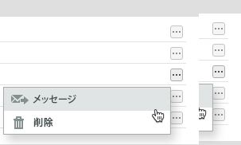

# でのファイルの管理 [!DNL Workfront Proof]

>[!IMPORTANT]
>
>この記事では、スタンドアロン製品の機能について説明します [!DNL Workfront Proof]. 内部での検証に関する情報 [!DNL Adobe Workfront]を参照してください。 [校正](../../../review-and-approve-work/proofing/proofing.md).

Workfront Proof にアップロードされたファイル（配達確認ではない）に関する情報を管理、共有および表示できます ( [ファイルと Web コンテンツのアップロード先 [!DNL Workfront Proof]](../../../workfront-proof/wp-work-proofsfiles/create-proofs-and-files/upload-files-web-content.md)) をクリックします。

1. の右にある下向き矢印をクリックします。 **[!UICONTROL 件数]** 左側のナビゲーションパネルで、 **[!UICONTROL ファイル]** 」と入力します。

1. 次をクリック： **[!UICONTROL 詳細]** ボタンをクリックし、 **[!UICONTROL ファイルの詳細を表示]** をクリックします。\
   \
   表示されるウィンドウで、ファイルの詳細を表示および編集できます。 例えば、ウィンドウ上部のファイル名を [!DNL Workfront Proof] **フォルダー** ファイルを保存し、 **所有者** ファイルの。\
   

1. （オプション）ファイルの編集権限を持っている場合は、右上隅にあるアクションボタンを使用して、ファイルを管理および共有します。

* **[!UICONTROL タグ]**. ファイルに適用されるタグを管理します。\
   \
   アクションボタンの下に、ファイルに適用されているタグが表示されます。 不要なタグの横にある x をクリックして、そのタグを削除できます。\
   

* **[!UICONTROL 指定の場所に移動]**. ファイルをフォルダーに整理します。 ファイルは、既存のフォルダー間で移動したり、新しいフォルダーに配置したりできます。\
   

* **[!UICONTROL 共有]**. 他のユーザーとファイルを共有します。 [!DNL Workfront Proof] は、カスタムメッセージとダウンロードリンクを含む電子メール通知を受信者に送信します。\
   

* **[!UICONTROL ごみ箱]**. ファイルをごみ箱に移動して削除できます。 ごみ箱が空になるまで、ファイルは保存の上限にカウントされます ( [でごみ箱を復元して空にする [!DNL Workfront Proof]](../../../workfront-proof/wp-work-proofsfiles/manage-your-work/restore-and-empty-trash.md)) をクリックします。\
   

* **[!UICONTROL 件が非表示]**. このドロップダウンリストで、 **[!UICONTROL 配達確認に変換]** ファイルの配達確認を作成するには ( [で配達確認を生成 [!DNL Workfront Proof]](../../../workfront-proof/wp-work-proofsfiles/create-proofs-and-files/generate-proofs.md)) をクリックします。 このファイルは、配達確認のファイルタイプ要件を満たしている必要があります ( [サポートされている検証ファイルの種類とサイズ制限の概要](../../../review-and-approve-work/proofing/proofing-overview/supported-proofing-file-types.md)) をクリックします。 ファイル名が既存の配達確認の名前と一致する場合、 [!DNL Workfront Proof] をクリックすると、ファイルを **[!UICONTROL 新しいバージョン]** を参照してください（を参照）。\
   

   >[!TIP]
   >
   >別のファイルから共有されたファイルの場合 [!DNL Workfront Proof] アカウント（自分のアカウントにアップロードされたものではない）の変換は、Enterprise Plans でのみ利用できます。

   また、 **[!UICONTROL ダウンロード]** をクリックして、元のファイルをコンピューターにダウンロードします。

1. （オプション） **[!UICONTROL 共有先]** 「 」セクションに、ファイルの共有先ユーザーの一覧が表示されます。

   以下が可能です。 **[!UICONTROL メッセージ]** または **[!UICONTROL 削除]** ユーザーが **[!UICONTROL 詳細]** アイコンが右側に表示されます。

   

   これらのユーザーの 1 つを「メッセージ」にする場合、 **[!DNL Message all]** ページが表示され、複数のメッセージを一度に送信できます。

1. を開きます。 **[!UICONTROL アクティビティ]** 「 」セクションに、ファイルに関するすべてのアクティビティのリストが表示されます。このリストには、日時、アクションを実行したユーザーが含まれます。 アクティビティには次のものが含まれます。

   * ファイルがアップロードされました
   * 新しい担当者が追加されました
   * 削除された担当者
   * ダウンロードされたファイル

1. を開きます。 **[!UICONTROL メッセージ]** セクションを使用して、ユーザーがファイルと関連付けて送信したメッセージをトレースします。 右側の「i」アイコンをクリックすると、メッセージのコンテンツを表示できます。
