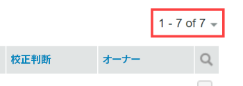

# 項目を [!UICONTROL 件数] ページイン [!DNL Workfront Proof]

>[!IMPORTANT]
>
>この記事では、スタンドアロン製品の機能について説明します [!DNL Workfront Proof]. 内部での検証に関する情報 [!DNL Adobe Workfront]を参照してください。 [校正](../../../review-and-approve-work/proofing/proofing.md).

この [!UICONTROL 件数] ページでは、すべての配達確認、ファイルおよびフォルダーを 1 か所で表示および操作できます。

## 表示 [!UICONTROL 件数] ページ

1. クリック **[!UICONTROL 件数]** 左側のサイドバーに表示されます。
1. ドロップダウンメニュー (2) から、表示するビュー (3) をクリックします。

## 変更 [!UICONTROL 件数] ページレイアウト

デフォルト [!UICONTROL 件数] ページレイアウトは「サムネール」リストです。 このレイアウトでは、各配達確認、ファイル（生成可能な場合）、フォルダー（設定可能な場合）のミニチュア画像と、その他の詳細情報が別々の列に含まれている画像を確認できます。

1. 次をクリック： **[!UICONTROL ページレイアウト]** アイコン (1) をクリックし、必要なレイアウトを選択します。

## 変更 [!UICONTROL 件数] リスト

内の表示内容を変更するには [!UICONTROL 件数] リスト：

1. 次をクリック： **[!UICONTROL ビューを変更]** 」ボタンをクリックします。\
   このボタンに表示される名前は、最後に使用したときに選択した表示によって異なります。\
   

1. ドロップダウンメニューで別のビューをクリックします。

   * **[!UICONTROL すべての項目]**:表示する権限を持つすべての配達確認、ファイル、フォルダーが含まれます。 これは、 [!UICONTROL 件数] ページ。 このビューでは、アーカイブ済みの配達確認を含めるか除外するかを選択できます。
   * **[!UICONTROL アクティブな項目]**:すべてのアクティブな配達確認、ファイルおよびフォルダー。
   * **[!UICONTROL 有効な配達確認]**:表示する権限を持つ、アクティブな（アーカイブされていない）すべての配達確認。
   * **[!UICONTROL ロックされた配達確認]**:ロックされた配達確認のみ。
   * **[!UICONTROL アーカイブした配達確認]**:アーカイブした配達確認のみ ( [アーカイブ [!DNL Workfront Proof]](../../../workfront-proof/wp-work-proofsfiles/organize-your-work/archive.md)) をクリックします。

   * **[!UICONTROL 配達確認]**:自分が所有者で、自分に委任された配達確認のみを表示します。 詳しくは、 [での一時配達確認所有者の指定 [!DNL Workfront Proof]](../../../workfront-proof/wp-getstarted/personal-settings/designate-temp-proof-owners.md).

   * **[!UICONTROL 配達確認が決定待ちです]**:決定が必要な配達確認のみを表示します
   * **[!UICONTROL 配達確認の遅延]**:期限が過ぎた配達確認のみを表示
   * **[!UICONTROL ファイル]**:ファイルのみを表示
   これらの各ビューには、次の列が含まれます

   * **タイプ**:配達確認、ファイルまたはフォルダーのアイコンを持つ項目のアイコン
   * **名前**:配達確認の名前、ファイルまたはフォルダー
   * **進行状況**:S=送信済み、O=開封済み、C=コメント、D=決定（プログレスバーを参照）
   * **ステータス**: [!UICONTROL 保留中、変更が必要、承認済み]
   * **決定**:行われた決定の数と必要な数
   * **所有者**:配達確認を所有する人の名前\

      配達確認、「配達確認は決定を待っています」および「遅延配達確認」表示には、「期限」という列が追加されます。 この列には、レビュー担当者または承認者として明示的に追加された配達確認に対する独自の締め切りが表示されます。

      >[!NOTE]
      >
      >ビューページから移動し、同じセッションの後半に戻ると、最後に選択したビューが表示されます。

      また、独自のビューを作成することもできます。 詳しくは、 [でカスタムビューを作成および管理する [!DNL Workfront Proof]](../../../workfront-proof/wp-work-proofsfiles/manage-your-work/create-and-manage-custom-views.md) を参照してください。

## 項目のフィルタリング

ビューに表示される情報をフィルタリングできます。

1. 次をクリック： **フィルターを表示** アイコンをクリックします (1)。\
   

1. フィルターバー (2) が表示され、各カテゴリには、希望の値を選択するためのフィルタードロップダウンメニュー (3) が表示されます。 各カテゴリのデフォルト値は「すべて」です。
1. フィルターバーは、作成したカスタムビューには表示されません。 これらのビューの場合、 [!UICONTROL フィルター] タブをクリックします。 詳しくは、 [でカスタムビューを作成および管理する [!DNL Workfront Proof]](../../../workfront-proof/wp-work-proofsfiles/manage-your-work/create-and-manage-custom-views.md).
1. 選択したすべてのフィルターを適用するには、 [!UICONTROL フィルター] アイコン (4) をクリックします。\
   

選択した [ フィルタ ] の値は、変更するまで有効です。 項目の完全なリストを再度表示してアクセスする場合は、すべてのフィルタ値をデフォルト ( **[!UICONTROL すべて]**.

>[!NOTE]
>
>フィルターオプションを設定した後、 [!UICONTROL フィルターを非表示] アイコン (5) をクリックすると、ビューを変更した場合に、バーが自動的に再び表示されます。 すべてのフィルターがデフォルトのすべてのオプションに設定されている間に、フィルタリングバーを非表示にした場合、ビューを変更しても、フィルタリングバーは非表示のままになります。

## 項目の並べ替え

新しい配達確認（またはバージョン）を作成したり、新しいファイルをアップロードすると、配達確認が [!UICONTROL すべての項目] リスト。 最も古い項目がリストの下部に表示されます。

リストを別の並べ替え順で表示するには：

1. 次のいずれかの操作を行います。

   * リストの列見出しの 1 つをクリックします。タイプ、名前、ステータス、決定または所有者。\

      例えば、配達確認やファイルをアルファベット順に表示する場合は、「名前」見出しを 1 回クリックして、名前を昇順 (A ～ Z) で並べ替えます。\
      「配達確認名」見出しを再度クリックすると (2)、順序が逆になり、配達確認が降順 (Z ～ A) で表示されます。

   * 右上の下向き矢印をクリックします。 [!UICONTROL 件数] 作成日（最新または最古）またはタイプ、名前、ステータス、決定、所有者で並べ替えるページ。\

      \
      列が昇順で並べ替えられている場合、列ヘッダーには列名の横に上向き矢印が表示されます。 順序を逆にする（降順に）には、該当する列ヘッダーをクリックします（列名の横に下向き矢印が表示されます）。

   * 項目の並べ替え順を変更した場合、変更は [ すべての項目 ] ページに表示されたままになるまで、最後に行われます。 すべての項目ページから移動して後で戻ると、その項目はデフォルトの時系列で再び表示されます。

## 配達確認の概要の表示

配達確認に関する詳細情報を表示するには、次の手順を実行します。

1. 配達確認画像の左側にある矢印をクリックします。\
   矢印が下を向き、配達確認の概要が、配達確認に関する基本情報の下に表示されます。 配達確認の概要には、次の内容が表示されます。

   * **配達確認の概要**:配達確認の全体的なステータス
   * **ステージ**:配達確認の期限、および実行された決定と必要な決定の数を示します
   * **レビュー担当者**:各レビュー担当者の名前、役割、進行状況が表示されます
   * **バージョン**:表示されている配達確認のバージョンと使用可能なバージョンの合計数
   * **フォルダー**:配達確認が配置されているフォルダー
   * **都道府県**:アクティブ、ロック済み、ドラフト、送信済み

1. （オプション）配達確認の編集権限を持っていて、配達確認にステージがある場合、 **[!UICONTROL 詳細]** （3 ドット）ステージの右側のメニューで、次のオプションにアクセスできます。

   * **[!UICONTROL すべてをメッセージ]**:ステージ上のすべてのレビュー担当者に E メールを送信します。
   * **[!UICONTROL 共有]**:新しいレビュー担当者を追加
   * **[!UICONTROL ステージを削除]**

1. （オプション）レビュー担当者の **[!UICONTROL 詳細]** （3 ドット）名前の右にあるメニューで、次のいずれかの操作を行います。

   * レビュー担当者にリマインダーメッセージを送信します。
   * 配達確認のレビュー担当者の設定を編集します。\

      表示される「レビュー担当者の編集」ボックスでは、役割と電子メールの警告だけでなく、レビュー担当者の表示名も変更できます。 表示名は、特定の配達確認に対してのみ変更でき、連絡先ページのレビュー担当者の詳細では変更できません。 詳しくは、 [連絡先](https://support.workfront.com/hc/en-us/sections/115000920808-Contacts) を参照してください。

   * 配達確認の決定者にするプライマリを選択します。
   * 配達確認からレビュー担当者を削除します。
   * 配達確認に追加されたレビュー担当者の役割および E メールアラートを変更することもできます。

## アーカイブした配達確認の含める/除外

この [!UICONTROL すべての項目] デフォルトで表示には、アクティブなロック済みの配達確認、ファイルおよびフォルダーがすべて表示されます。 また、ビューにアーカイブ済みの配達確認を含めるか除外するかを選択することもできます。\
アーカイブした配達確認を含めるには：

1. ビューを選択したら、 **[!UICONTROL アーカイブした配達確認を含める]**.\
   \
   アーカイブされた配達確認は、他の配達確認と区別するために、アーカイブされたアイコン付きで表示されます。\
   

## リストビューから項目を開く

1. 次のいずれかの操作を行います。

   * 配達確認、ファイルまたはフォルダーに関する詳細を表示するには、その名前をクリックします。
   * 校正ビューアで配達確認を開くには、 **[!UICONTROL 配達確認に移動]**.\

      校正ビューアについて詳しくは、 [配達確認の確認](../../../review-and-approve-work/proofing/reviewing-proofs-within-workfront/review-a-proof/review-a-proof.md).

## 複数の項目に対するアクションの実行

複数の項目を選択する手順は、次のとおりです。

1. リストの上のチェックボックスをクリックします。\
   

1. [ ビュー ] リストの上に表示される追加のオプションで、選択したファイルに対して次のいずれかの操作を行います。

   * クリック **[!UICONTROL タグ]** をクリックして、これらの項目にタグを追加します。
   * クリック **[!UICONTROL 移動先]** 選択した項目を別のフォルダーに移動する ( または（「フォルダーが選択されていません」）を選択した場合は、項目をフォルダーから移動する )。
   * クリック **[!UICONTROL 選択した項目を共有]** これらのすべての項目を追加のレビュー担当者と共有するには、\

      

   * クリック **[!UICONTROL 削除]** 選択した項目をごみ箱に移動します。\

      

   * 次をクリック： **[!UICONTROL 詳細]** メニューを使用して、追加のアクションを実行できます。

   * アクションは、選択した項目の中で特定のオプションを使用できるものにのみ適用されます。 例えば、「ファイルと配達確認」を選択し、「 [!UICONTROL ロック]、配達確認のみがロックされます（ファイルをロックできないため）。

## フォルダへの項目の移動

編集権限を持っている場合は、配達確認、ファイルおよびフォルダーを、 [!UICONTROL 件数] ページ。

1. サイドバーのフォルダーツリーを開くには、一番上のフォルダーの左にある矢印をクリックします。
1. 次のいずれかの操作を行います。

   * 1 つの項目を移動するには、項目をクリックしたまま、移動先のフォルダーに項目をドラッグ&amp;ドロップします。
   * 複数の項目を同時に移動するには、項目の左側にあるチェックボックスをオンにし、「**[!UICONTROL 移動先]**リストの上にある場合は、配置するフォルダーを選択するか、新しいフォルダーを作成します。
