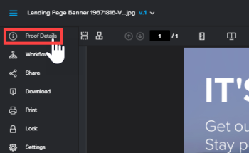

# [!DNL Workfront Proof] でのプルーフ詳細の管理

>[!IMPORTANT]
>
>この記事では、スタンドアロン製品 [!DNL Workfront Proof] の機能について説明します。[!DNL Adobe Workfront] 内でのプルーフについて詳しくは、[プルーフ](../../../review-and-approve-work/proofing/proofing.md)を参照してください。

[!UICONTROL プルーフの詳細]ページでは、既存のプルーフを管理できます。例えば、新しいレビュー担当者の追加、期限の修正、プルーフの当初の設定の変更、プルーフに対して発生したアクティビティの確認などを行うことができます。

[!UICONTROL プルーフの詳細]ページは、プルーフのすべての変更を追跡する必要があるプロジェクト担当者に特に役立ちます。このページでは、数回クリックするだけで、プルーフに関して必要なすべての情報を確認できます。

自動化ワークフローのプルーフの管理方法については、[自動化ワークフローで設定されたプルーフの管理： [!DNL Workfront Proof]](../../../workfront-proof/wp-work-proofsfiles/automated-workflow/manage-proof-configured-auto-workflow.md) を参照してください。

## ビューリストからプルーフの詳細ページを開く

1. プルーフの右にある&#x200B;**[!UICONTROL その他]**（3 ドット）メニューをクリックし、「**[!UICONTROL プルーフの詳細を表示]**」をクリックします。

## プルーフビューアからプルーフの詳細ページを開く

1. 左ツールバーが表示されていない場合は、左上隅にある&#x200B;**[!UICONTROL メニュー]**&#x200B;アイコンをクリックします。\
   

1. 左ツールバーにポインタを合わせ、「**[!UICONTROL プルーフの詳細]**」をクリックします。\
   

   >[!NOTE]
   >
   >プルーフビューアーからプルーフの詳細ページにアクセスできるのは [!DNL Workfront Proof] ユーザーのみです。詳しくは、[ユーザー](https://support.workfront.com/hc/ja-jp/sections/115000911887-Users)を参照してください。

   [プルーフのステージとレビュー担当者の編集](../../../review-and-approve-work/proofing/managing-proofs-within-workfront/edit-proof-stages-and-reviewers.md)および[プルーフの設定： [!DNL Workfront Proof]](../../../workfront-proof/wp-work-proofsfiles/manage-your-work/configure-proof-settings.md) も参照してください。

## プルーフの詳細ページの情報とオプション

プルーフの詳細ページには、次の情報が表示されます。プルーフの編集権限がある場合は、これらの詳細の一部を編集できます。[!DNL Workfront Proof] では、ユーザーの変更内容を自動的に保存します。詳しくは、[プルーフ権限プロファイル： [!DNL Workfront Proof]](../../../workfront-proof/wp-acct-admin/account-settings/proof-perm-profiles-in-wp.md) および [プルーフの役割の管理： [!DNL Workfront Proof]](../../../workfront-proof/wp-work-proofsfiles/share-proofs-and-files/manage-proof-roles.md) を参照してください。

>[!NOTE]
>
>使用可能なオプションは、プルーフでの役割、権限プロファイル、プルーフの設定によって異なるので、ページに必ずしもすべての項目が表示されない場合があります。詳しくは、[プルーフの役割の管理： [!DNL Workfront Proof]](../../../workfront-proof/wp-work-proofsfiles/share-proofs-and-files/manage-proof-roles.md)、[プルーフ権限プロファイル： [!DNL Workfront Proof]](../../../workfront-proof/wp-acct-admin/account-settings/proof-perm-profiles-in-wp.md)、[Workfront Proof でのプルーフの設定](../../../workfront-proof/wp-work-proofsfiles/manage-your-work/configure-proof-settings.md)を参照してください。

* プルーフ名：[!DNL Workfront Proof] では、プルーフの作成時に名前を付けない限り、プルーフの作成に使用した元のファイル名を使用して、左上隅に大きな文字でプルーフ名を作成します。この名前をクリックすると編集できます。
* プルーフの基本情報：

   * **フォルダー：**&#x200B;プルーフがフォルダーに保存されている場合は、フォルダー名と、そのフォルダーを共有しているユーザー数が表示されます。ここで、プルーフの場所を別の場所に変更できます。詳しくは、[フォルダーの管理： [!DNL Workfront Proof]](../../../workfront-proof/wp-work-proofsfiles/organize-your-work/manage-folders.md) を参照してください。

   * **ファイル名**：結合したプルーフの場合、プルーフに含まれているファイルのリストを&#x200B;**[!UICONTROL クリックして表示]**&#x200B;できます。

   * **所有者：**&#x200B;プルーフを所有するユーザーです。ここでは、プルーフに別の所有者を選択できます。詳しくは、[プルーフ権限プロファイル： [!DNL Workfront Proof]](../../../workfront-proof/wp-acct-admin/account-settings/proof-perm-profiles-in-wp.md) を参照してください。

   * **委任済み：**「不在」機能が有効になっている場合、プルーフの委任所有者が表示されます。詳しくは、[一時的なプルーフ所有者の指定： [!DNL Workfront Proof]](../../../workfront-proof/wp-getstarted/personal-settings/designate-temp-proof-owners.md) を参照してください。

   * **作成日時：**&#x200B;プルーフがアップロードされた日時です。
   * **状態：**&#x200B;プルーフの現在の状態です。ここでプルーフの状態を変更できます。詳しくは、[プルーフの進捗とステータスの表示： [!DNL Workfront Proof]](../../../workfront-proof/wp-work-proofsfiles/manage-your-work/view-progress-and-status-of-proof.md) を参照してください。

   * **ID**：[!DNL Workfront Proof] で作成されたすべてのプルーフに割り当てられる一意の番号

* プルーフの基本的な詳細の上に表示されるアクションボタン：

   * **[!UICONTROL プルーフに移動]**：プルーフビューアーでプルーフを開きます。
   * **[!UICONTROL 共有]**：プルーフをレビュー担当者と共有できます。詳しくは、[プルーフの共有： [!DNL Workfront Proof]](../../../workfront-proof/wp-work-proofsfiles/share-proofs-and-files/share-proof.md) を参照してください。

   * **[!UICONTROL ダウンロード]**：結合したプルーフの場合、個々のファイルをダウンロードできます（ZIP ファイルに圧縮されています）。詳しくは、[保存されているファイルのダウンロード： [!DNL Workfront Proof]](../../../workfront-proof/wp-work-proofsfiles/manage-your-work/download-files-stored.md) を参照してください。

   * **[!UICONTROL コメントを印刷します]**。すべての決定、コメント、マークアップを含む、プルーフの印刷可能なレポートを作成できます。詳しくは [ [!DNL Workfront Proof]](../../../workfront-proof/wp-work-proofsfiles/organize-your-work/print-and-export-comments.md) でのコメントの印刷と書き出しを参照してください。

   * **[!UICONTROL その他]**：このメニューには、複数のアクションが含まれます。

      * **[!UICONTROL Excel に書き出し]**：プルーフを Excel に書き出す方法について詳しくは、[ [!DNL Workfront Proof]](../../../workfront-proof/wp-work-proofsfiles/organize-your-work/print-and-export-comments.md) でのコメントの印刷と書き出しを参照してください。

      * **[!UICONTROL このバージョンをコピー]**&#x200B;および&#x200B;**[!UICONTROL 新しいファイルでコピー]**：プルーフのバージョンのコピーについて詳しくは、[ [!DNL Workfront Proof]](../../../workfront-proof/wp-work-proofsfiles/create-proofs-and-files/copy-proofs.md) でのプルーフのコピーを参照してください。

      * **[!UICONTROL ロック]**：プルーフをロックすると、プルーフがアクティブ状態からロック状態に移動します。

        プルーフがロックされると、プルーフに対してコメントしたり決定を下したりすることができなくなります。この設定をプルーフに適用すると、すべての決定が行われたときに、プルーフを自動的にロックするように設定できます。

      * 新しいバージョンのプルーフをアップロードすると、以前のバージョンは自動的にロックされます。詳細情報は、以下を参照してください。
      * **[!UICONTROL 以前のバージョンを変更]**：同じプルーフチェーン内のバージョンとして別々のプルーフをリンクできます（また、それぞれのプルーフに対するすべてのマークアップとコメントを保持します）。これは、プルーフの最新バージョンとなるプルーフの、プルーフの詳細ページから行う必要があります。詳しくは、[ [!DNL Workfront Proof]](../../../workfront-proof/wp-work-proofsfiles/manage-your-work/manage-proof-versions.md) でのプルーフのバージョンの管理を参照してください。

      * **[!UICONTROL 以前のバージョンへのリンクを削除]**：現在表示中のプルーフを、アカウント内の別のプルーフにリンクすることなく、親プルーフ（以前のバージョン）からリンク解除できます。詳しくは、[ [!DNL Workfront Proof]](../../../workfront-proof/wp-work-proofsfiles/manage-your-work/manage-proof-versions.md)でのプルーフのバージョンの管理にある、[ [!DNL Workfront Proof]](../../../workfront-proof/wp-work-proofsfiles/manage-your-work/manage-proof-versions.md)でのプルーフのバージョンの管理を参照してください。

      * **[!UICONTROL 自動ワークフローに変換]**：プルーフのワークフローを基本ワークフローから自動ワークフローに変換します。詳しくは、[自動ワークフローの概要](../../../review-and-approve-work/proofing/proofing-overview/automated-workflow.md)を参照してください。
   * **[!UICONTROL ワークフロー]**&#x200B;セクション：プルーフの進行状況と期限を確認し、ワークフローステージと個々のレビュー担当者の設定を変更できます。

     ワークフローステージは、レビュアーに設定された期限を使用して、レビュアーをグループ化するシステムによって自動的に作成されます。ステージの期限を設定する（期限日が過去でない場合）ことで、担当者をステージに追加できます。また、プルーフに関する個々のレビュアー担当者の進行状況や決定を確認し、プルーフおよびメールアラートでの役割を変更することもできます。

     ステージの編集について詳しくは、[プルーフのステージとレビュアーの編集](../../../review-and-approve-work/proofing/managing-proofs-within-workfront/edit-proof-stages-and-reviewers.md)を参照してください。

     >[!NOTE]
     >
     >プルーフのステージとレビュアーの詳細を編集するには、プルーフの編集権限が必要です。詳しくは、[ [!DNL Workfront Proof]](../../../workfront-proof/wp-work-proofsfiles/share-proofs-and-files/manage-proof-roles.md) でのプルーフの役割の管理、および[ [!DNL Workfront Proof]](../../../workfront-proof/wp-acct-admin/account-settings/proof-perm-profiles-in-wp.md) のプルーフ権限プロファイルを参照してください。

   * **[!UICONTROL その他の共有オプション]**&#x200B;セクション：プルーフ URL と埋め込みコードを有効にできます。[!DNL Workfront] プルーフとの Basecamp 統合を使用する場合、このセクションでは、プルーフを [!DNL Basecamp] プロジェクトに追加したり、プルーフを追加したプロジェクトを変更したり（「**[!UICONTROL 編集]**」をクリック）、Basecamp でプルーフにアクセスしたり（提供されたリンクをクリック）することができます。

   * **[!UICONTROL 設定]**&#x200B;セクション： [!DNL Workfront Proof]](../../../workfront-proof/wp-work-proofsfiles/manage-your-work/configure-proof-settings.md) での [[!UICONTROL プルーフの設定]で説明されているように、設定を変更できます。

   * **[!UICONTROL アクティビティ]**&#x200B;セクション：プルーフに対して実行されたすべてのアクションのリストを時系列順に表示し、プルーフの監査証跡を提供します。これには、プルーフに関する最近のアクティビティの日付と詳細が含まれます。[!UICONTROL メッセージ]セクションと併せて、[!UICONTROL アクティビティ]セクションでは、プルーフのレビュープロセスの完全な概要を説明します。これは、承認プロセスを担当するプロジェクトマネージャーにとって特に役立ちます。
   * **[!UICONTROL メッセージ]**&#x200B;セクション：プルーフのすべてのメールアクティビティの詳細をリスト表示します。詳しくは、[ [!DNL Workfront Proof]](../../../workfront-proof/wp-emailsntfctns/email-alerts/config-email-notification-settings-wp.md) でのメール通知の設定を参照してください。

     また、レビュアーに送信されたメッセージ全体を表示するには、メッセージの右側の「i」アイコンにポインタを合わせ、「**[!UICONTROL 完全なメッセージを表示]**」をクリックします。
