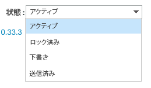

# Workfront Proof のプルーフの状態について

>[!IMPORTANT]
>
>この記事では、スタンドアロン製品 [!DNL Workfront Proof] の機能について説明します。[!DNL Adobe Workfront] 内でのプルーフについて詳しくは、[プルーフ](../../../review-and-approve-work/proofing/proofing.md)を参照してください。

[!DNL Workfront Proof] では、プルーフは様々状態で存在します。これらの状態によって、コメント機能や校正判断など、プルーフに対して実行できるアクションが決まります。

## プルーフの状態について

4 つの状態は次のとおりです。

* [アクティブ](#active)
* [ロック済み](#locked)
* [ドラフト（ドロップゾーンのみ）](#draft-dropzone-only)
* [送信済み（ドロップゾーンのみ）](#submitted-dropzone-only)

### アクティブ {#active}

新規プルーフページまたはドロップゾーンを通して [!DNL Workfront Proof] にアップロードされたプルーフは、処理後アクティブと表示されます。プルーフがアクティブな場合、ユーザーはプルーフに対してレビュー、コメントの作成および校正判断を行うことができます。

>[!NOTE]
>
>ドロップゾーンを通じてアップロードされたプルーフは、「送信時にプルーフを有効にする」オプションが有効な場合にのみ、アクティブとして表示されます。このオプションが有効になっていない場合は、プルーフを手動で有効にする必要があります。

ドロップゾーンの設定について詳しくは、[ [!DNL Workfront Proof]](../../../workfront-proof/wp-acct-admin/account-settings/configure-dropzone-in-wp.md) でのドロップゾーンの設定を参照してください。

### ロック済み {#locked}

プルーフのレビューが終了したら、プルーフをロックできます。プルーフをロックすると、プルーフに対するコメントや校正判断を実行できなくなりますが、プルーフを開くことはできます。

プルーフの編集権限を持つユーザーであれば、誰でもロックを解除できます。

権限について詳しくは、[ [!DNL Workfront Proof]](../../../workfront-proof/wp-acct-admin/account-settings/proof-perm-profiles-in-wp.md) のプルーフ権限プロファイルを参照してください。

>[!NOTE]
>
>プルーフがロックされた際にメール通知が送信されなくなりました。例えば、プルーフが期限より前にロックされている場合、期限を過ぎると通知メールは送信されません。

### ドラフト（ドロップゾーンのみ） {#draft-dropzone-only}

ドロップゾーンからプルーフを送信すると、管理者がアクティブ化する前にドラフト状態になります。ドラフトゾーンの場合は、プルーフに対して何のアクションも実行できません。

### 送信済み（ドロップゾーンのみ） {#submitted-dropzone-only}

管理者がドラフトを有効にすると、プルーフはドロップゾーンに送信済みと表示されます。送信後、プルーフに対してアクションを実行できます。

## プルーフの状態の表示と変更

特定の状態でのすべてのプルーフのリストの表示（すべてのアクティブなプルーフまたはロックされたプルーフの表示など）について詳しくは、[ [!DNL Workfront Proof]](../../../workfront-proof/wp-work-proofsfiles/manage-your-work/manage-items-on-views-page.md) のビューページでの項目の管理の記事の[ [!DNL Workfront Proof]](../../../workfront-proof/wp-work-proofsfiles/manage-your-work/manage-items-on-views-page.md) のビューページでの項目の管理を参照してください。

1. [!DNL Workfront Proof] ダッシュボードにアクセスします。

   詳しくは、[Adobe Workfrontから  [!DNL Workfront Proof]  へのアクセス](../../../review-and-approve-work/proofing/managing-proofs-within-workfront/access-wf-proof-in-workfront.md)を参照してください。

1. **[!UICONTROL ダッシュボード]**&#x200B;で、表示するプルーフまたは状態を変更するプルーフの横の「**[!UICONTROL 展開]**」の矢印をクリックします。

   

   「**[!UICONTROL ワークフロープロセス]**」セクションが表示されます。

   

1. **[!UICONTROL ワークフロープロセス]**&#x200B;で&#x200B;**[!UICONTROL ステート]**&#x200B;を表示します。

1. （オプション）状態を変更するには、現在の「**[!UICONTROL 状態]**」をクリックし、ドロップダウンメニューをクリックして、新しい状態を選択します。

   
