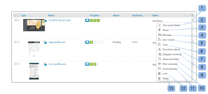

# 配達確認の進行状況とステータスをで表示 [!DNL Workfront Proof]

>[!IMPORTANT]
>
>この記事では、スタンドアロン製品の機能について説明します [!DNL Workfront Proof]. 内部での検証に関する情報 [!DNL Adobe Workfront]を参照してください。 [校正](../../../review-and-approve-work/proofing/proofing.md).

## 配達確認の進行状況について

配達確認の進行状況は、配達確認をレビュー担当者に送信した時点から配達確認を決定した時点までに、配達確認に対しておこなわれる作業を示します。

* [進行状況アイコン](#progress-icons)
* [配達確認の進行状況のレベル](#levels-of-proof-progress)

### 進行状況アイコン {#progress-icons}

進行状況アイコン（S、O、C および D）がプログレスバーに表示され、配達確認の進行状況を示します。

配達確認に関する次の情報を示します。

<table style="table-layout:auto"> 
 <col> 
 <col> 
 <thead> 
  <tr> 
   <td> 
<strong>進行状況アイコン</strong> 
 </td> 
   <td> 
<strong>説明</strong> 
 </td> 
  </tr> 
 </thead> 
 <tbody> 
  <tr> 
   <td> 
  
 </td> 
   <td> 
<strong>送信済み</strong>. 配達確認がレビュー担当者に送信されました。
 </td> 
  </tr> 
  <tr> 
   <td> 
  
 
 
 </td> 
   <td> 
<strong>開封済み</strong>. 校正の詳細ページを開いたか、校正ビューアで配達確認自体を開いています。
 </td> 
  </tr> 
  <tr> 
   <td> 
  
 </td> 
   <td> 
<strong>コメント</strong>. 配達確認に対してレビュー担当者（コメントを作成できるユーザー）がコメントを行いました。
 
配達確認のレビュー担当者が指定されていない場合、このアイコンは表示されません。
 </td> 
  </tr> 
  <tr> 
   <td> 
  
 </td> 
   <td> 
<strong>決定</strong>. レビュー担当者が配達確認に関する決定をおこないました。
 
配達確認の承認者（意思決定者）が指定されていない場合、このアイコンは表示されません。 
 </td> 
  </tr> 
 </tbody> 
</table>

これらのアイコンは、配達確認の進行状況に関する特定の情報を示すために、次の色で表示されます。

* **緑**. 完了.
* **白**. 未完了。
* **オレンジ**. 完了せず、期限が 24 時間未満です。
* **赤**. 完了せず、期限を過ぎていません。

### 配達確認の進行状況のレベル {#levels-of-proof-progress}

Workfront Proof は、進行状況アイコンを使用して、次の各レベルでの配達確認の進行状況を追跡します。

* 各レビュー担当者に対する、配達確認に対するそのユーザーのアクティビティに基づく。
* 各ステージで、検証プロセスで最も遅れているステージのレビュー担当者の進捗状況に基づきます。 詳しくは、 [自動ワークフローステージの概要](../../../review-and-approve-work/proofing/proofing-overview/stages.md).
* 配達確認の場合は、校正プロセスで最も遅れているステージ（レビュー担当者のグループ）の進捗状況に基づきます。

例： [!DNL Workfront Proof] 最も遅れているレビュー担当者またはステージを使用して進行状況を決定します。配達確認の 3 人のレビュー担当者が決定を下す必要があるとします。 2 人が決定したが、3 人目が決定しなかった場合、配達確認の進行状況バーには、未処理の決定のために D が緑色で表示されません。

この [!UICONTROL プライマリ意思決定者] 配達確認の設定が選択され、主な意思決定者が決定を送信すると、配達確認の進行状況バーの D が、他の決定が不要なので、すべてのレビュー担当者に対して緑色に変わります。

同様に、 [!UICONTROL 1 つの決定のみが必要です] 配達確認の設定が選択され、任意のレビュー担当者が決定を送信すると、配達確認の進行状況バーの「 D 」が、他の決定が不要なので、すべてのレビュー担当者の緑色に変わります。

## 配達確認のステータスについて

配達確認ステータスには、配達確認に必要な決定のステータスが表示されます。

\
標準ステータスのオプションは次のとおりです。

* 保留中
* 承認済み
* 変更も承認済み
* 変更が必要です
* 関連なし

アカウントでカスタムの決定が設定されている場合、ステータスオプションはカスタムの決定設定を反映します。

配達確認のステータスは、「最悪のケース」の参加者によって決まります。 例えば、配達確認に関して 3 つの決定があるとします。2 人は～の地位を持っている **許可済み** そして一人は **却下**. 「却下されたオーバールール」の「最悪のケース」の決定は、他の決定と配達確認の全体的なステータスは、次のように表示されます **却下**.

## 進行状況とステータスの表示 {#viewing-progress-and-status}

各ステージで、配達確認、ステージ、レビュー担当者の進行状況およびステータスを表示できます。

* [配達確認の概要](#proof-summary)
* [ステージアクションメニュー](#stage-actions-menu)
* [内 [!UICONTROL 概要] 「 」セクションでは、配達確認の編集権限を持っている場合に、レビュー担当者のアクションメニューにアクセスすることもできます。 詳しくは、 Workfront配達確認の配達確認権限プロファイルおよびWorkfront配達確認の配達確認の役割の管理を参照してください。 この [!UICONTROL レビュー担当者のアクション] レビュー担当者の詳細にカーソルを合わせるとメニュー (1) が表示され、次の操作を実行できます。](#in-the-summary-section-you-can-also-access-the-reviewer-actions-menus-provided-you-have-edit-rights-on-the-proof-for-more-information-see-proof-permissions-profiles-in-workfront-proof-and-manage-proof-roles-in-workfront-proof-the-reviewer-actions-menu-1-appears-when-you-hover-over-the-reviewer-s-details-and-allows-you-to)
* [配達確認アクションメニュー](#proof-actions-menu)

### 配達確認の概要 {#proof-summary}

フォルダー内の各配達確認には、配達確認の詳細をすばやく表示および編集できる、拡大可能な概要が表示されます。

サマリーを展開または折りたたむには：

1. ダッシュボードまたは任意のリスト表示で、配達確認の左側にある矢印をクリックします。

概要には、以下が含まれます。

* ワークフロー (2)
* バージョン (3)
* フォルダ (4)
* 都道府県 (5)\
   

概要では、配達確認の次の詳細を表示および編集できます。

* 配達確認の進行状況 (1)
* 各ステージの進捗状況 (2)
* ステージの期限設定 (3)
* レビュー担当者の詳細：

   * 各レビュー担当者が行ったコメントと返信の数 (4)
   * 各レビュー担当者の進行状況 (5)
   * 決定（決定に電子署名が含まれている場合、決定の横にアイコンが表示され、これを示します。） (6)
   * 配達確認に対する役割 (7)
   * メールアラート設定 (8)

>[!NOTE]
>
>配達確認の詳細を編集できるかどうかは、配達確認に対する権限によって異なります ( [の配達確認権限プロファイル [!DNL Workfront Proof]](../../../workfront-proof/wp-acct-admin/account-settings/proof-perm-profiles-in-wp.md) および [での配達確認の役割の管理 [!DNL Workfront Proof]](../../../workfront-proof/wp-work-proofsfiles/share-proofs-and-files/manage-proof-roles.md)) をクリックします。

### [!UICONTROL ステージアクション] メニュー  {#stage-actions-menu}

ワークフローの各ステージには個別のメニューがあり、そのステージでレビュー担当者に関連するバルクアクションを実行できます。

この [!UICONTROL ステージアクション] 「ステージ」セクション (1) にマウスポインターを置くとメニューが表示され、次の操作を実行できます。

* [!UICONTROL すべてをメッセージ] (2)
* [!UICONTROL 共有] (3)
* [!UICONTROL ステージを削除] (4)

>[!NOTE]
>
>これらのオプションを使用できるかどうかは、配達確認に対する権限によって異なります ( [の配達確認権限プロファイル [!DNL Workfront Proof]](../../../workfront-proof/wp-acct-admin/account-settings/proof-perm-profiles-in-wp.md) および [での配達確認の役割の管理 [!DNL Workfront Proof]](../../../workfront-proof/wp-work-proofsfiles/share-proofs-and-files/manage-proof-roles.md)) をクリックします。

「概要」セクションでは、配達確認の編集権限を持っている場合に、レビュー担当者のアクションメニューにアクセスすることもできます。 詳しくは、 [の配達確認権限プロファイル [!DNL Workfront Proof]](../../../workfront-proof/wp-acct-admin/account-settings/proof-perm-profiles-in-wp.md) および [での配達確認の役割の管理 [!DNL Workfront Proof]](../../../workfront-proof/wp-work-proofsfiles/share-proofs-and-files/manage-proof-roles.md). レビュー担当者の詳細にマウスポインターを置くと、レビュー担当者のアクションメニュー (1) が表示され、次の操作を実行できます。

* レビュー担当者にメッセージを送信する (2)
* レビュー担当者の詳細を編集 (3) — レビュー担当者の表示名、配達確認の役割および電子メールのアラートを編集できます
* 配達確認の所有者にする (4)
* 主な意思決定者にする (5)
* 配達確認から削除する (6)

>[!NOTE]
>
>これらのオプションの表示は、配達確認に対する権限に応じて異なります ( [の配達確認権限プロファイル [!DNL Workfront Proof]](../../../workfront-proof/wp-acct-admin/account-settings/proof-perm-profiles-in-wp.md) および [での配達確認の役割の管理 [!DNL Workfront Proof]](../../../workfront-proof/wp-work-proofsfiles/share-proofs-and-files/manage-proof-roles.md)) をクリックします。

### 配達確認アクションメニュー {#proof-actions-menu}

各配達確認には、次の操作を実行できるメニュー (1) もあります。

* 配達確認の詳細ページにアクセスできます (2)
* 他の人と配達確認を共有する (3)
* レビュー担当者にメッセージを送信する (4)
* 配達確認の新しいバージョンの作成 (5)
* 配達確認をコピーする (6)
* 元のファイルをダウンロードする (7)
* 配達確認リンクを共有 (8)
* コメントを印刷する (9)
* 配達確認の Excel サマリを要求する (10)
* 配達確認をロックする (11)
* 配達確認の削除 (12)

>[!NOTE]
>
>これらのオプションを使用できるかどうかは、配達確認に対する権限によって異なります ( [の配達確認権限プロファイル [!DNL Workfront Proof]](../../../workfront-proof/wp-acct-admin/account-settings/proof-perm-profiles-in-wp.md) および [での配達確認の役割の管理 [!DNL Workfront Proof]](../../../workfront-proof/wp-work-proofsfiles/share-proofs-and-files/manage-proof-roles.md)) をクリックします。

内での配達確認の進行状況とステータスの表示に関する情報 [!DNL Workfront]を参照してください。 [進行状況とステータスの表示](#viewing-progress-and-status).

デスクトップ校正ビューアでの進捗状況と状態の表示については、 [校正ビューアでのワークフローのレビュー](../../../workfront-proof/wp-work-proofsfiles/review-proofs-wpv/review-workflow.md).
