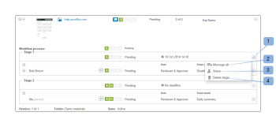

# [!DNL Workfront Proof] でのプルーフの進捗状態とステータスの表示

>[!IMPORTANT]
>
>この記事では、スタンドアロン製品 [!DNL Workfront Proof] の機能について説明します。[!DNL Adobe Workfront] 内でのプルーフについて詳しくは、[プルーフ](../../../review-and-approve-work/proofing/proofing.md)を参照してください。

## プルーフの進捗状態について

プルーフの進捗状態は、プルーフをレビュアーに送信してからレビュアーがプルーフで決定を下すまでに、プルーフで行われた作業を示します。

* [進捗アイコン](#progress-icons)
* [プルーフの進捗状態のレベル](#levels-of-proof-progress)

### 進捗アイコン {#progress-icons}

進捗アイコン（S、O、C、D）が進捗バーに表示され、プルーフの進捗状態を示します。

プルーフに関する次の情報を示します。

<table style="table-layout:auto"> 
 <col> 
 <col> 
 <thead> 
  <tr> 
   <td> 
<strong>進捗アイコン</strong> 
 </td> 
   <td> 
<strong>説明</strong> 
 </td> 
  </tr> 
 </thead> 
 <tbody> 
  <tr> 
   <td> 
  
 </td> 
   <td> 
<strong>送信済み</strong>：プルーフがレビュアーに送信されました。
 </td> 
  </tr> 
  <tr> 
   <td> 
  
 
 
 </td> 
   <td> 
<strong>開封済み</strong>：レビュアーがプルーフの詳細ページを開いたか、プルーフビューアーでプルーフ自体を開きました。
 </td> 
  </tr> 
  <tr> 
   <td> 
  
 </td> 
   <td> 
<strong>コメント</strong>：プルーフに対してレビュアー（コメントを作成できるユーザー）がコメントを付けました。
 
プルーフにレビュアーが指定されていない場合、このアイコンは表示されません。
 </td> 
  </tr> 
  <tr> 
   <td> 
  
 </td> 
   <td> 
<strong>決定</strong>：レビュアーがプルーフに関する決定を下しました。
 
プルーフの承認者（校正判断者）が指定されていない場合、このアイコンは表示されません。 
 </td> 
  </tr> 
 </tbody> 
</table>

これらのアイコンは、プルーフの進捗状態に関する特定の情報を示すために、次の色で表示されます。

* **緑**：完了しています。
* **白**：未完了です。
* **オレンジ**：未完了であり、期限が 24 時間未満です。
* **赤**：未完了であり、期限を過ぎています。

### プルーフの進捗状態のレベル {#levels-of-proof-progress}

Workfront Proof は進捗アイコンを使用して、次の各レベルでのプルーフの進捗状態を追跡します。

* 各レビュアー（プルーフに対するそのユーザーのアクティビティに基づく）。
* 各ステージ（プルーフのプロセスで最も遅れているステージのレビュアーの進捗に基づく）。詳しくは、[自動ワークフローステージの概要](../../../review-and-approve-work/proofing/proofing-overview/stages.md)を参照してください。
* プルーフ（プルーフのプロセスで最も遅れているステージ（レビュアーのグループ）の進捗に基づく）。

[!DNL Workfront Proof] で最も遅れているレビュアーまたはステージによって進捗が決まる例として、プルーフに 3 人のレビュアーが決定を下す必要があるとします。2 人が決定を下し、3 人目が決定を下していない場合、未処理の決定があるため、プルーフの進捗バーには D が緑色で表示されません。

プルーフで「[!UICONTROL プライマリ校正判断者]」の設定が選択されていて、プライマリ校正判断者が決定を送信すると、他に決定は必要ないので、すべてのレビュアーに対してプルーフの進捗バーの D が緑色に変わります。

同様に、プルーフで「[!UICONTROL 1 名による決定のみが必要です]」の設定が選択されていて、いずれかのレビュアーが決定を送信すると、他に決定は必要ないので、すべてのレビュアーに対してプルーフの進捗バーの D が緑色に変わります。

## プルーフのステータスについて

プルーフのステータスには、プルーフに必要な決定のステータスが表示されます。

\
標準のステータスのオプションは次のとおりです。

* 保留中
* 承認済み
* 変更後承認
* 変更が必要です
* 無関係

アカウントでカスタム決定が設定されている場合、ステータスオプションにはカスタム決定の設定が反映されます。

プルーフのステータスは、「ワーストケース」の参加者によって決まります。例えば、プルーフに 3 つの決定があるとします。2 つの決定のステータスは&#x200B;**許可済み**&#x200B;で、1 つは&#x200B;**却下**&#x200B;です。「ワーストケース」である却下の決定は、他の決定より優先され、プルーフの全体的なステータスは&#x200B;**却下**&#x200B;として表示されます。

## 進捗とステータスの表示 {#viewing-progress-and-status}

各ステージで、プルーフ、ステージおよびレビュアーの進捗およびステータスを表示できます。

* [プルーフの概要](#proof-summary)
* [ステージアクションメニュー](#stage-actions-menu)
* [「[!UICONTROL 概要]」セクションでは、プルーフの編集権限を持っている場合、レビュアーのアクションメニューにアクセスすることもできます。詳しくは、Workfront Proof のプルーフ権限プロファイル、および Workfront Proof でプルーフの役割を管理を参照してください。レビュアーの詳細にポインタを合わせると、[!UICONTROL レビュアーのアクション]メニュー（1）が表示され、次の操作を実行できます。](#in-the-summary-section-you-can-also-access-the-reviewer-actions-menus-provided-you-have-edit-rights-on-the-proof-for-more-information-see-proof-permissions-profiles-in-workfront-proof-and-manage-proof-roles-in-workfront-proof-the-reviewer-actions-menu-1-appears-when-you-hover-over-the-reviewer-s-details-and-allows-you-to)
* [プルーフアクションメニュー](#proof-actions-menu)

### プルーフの概要 {#proof-summary}

フォルダー内の各プルーフには展開可能な概要が表示され、プルーフの詳細を素早く表示および編集できます。

概要を展開または折りたたむには：

1. ダッシュボードまたは任意のリストビューで、プルーフの左側にある矢印をクリックします。

概要には、以下が含まれます。

* ワークフロー（2）
* バージョン（3）
* フォルダー（4）
* 状態（5）\
   

概要では、プルーフの次の詳細を表示および編集できます。

* プルーフの進捗状態（1）
* 各ステージの進捗（2）
* ステージの期限設定（3）
* レビュアーの詳細：

   * 各レビュアーが行ったコメントと返信の数（4）
   * 各レビュアーの進捗（5）
   * 決定（決定に電子サインが含まれている場合、そのことを示すアイコンが決定の横に表示されます。）（6）
   * プルーフに対する役割（7）
   * メールアラート設定（8）

>[!NOTE]
>
>プルーフの詳細を編集できるかどうかは、プルーフに対する権限によって異なります（[ [!DNL Workfront Proof]](../../../workfront-proof/wp-acct-admin/account-settings/proof-perm-profiles-in-wp.md) のプルーフ権限プロファイルおよび [ [!DNL Workfront Proof]](../../../workfront-proof/wp-work-proofsfiles/share-proofs-and-files/manage-proof-roles.md) でのプルーフの役割の管理を参照してください）。

### [!UICONTROL ステージアクション]メニュー  {#stage-actions-menu}

ワークフローの各ステージには個別のメニューがあり、そのステージの各レビュアーに関連する一括アクションを実行できます。

「ステージ」セクション（1）にポインタを合わせると[!UICONTROL ステージアクション]メニューが表示され、次の操作を実行できます。

* [!UICONTROL 全員にメッセージを送信]（2）
* [!UICONTROL 共有]（3）
* [!UICONTROL ステージを削除]（4）

>[!NOTE]
>
>これらのオプションを使用できるかどうかは、プルーフに対する権限によって異なります（[ [!DNL Workfront Proof]](../../../workfront-proof/wp-acct-admin/account-settings/proof-perm-profiles-in-wp.md) のプルーフ権限プロファイルおよび [ [!DNL Workfront Proof]](../../../workfront-proof/wp-work-proofsfiles/share-proofs-and-files/manage-proof-roles.md) でプルーフの役割を管理を参照してください）。

「概要」セクションでは、プルーフの編集権限を持っている場合、レビュアーのアクションメニューにアクセスすることもできます。詳しくは、[ [!DNL Workfront Proof]](../../../workfront-proof/wp-acct-admin/account-settings/proof-perm-profiles-in-wp.md) のプルーフ権限プロファイルおよび [ [!DNL Workfront Proof]](../../../workfront-proof/wp-work-proofsfiles/share-proofs-and-files/manage-proof-roles.md) でプルーフの役割を管理を参照してください。レビュアーの詳細にポインタを合わせると、レビュアーのアクションメニュー（1）が表示され、次の操作を実行できます。

* レビュアーにメッセージを送信（2）
* レビュアーの詳細を編集（3）- レビュアーの表示名、プルーフの役割およびメールアラートを編集できます
* レビュアーをプルーフの所有者にする（4）
* レビュアーをプライマリ決定者にする（5）
* プルーフから削除（6）

>[!NOTE]
>
>これらのオプションが表示されるかどうかは、プルーフに対する権限によって異なります（[ [!DNL Workfront Proof]](../../../workfront-proof/wp-acct-admin/account-settings/proof-perm-profiles-in-wp.md) のプルーフ権限プロファイルおよび [ [!DNL Workfront Proof]](../../../workfront-proof/wp-work-proofsfiles/share-proofs-and-files/manage-proof-roles.md) でプルーフの役割を管理を参照してください）。

### プルーフアクションメニュー {#proof-actions-menu}

各プルーフには、次の操作を実行できるメニュー（1）もあります。

* プルーフの詳細ページにアクセス（2）
* 他のユーザーとプルーフを共有（3）
* メッセージをレビュアーに送信（4）
* プルーフの新しいバージョンを作成（5）
* プルーフをコピー（6）
* 元のファイルをダウンロード（7）
* プルーフのリンクを共有（8）
* コメントを印刷（9）
* プルーフの Excel 概要をリクエスト（10）
* プルーフをロック（11）
* プルーフを削除（12）

>[!NOTE]
>
>これらのオプションを使用できるかどうかは、プルーフに対する権限によって異なります（[ [!DNL Workfront Proof]](../../../workfront-proof/wp-acct-admin/account-settings/proof-perm-profiles-in-wp.md) のプルーフ権限プロファイルおよび [ [!DNL Workfront Proof]](../../../workfront-proof/wp-work-proofsfiles/share-proofs-and-files/manage-proof-roles.md) でプルーフの役割を管理を参照してください）。

[!DNL Workfront] 内でのプルーフの進捗状態とステータスの表示について詳しくは、[進捗状況とステータスの表示](#viewing-progress-and-status)を参照してください。

デスクトッププルーフビューアでの進捗状況とステータスの表示について詳しくは、[プルーフビューアーでワークフローをレビュー](../../../workfront-proof/wp-work-proofsfiles/review-proofs-wpv/review-workflow.md)を参照してください。
