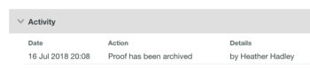

# アーカイブ [!DNL Workfront Proof]

>[!IMPORTANT]
>
>この記事では、スタンドアロン製品の機能について説明します [!DNL Workfront Proof]. 内部での検証に関する情報 [!DNL Adobe Workfront]を参照してください。 [校正](../../../review-and-approve-work/proofing/proofing.md).

[!DNL Workfront Proof] は、60 日間操作が行われなかった場合の配達確認をアーカイブします。

編集権限がある場合は、いつでも手動で配達確認をアーカイブできます。 編集権限について詳しくは、 [の配達確認権限プロファイル [!DNL Workfront Proof]](../../../workfront-proof/wp-acct-admin/account-settings/proof-perm-profiles-in-wp.md).

アーカイブした配達確認：

* ビューページのアーカイブ配達確認ビューにのみ表示されます（以下の「配達確認がアーカイブされているかどうかを確認する方法」を参照）
* 無期限にアカウントに残ります（削除されない場合）
* 誰でもいつでもアーカイブを解除できます（アーカイブを解除できないレビュー担当者も含む） [!DNL Workfront Proof] ユーザー )
* ストレージの制限にカウントする
* 自動アーカイブ時に自動的にロックする
* 手動でアーカイブする際にロックまたはロック解除可能

アーカイブとアーカイブ解除は、配達確認の「アクティビティ」セクションに記録されます。 詳しくは、 [で配達確認の詳細を管理 [!DNL Workfront Proof]](../../../workfront-proof/wp-work-proofsfiles/manage-your-work/manage-proof-details.md).

>[!NOTE]
>
>ファイルやフォルダはアーカイブできません。

## 配達確認の手動アーカイブ

編集権限がある場合は、いつでも手動で配達確認をアーカイブできます。 編集権限について詳しくは、 [の配達確認権限プロファイル [!DNL Workfront Proof]](../../../workfront-proof/wp-acct-admin/account-settings/proof-perm-profiles-in-wp.md).

アーカイブ処理が完了するまでに最大 24 時間かかる場合があります。

1. ダッシュボードまたはリスト表示で、アーカイブする各配達確認のチェックボックスを選択します (  [のビューページで項目を管理 [!DNL Workfront Proof]](../../../workfront-proof/wp-work-proofsfiles/manage-your-work/manage-items-on-views-page.md) を参照してください )。

1. 選択 **[!UICONTROL 詳細]** > **[!UICONTROL アーカイブ]**.\
   この [!UICONTROL 配達確認のアーカイブ] メッセージボックスが表示されます。

1. オプションをクリックして、配達確認のアーカイブ中に、配達確認をロックするかロックを解除するかを指定します。\
   [!DNL Workfront Proof] は、指定したロックオプションを使用して配達確認をアーカイブします。

## アーカイブされた配達確認のリスト

アーカイブされた配達確認は、 **[!UICONTROL アーカイブした配達確認]** 配達確認名の右側にアーカイブ済みアイコンを表示します。

アーカイブ済みの配達確認ビューを表示するには：

1. クリック **[!UICONTROL 件数]**&#x200B;を選択し、「 **[!UICONTROL すべての項目]** > **[!UICONTROL アーカイブした配達確認]**.

   このリストでアーカイブされた配達確認の名前をクリックすると、 [!UICONTROL 配達確認の詳細] ページが表示され、表示 **[!UICONTROL アーカイブ解除]** 」ボタンをクリックします。

   また、 **[!UICONTROL アクティビティ]** 「 」セクションでは、配達確認がアーカイブされた日時と、誰がアーカイブしたかを示すエントリを表示できます。\
   \
   この **[!UICONTROL アクティビティ]** 「 」セクションには、配達確認をアーカイブしたユーザーの名前は表示されません。つまり、無操作状態が 60 日間続くと、配達確認は自動的にアーカイブされました。\
   アーカイブされた配達確認の内容を表示するには、まずアーカイブを解除する必要があります。

## 配達確認のアーカイブ解除

誰でも、いつでも配達確認のアーカイブを解除できます。 これには、以外のレビュー担当者も含まれます [!DNL Workfront Proof] ユーザー。

「アーカイブ済みの配達確認」ビューから配達確認をアーカイブ解除するには：

1. クリック **[!UICONTROL 件数]**&#x200B;を選択し、「 **[!UICONTROL すべての項目]** > **[!UICONTROL アーカイブした配達確認]**.

1. アーカイブを解除する配達確認または配達確認の横にあるチェックボックスをクリックします。
1. クリック **[!UICONTROL 詳細]**&#x200B;を選択し、「 **[!UICONTROL アーカイブ解除]** をクリックします。\
   配達確認のアーカイブが解除されていることを示すメッセージがページ上部に表示されます。
