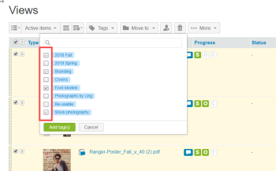

# [!DNL Workfront Proof] でのタグの作成と管理

>[!IMPORTANT]
>
>この記事では、スタンドアロン製品 [!DNL Workfront] の機能について説明します。[!DNL Adobe Workfront] 内のプルーフについて詳しくは、[プルーフ](../../../review-and-approve-work/proofing/proofing.md)を参照してください。

タグを作成および編集して、プルーフやファイルに適用できます。これは、プロジェクト、部門、クライアントなど、多数の様々な [!DNL Workfront Proof] アイテムがあり、それらを簡単に識別して見つけたい場合に最適です。

リストビューページのいずれかで、新規または既存のプルーフ、新規ファイル、新規バージョンおよびコピーにタグを適用できます。

>[!TIP]
>
>1 つのアイテムに複数のカテゴリが適用される場合は、複数のタグを使用すると便利です。どのアイテムにもタグをいくつでも適用できます。

プロフィールと権限の設定は、利用できるタグ機能に影響します。

* 請求管理者、管理者およびスーパーバイザーは、このページで説明されているすべての機能を使用できます。
* 管理者は、自身のアイテムのタグのみを作成および編集できます。
* オブザーバーはアイテムにタグを適用したりタグを編集したりできませんが、他のユーザーがアイテムに適用したタグを表示したり、個人用設定で「タグ」タブを表示したりできます。

これらのプロファイルと権限について詳しくは、[ [!DNL Workfront Proof]](../../../workfront-proof/wp-acct-admin/account-settings/proof-perm-profiles-in-wp.md) のプルーフ権限プロファイルを参照してください。

## アカウントでのタグの作成、編集または削除

1. **[!UICONTROL 設定]**／**[!UICONTROL 個人用設定]**&#x200B;をクリックします。

1. **[!UICONTROL 個人用設定]**&#x200B;ページの上部にある「**[!UICONTROL タグ]**」タブを開きます。\
   次のいずれかの操作を行います。

   * タグを作成するには、「**[!UICONTROL 新規タグ]**」をクリックし、タグの名前を入力したあと、**[!UICONTROL Enter]** キーを押します。

     タグ名は、少なくとも 1 つの英数字を含み、30 文字以内にする必要があります。\
      既存のタグを編集するには、タグの名前をクリックし、新しいテキストを入力して、**[!UICONTROL Enter]** キーを押します。

   * タグを削除するには、タグがリストされている行の末尾にあるごみ箱アイコンをクリックします。

## タグに関する情報の表示

1. **[!UICONTROL 設定]**／**[!UICONTROL 個人用設定]**&#x200B;をクリックします。

1. **[!UICONTROL 個人用設定]**&#x200B;ページの上部にある「**[!UICONTROL タグ]**」タブを開きます。\
   「**[!UICONTROL タグ]**」タブには、タグに関する次の情報が表示されます。

   * **名前**
   * タグが適用されている&#x200B;**アイテム合計**
   * タグが適用されている&#x200B;**表示権限のあるアイテム**

1. （オプション）特定のタグが適用されているすべてのアイテムを表示する場合は、**表示権限のあるアイテム**&#x200B;で、そのタグの横にある数字をクリックします。\
   表示される検索結果ページには、タグが適用され、表示が許可されているすべてのアイテムがリストされます。

## 1 つまたは複数のアイテムに対するタグの作成

1. リストビューまたはダッシュボードで、タグを作成または管理する対象となる任意の数のアイテムを選択します。
1. リストのすぐ上にある&#x200B;**[!UICONTROL タグ]**／**[!UICONTROL 新規タグ]**&#x200B;をクリックし、タグの名前を入力して、「**[!UICONTROL 作成]**」をクリックします。

1. 新規タグを選択し、「**[!UICONTROL タグを追加]**」をクリックします。

## 1 つまたは複数のアイテムに対するタグの管理

1. リストビューまたはダッシュボードで、タグを作成または管理する対象となる任意の数のアイテムを選択します。
1. リストのすぐ上にある&#x200B;**[!UICONTROL タグ]**／**[!UICONTROL タグを管理]**&#x200B;をクリックします。

1. 表示される「[!UICONTROL タグ]」タブで、上記の[タグの作成、編集または削除](https://support.workfront.com/knowledge/articles/115004379508/en-us?brand_id=662728&amp;return_to=%2Fhc%2Fen-us%2Farticles%2F115004379508#CreatingEditingDeletingTag) の説明に従ってタグを管理します。\
   タグの横のチェックボックスが濃い灰色の場合は、選択したすべてのアイテムにタグが適用されます。薄い灰色の場合は、選択したバッチ内の一部のアイテムのみにタグが付けられています。選択したすべてのアイテムからタグを削除する場合は、そのタグの横にあるチェックボックスがオフになっていることを確認してください。\
   

## プルーフ詳細またはファイル詳細からのタグの管理

プルーフまたはファイルに適用されたタグは、それぞれプルーフの詳細ページとファイルの詳細ページに表示されます。このページでは、タグを表示、変更および削除できます。詳しくは、[ [!DNL Workfront Proof]](../../../workfront-proof/wp-work-proofsfiles/manage-your-work/manage-proof-details.md) でのプルーフ詳細の管理と[ [!DNL Workfront Proof]](../../../workfront-proof/wp-work-proofsfiles/manage-your-work/manage-files.md) でのファイルの管理を参照してください。

1. [プルーフ詳細の管理 [!DNL Workfront Proof]](../../../workfront-proof/wp-work-proofsfiles/manage-your-work/manage-proof-details.md)の説明に従って、プルーフ詳細ページを開きます。\
   または\
   [ファイルの管理 [!DNL Workfront Proof]](../../../workfront-proof/wp-work-proofsfiles/manage-your-work/manage-files.md)の説明に従って、ファイルの「ファイル詳細」ページを開きます。\
   項目に適用されたタグは、右上隅近くに表示されます。\
   

1. （オプション）プルーフまたはファイルからタグを削除するには、その横にある x をクリックします。
1. 右上隅で、「**[!UICONTROL タグ]**」をクリックします。\
   

1. 表示されるボックスで、項目に適用するタグを選択し（または削除するタグの選択を解除し）、「**[!UICONTROL タグを追加]**」をクリックします。

## タグ名を使用した項目の検索

項目に適用されているタグの名前を使用して項目を検索できます。項目を他のユーザーと共有すると、そのユーザーは同じ方法でその項目を検索できます。タグが適用されているすべての項目のリストを表示するには、次の手順に従います。

1. リスト表示またはダッシュボードで、左サイドバーの「**[!UICONTROL タグ]**」タブを開き、表示されるタグのリストでタグをクリックします。\
   \
   [!DNL Workfront Proof] の右上隅の検索フィールドで、タグ名が表示されます。追加のタグを選択するか、検索フィールドに追加のキーワードを入力することで、検索を絞り込むことができます。タグ名の横にある「x」アイコンをクリックして、検索フィールドからタグを削除できます。
