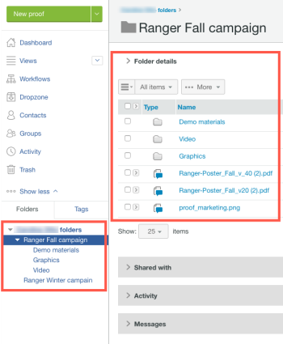

# 内のフォルダー [!DNL Workfront Proof]

>[!IMPORTANT]
>
>この記事では、スタンドアロン製品の機能について説明します [!DNL Workfront Proof]. 内部での検証に関する情報 [!DNL Adobe Workfront]を参照してください。 [校正](../../../review-and-approve-work/proofing/proofing.md).

フォルダーを使用すると、作業を [!DNL Workfront Proof] アカウント フォルダー構造を作成して、クライアント、ジョブまたはキャンペーンごとに別々のフォルダー構造を使用して、コンピューター上でのフォルダーの整理方法を反映させることができます。

フォルダーを使用する利点は次のとおりです。

* **機密クライアントデータへのアクセスの制限**:一部のユーザーに対して一部の配達確認を表示したくない場合は、配達確認の保存場所を非公開にできます。 詳しくは、 [でのフォルダー権限について [!DNL Workfront Proof]](../../../workfront-proof/wp-work-proofsfiles/organize-your-work/folder-permissions.md).

* **配達確認およびファイルに対する一括アクションの実行**:フォルダーにグループ化された配達確認やファイルに対してバルクアクションを実行すると、それらを簡単に管理できます。 例えば、1 つのアクションで複数の項目を共有できます。 詳しくは、 [でフォルダとそのコンテンツを管理 [!DNL Workfront Proof]](../../../workfront-proof/wp-work-proofsfiles/organize-your-work/manage-folders-and-contents.md).

* **他のWorkfront Proof ユーザーとフォルダーを共有する**:フォルダーを共有すると、そのフォルダーは他のユーザーのサイドバーに表示され、フォルダー内のすべての項目に対して読み取り専用アクセス権を持ちます。 別のWorkfront Proof アカウントと密接に連携している場合は、Workfront Proof アカウント間に Partner 関係を設定することをお勧めします。 これにより、フォルダーを会社全体と一度に共有できるので、Partner アカウントから新しいユーザーと自動的に共有されます。 詳しくは、 [でフォルダーを共有 [!DNL Workfront Proof]](../../../workfront-proof/wp-work-proofsfiles/organize-your-work/share-folders.md).

* **一緒に作業する配達確認や、レビュー担当者と一緒に作業するレビュー担当者をグループ化します**:自分または他のレビュー担当者がいずれかの配達確認を開くと、校正ビューアを起動すると、フォルダー内のすべての配達確認もここで使用できます。 校正ビューアを開いたままで、他の配達確認を表示したり、配達確認を並べ替えたり検索したり、相互に比較したりできます。 詳しくは、「校正ビューアでの複数の配達確認の操作」を参照してください。

フォルダーは 1 つずつ作成できます。 詳しくは、 [でのフォルダーの作成 [!DNL Workfront Proof]](../../../workfront-proof/wp-work-proofsfiles/organize-your-work/create-folders.md).
