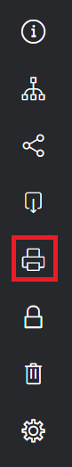

# でのコメントの印刷と書き出し [!DNL Workfront Proof]

>[!IMPORTANT]
>
>この記事では、スタンドアロン製品の機能について説明します [!DNL Workfront Proof]. 内部での検証に関する情報 [!DNL Adobe Workfront]を参照してください。 [校正](../../../review-and-approve-work/proofing/proofing.md).

## コメントの印刷

コメントの概要には、次の領域から直接アクセスできます。

* [配達確認ビューア](#the-proof-viewer)
* [配達確認の詳細ページ](#the-proof-details-page)
* [この [!DNL Proof] アクションメニュー](#the-proof-actions-menu)

### 配達確認ビューア {#the-proof-viewer}

配達確認のサムネールやフルビュー画像を含む、配達確認のコメントの概要を、 **[!UICONTROL 印刷]** アイコンをクリックします。 (1)

### 配達確認の詳細ページ {#the-proof-details-page}

配達確認のコメントの概要は、 **[!UICONTROL 印刷]** アイコンをクリックします。 (2)

### この [!DNL Proof] アクションメニュー {#the-proof-actions-menu}

配達確認のコメントの概要は、 **[!UICONTROL 印刷]** アイコン [!UICONTROL 配達確認アクション] メニュー

次の手順で [!UICONTROL コメントの概要] ページをリスト表示から：

1. をクリックします。 **[!UICONTROL アクション]** メニュー (3)
1. 選択 **[!UICONTROL コメントを印刷]**. (4)

\
[ コメントの概要 ] ページでは、次の印刷オプションから選択できます。

* サムネール表示 (1)
* 全ページ表示 (2)
* ページを印刷する (3)
* コメント付き配達確認をPDFファイルにエクスポートする (4)
* 配達確認コメントをに書き出す [!DNL Excel] ファイル (5)

### サムネール表示

サムネールビューでは、各コメントが順に表示され、各コメントのフルスレッドが表示されます。 また、コメントを並べ替えたり、マークアップを追加した各コメントのサムネイルを表示することもできます。

サムネールビューを印刷するには、 **[!UICONTROL プリンタ]** ページの右上隅にあるアイコンをクリックし、次のいずれかを選択します。

* コメント ID またはページ (1) で並べ替え
* マークアップが追加された各コメントのサムネイル (2)

### フルページ表示

全ページ表示では、各ページがそのページのコメントと共に表示され、コメントのマークアップがページ上のどこに配置されているかを示すピンが表示されます。

全ページ表示を印刷するには、 **[!UICONTROL プリンタ]** アイコンをクリックします。

## のエクスポート [!DNL Excel] 概要

次の手順で [!DNL Excel] 概要：

1. 配達確認の右側にある配達確認のアクションメニューを開き、「 **[!UICONTROL [!DNL Excel]概要]**. (1)\
   

次の手順で [!DNL Excel] 概要を「配達確認の詳細」ページで表示します。

1. [ 書き出し先 ] をクリックします。 **[!DNL Excel]** アイコン (2)
1. 

## PDFへの書き出し

すべてのマークアップとコメントを含め、PDFに配達確認を書き出すには、次の手順に従います。

1. に移動します。 **[!UICONTROL 件数]** をクリックします。
1. 次をクリック： **[!UICONTROL 詳細]** アイコンを配達確認とインラインで表示し、「 **[!UICONTROL コメントを印刷]**.

1. ページの右上隅にある「PDFに書き出し」アイコンをクリックします。

   PDFの準備が整ったら、ダウンロードリンクが記載された電子メールを受信します。

すべてのコメントがPDFリーダーに表示されます。 コメントに複数のマークアップが関連付けられている場合、コメントはコメントリストに複数回表示されます（マークアップごとに 1 回）。

>[!IMPORTANT]
>
>「PDFに書き出し」機能は、静的ファイルに対してのみ使用できます。
