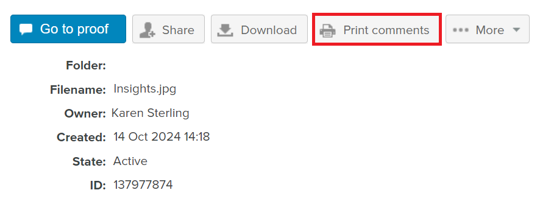
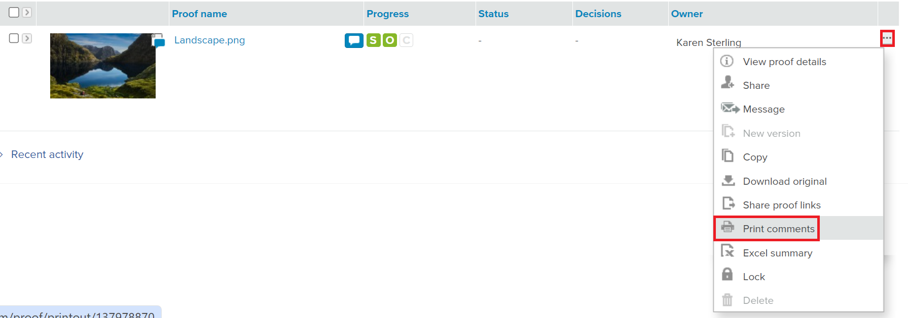
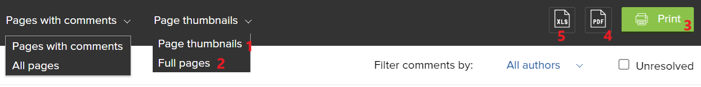
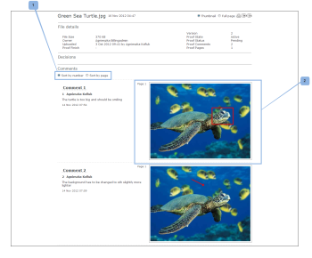
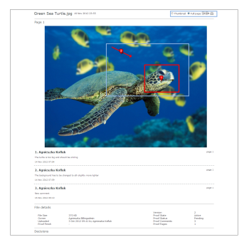
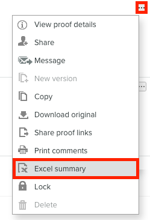
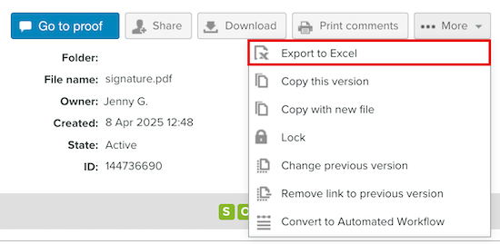

# [!DNL Workfront Proof] でのコメントの印刷と書き出し

<!-- Audited: 4/2025 -->

>[!IMPORTANT]
>
>この記事では、スタンドアロン製品 [!DNL Workfront Proof] の機能について説明します。 [!DNL Adobe Workfront] 内でのプルーフについて詳しくは、[プルーフ](../../../review-and-approve-work/proofing/proofing.md)を参照してください。

## コメントの印刷

コメントの概要には、次のエリアから直接アクセスできます。

* [プルーフビューア](#the-proof-viewer)
* [プルーフの詳細ページ](#the-proof-details-page)
* [ [!DNL Proof]  アクションメニュー](#the-proof-actions-menu)

### プルーフビューア {#the-proof-viewer}

プルーフビューアの「**[!UICONTROL 印刷]**」アイコンをクリックすると、プルーフのサムネールやフルビュー画像を含むプルーフのコメントの概要を印刷できます。

プルーフビューアにアクセスするには、プルーフの詳細ページで「**プルーフに移動**」ボタンをクリックします。

### プルーフの詳細ページ {#the-proof-details-page}

プルーフの詳細ページの「**[!UICONTROL 印刷]**」アイコンをクリックすると、プルーフのコメントの概要を印刷できます。

特定のプルーフのプルーフの詳細ページにアクセスするには、リストビューからプルーフの名前をクリックします。

### [!DNL Proof] アクションメニュー {#the-proof-actions-menu}

プルーフのコメントの概要を印刷するには、[!UICONTROL  プルーフアクション ] メニューの&#x200B;**[!UICONTROL 印刷]** アイコンをクリックします。

リスト表示から[!UICONTROL コメントの概要]ページにアクセスするには、次の手順に従います。

1. **[!UICONTROL アクション]**&#x200B;メニューをクリックします。
1. 「**[!UICONTROL コメントを印刷]**」を選択します。

   

   コメントの概要ページで、次の印刷オプションから選択します。

   * サムネール表示 (1)
   * 全ページ表示 (2)
   * ページを印刷する (3)
   * コメント付きのプルーフを PDF ファイルに書き出す (4)
   * プルーフのコメントを [!DNL Excel] ファイルに書き出す (5)

### サムネール表示

サムネールビューには、各コメントのスレッド全体が順番に表示されます。 また、コメントを並べ替えたり、マークアップを追加した各コメントのサムネールを表示することもできます。

サムネールビューを印刷するには、ページの右上隅にある&#x200B;**[!UICONTROL プリンター]** アイコンをクリックし、次のいずれかを選択します。

* コメント ID またはページで並べ替え (1)
* マークアップが追加された各コメントのサムネール (2)

### 全ページ表示

ページ全体のビューには、各ページが順番に表示され、そのページのコメントと、コメントの場所を示すピンが表示されます。

ページ全体のビューを印刷するには、ページの右上隅にある&#x200B;**[!UICONTROL プリンター]** アイコンをクリックします。

## [!DNL Excel] 概要の書き出し

プルーフアクションメニューから[!DNL Excel]概要をエクスポートするには：

1. プルーフの右側にある&#x200B;**アクション** アイコンをクリックし、**[!UICONTROL [!DNL Excel]の概要]**を選択します。
   

プルーフの詳細ページから [!DNL Excel] 概要をダウンロードするには、次の手順に従います。

1. 「**詳細**」ボタンをクリックし、「**Excelに書き出し**」を選択します。

   

## PDF への書き出し

PDF ファイルに書き出すと、すべてのコメントがPDF リーダーに表示されます。 コメントに複数のマークアップが関連付けられている場合、コメントはコメントリストに複数回表示されます（マークアップごとに 1 回）。

>[!IMPORTANT]
>
>「PDFに書き出し」機能は、静的ファイルに対してのみ使用できます。

マークアップとコメントを含むプルーフをPDFに書き出すには：

1. 画面の左側で、**[!UICONTROL ビュー]**&#x200B;をクリックします。
1. 特定のプルーフに沿って&#x200B;**[!UICONTROL 詳細]** ボタンをクリックし、「**[!UICONTROL コメントを印刷]**」を選択します。

1. ページの右上隅にある「**PDFに書き出し**」ボタンをクリックします。 PDFのダウンロードが開始され、完了後に電子メールで通知されます。
