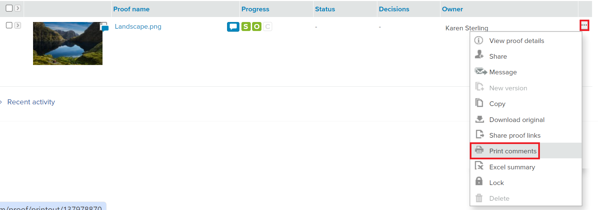
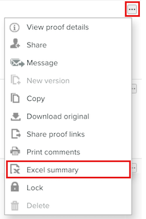

# [!DNL Workfront Proof] でのコメントの印刷と書き出し

>[!IMPORTANT]
>
>この記事では、スタンドアロン製品 [!DNL Workfront Proof] の機能について説明します。[!DNL Adobe Workfront] 内でのプルーフについて詳しくは、[プルーフ](../../../review-and-approve-work/proofing/proofing.md)を参照してください。

## コメントの印刷

コメントの概要には、次のエリアから直接アクセスできます。

* [プルーフビューア](#the-proof-viewer)
* [プルーフの詳細ページ](#the-proof-details-page)
* [ [!DNL Proof]  アクションメニュー](#the-proof-actions-menu)

### プルーフビューア {#the-proof-viewer}

プルーフビューアで **[!UICONTROL 印刷]** アイコンをクリックすると、プルーフのサムネールやフルビューの画像を含むプルーフのコメントの概要を印刷できます。

プルーフビューアにアクセスするには、プルーフの詳細ページの **プルーフに移動** ボタンをクリックします。

### プルーフの詳細ページ {#the-proof-details-page}

プルーフのコメントの概要を印刷するには、プルーフの詳細ページで **[!UICONTROL 印刷]** アイコンをクリックします。

特定のプルーフのプルーフの詳細ページにアクセスするには、リスト表示からプルーフの名前をクリックします。

### [!DNL Proof] アクションメニュー {#the-proof-actions-menu}

プルーフのコメントの概要を印刷するには、**[!UICONTROL プルーフアクション [!UICONTROL  メニューの]** 印刷 ] アイコンをクリックします。

リスト表示から[!UICONTROL コメントの概要]ページにアクセスするには、次の手順に従います。

1. **[!UICONTROL アクション]** メニューをクリックします。
1. 「**[!UICONTROL コメントを印刷]**」を選択します。

   

   コメントの概要ページで、次の印刷オプションから選択します。

   * サムネール表示 (1)
   * 全ページ表示 (2)
   * ページを印刷する (3)
   * コメント付きのプルーフを PDF ファイルに書き出す (4)
   * プルーフのコメントを [!DNL Excel] ファイルに書き出す (5)

### サムネール表示

サムネール表示には、各コメントが各コメントのフルスレッドと順に表示されます。 また、コメントを並べ替えたり、マークアップを追加した各コメントのサムネールを表示することもできます。

サムネール表示を印刷するには、ページの右上隅にある **[!UICONTROL プリンター]** アイコンをクリックし、次のいずれかを選択します。

* コメント ID またはページで並べ替え (1)
* マークアップが追加された各コメントのサムネール (2)

### 全ページ表示

フルページビューでは、各ページが順番に表示され、そのページのコメントと、コメントの場所を示すピンが表示されます。

フルページビューを印刷するには、ページの右上隅にある **[!UICONTROL プリンター]** アイコンをクリックします。

## [!DNL Excel] 概要の書き出し

プルーフのアクション メニューから [!DNL Excel] の概要をエクスポートするには：

1. プルーフの右側にある **アクション** アイコンをクリックし、「概要 ]****[!UICONTROL [!DNL Excel] 選択します。
   

プルーフの詳細ページから [!DNL Excel] 概要をダウンロードするには、次の手順に従います。

1. **詳細** ボタンをクリックして、「**Excel にエクスポート**」を選択します。

   <!--
    -->

## PDF への書き出し

PDF ファイルに書き出すと、すべてのコメントがPDF Reader に表示されます。 コメントに複数のマークアップが関連付けられている場合、コメントはコメントリストに複数回表示されます（マークアップごとに 1 回）。

>[!IMPORTANT]
>
>「PDFに書き出し」機能は、静的ファイルに対してのみ使用できます。

マークアップとコメントを含むプルーフをPDFに書き出すには、次の手順を実行します。

1. 画面の左側にある「**[!UICONTROL 表示]**」をクリックします。
1. 特定のプルーフのインラインで **[!UICONTROL その他]** ボタンをクリックし、「**[!UICONTROL コメントを印刷]**」を選択します。

1. ページの右上隅にある「**PDFに書き出し** ボタンをクリックします。 PDFのダウンロードが開始され、完了するとメールで通知されます。
