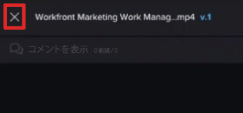

# 校正ビューアで配達確認を比較

>[!IMPORTANT]
>
>この記事では、スタンドアロン製品の機能について説明します [!DNL Workfront Proof]. 内部での検証に関する情報 [!DNL Adobe Workfront]を参照してください。 [校正](../../../review-and-approve-work/proofing/proofing.md).

2 つの配達確認の比較を並べて表示できます。 これには、同じ配達確認の 2 つのバージョンを使用することも、完全に別々の配達確認を使用することもできます。

## 配達確認のバージョンを比較 {#compare-proof-versions}

1. 比較する複数のバージョンの配達確認を開きます。
1. 表示される校正ビューアの左上隅で、配達確認の名前をクリックします。 次に、表示されるバージョンのリストで、 **比較** 開いて比較するバージョンの横にあるアイコンをクリックします。

   

   配達確認は横に並べて表示され、新しいバージョンが左側に表示されます。

   <!--
   
Separate breadcrumbs above each proof allow you to view and go to the work item associated with the proof:

   -->

   <!--
   
  

   -->

1. 続行 [比較ツールの使用](#use-the-compare-tools).

## 個別の配達確認を比較 {#compare-separate-proofs}

2 つの異なる配達確認を比較できます。

* [で個別の配達確認を比較 [!DNL Workfront]](#compare-separate-proofs-in-workfront)
* [で個別の配達確認を比較 [!DNL Workfront Proof]](#compare-separate-proofs-in-workfront-proof)

### で個別の配達確認を比較 [!DNL Workfront] {#compare-separate-proofs-in-workfront}

内のドキュメントリストとは別の配達確認の比較に関する情報 [!DNL Workfront]を参照し、 [2 つの異なる配達確認の比較](../../../review-and-approve-work/proofing/reviewing-proofs-within-workfront/review-a-proof/compare-proofs.md#comparing-two-proofs-from-a-document-list) セクション [配達確認の比較](../../../review-and-approve-work/proofing/reviewing-proofs-within-workfront/review-a-proof/compare-proofs.md) 記事。

### で個別の配達確認を比較 [!DNL Workfront Proof] {#compare-separate-proofs-in-workfront-proof}

>[!NOTE]
>
>比較する配達確認は、同じフォルダー内、およびフォルダー構造内の同じ階層レベルに配置する必要があります。 フォルダーを使用して比較する配達確認をグループ化する方法について詳しくは、 [複数の配達確認を校正ビューアで使用する](../../../workfront-proof/wp-work-proofsfiles/review-proofs-wpv/work-with-multiple-proofs.md)

1. 比較するいずれかの配達確認を校正ビューアで開きます。
1. 次をクリック： **[!UICONTROL 比較モード]** アイコン

   \
   表示領域が半分に分割され、校正ビューアの左側と右側の両方に配達確認が表示されます。

   

1. 次をクリック： [!UICONTROL フォルダー] アイコンを左側または右側に配置して、同じフォルダー内の他の配達確認をリストします。

   

1. リストで、現在校正ビューアで開いている配達確認と比較する配達確認の名前をクリックします。

   

   両方の配達確認が表示されます。

1. 続行 [比較ツールの使用](#use-the-compare-tools).

## 比較ツールの使用 {#use-the-compare-tools}

校正ビューアは、配達確認を効果的かつ効率的に比較するための様々なツールを提供します。

* [配達確認を自動比較](#auto-compare-proofs)
* [オーバーレイでの配達確認の比較](#compare-proofs-in-an-overlay)
* [同時ナビゲーション比較](#simultaneous-navigation-comparison)

### 配達確認を自動比較 {#auto-compare-proofs}

自動比較では、2 つの静的配達確認またはビデオ配達確認をピクセルごとに比較します。 検出された違いは、左側の配達確認で赤くハイライト表示されます。

インタラクティブな配達確認を比較する場合は、自動比較は使用できません。

2 つの配達確認を自動比較するには：

1. 次のいずれかの方法で配達確認の比較を開始します。

   * 同じ配達確認の 2 つのバージョンを比較する ( [配達確認のバージョンを比較](#compare-proof-versions) （この記事を参照）。
   * 2 つの異なる配達確認を比較します ( [個別の配達確認を比較](#compare-separate-proofs) （この記事を参照）。

1. 次をクリック： **[!UICONTROL 自動比較]** アイコン

   

   2 つの配達確認の違いは、左側の配達確認で赤くハイライト表示されます。

1. （オプション） **[!UICONTROL 切り替え]** アイコンをクリックし、アクティブな側を変更して、右側の配達確認に違いが表示されるようにします。 デフォルトでは、差異は左側の配達確認に表示されます。

   

1. （オプション） **[!UICONTROL カラー]** アイコン：違いをハイライトする際に使用するカラーと不透明度を変更します。

   

### オーバーレイでの配達確認の比較 {#compare-proofs-in-an-overlay}

オーバーレイ比較を使用すると、2 つの静的な配達確認を 1 つの配達確認として表示し、配達確認の中央下に垂直方向の区切りを表示して、2 つの静的な配達確認の違いを表示できます。 垂直ディバイダをまたいで配達確認をパンすると、差異が表示されます。

>[!NOTE]
>
>ビデオの配達確認とインタラクティブな配達確認を比較する場合は、オーバーレイ比較は使用できません。

オーバーレイ比較を有効にするには：

1. 次のいずれかの方法で配達確認の比較を開始します。

   * 同じ配達確認の 2 つのバージョンを比較する ( [配達確認のバージョンを比較](#compare-proof-versions) （この記事を参照）。
   * 2 つの異なる配達確認を比較します ( [個別の配達確認を比較](#compare-separate-proofs) （この記事を参照）。

1. 次をクリック： **[!UICONTROL オーバーレイ]** アイコン

   

   2 つの配達確認は、配達確認の中央下に垂直方向の区切り線が付いた 1 つの配達確認として表示されます。

1. 次のいずれかの操作を行います。

   * 垂直ディバイダをまたいで配達確認をパンします。 パン中は、縦区切りの左側に配達確認が表示され、右側に配達確認が表示されます。
   * 垂直のディバイダを左右に移動します。 区切りを移動すると、縦区切りの左側に配達確認が表示され、右側に配達確認が表示されます。

### 同時ナビゲーション比較 {#simultaneous-navigation-comparison}

配達確認の比較時には、同時ナビゲーションがデフォルトで有効になっています。 これは、静的な配達確認と静的な配達確認を比較する場合、またはビデオ配達確認とビデオ配達確認を比較する場合に使用できます。 静的な配達確認とビデオ配達確認を比較する場合は使用できません。

**静的配達確認：** 静的な配達確認を有効にすると、同時ナビゲーションにより、パンまたはスクロール時に 2 つの配達確認のズームレベルと位置がロックされます。 配達確認に複数のページが含まれ、同時にナビゲーションが有効な場合、1 つの配達確認でページを変更すると、他の配達確認でページが変更されます。

**ビデオ配達確認：** ビデオ配達確認を有効にすると、同時ナビゲーションで 2 つの配達確認のタイムラインの時間差が記憶されます。

有効化されていない場合に同時ナビゲーションを有効にするには：

1. 次のいずれかの方法で配達確認の比較を開始します。

   * 同じ配達確認の 2 つのバージョンを比較する ( [配達確認のバージョンを比較](#compare-proof-versions) （この記事を参照）。
   * 2 つの異なる配達確認を比較します ( [個別の配達確認を比較](#compare-separate-proofs) （この記事を参照）。

1. 次をクリック： **[!UICONTROL 同時ナビゲーション]** アイコン

   

1. （オプション） **[!UICONTROL リセット]** アイコンを使用すれば、いつでもズームレベルと位置をリセットできます（静的な配達確認の場合）。またはタイムラインをリセットすることもできます（ビデオの配達確認の場合）。

   

## 比較モードを終了

1. 今後表示しない配達確認を閉じるには、配達確認の左上隅にある (x) アイコンをクリックします。

   

   閉じない配達確認は、校正ビューアで開いたままになります。
