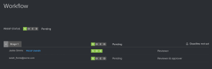

# 校正ビューアでのワークフローのレビュー

>[!IMPORTANT]
>
>この記事では、スタンドアロン製品の機能について説明します [!DNL Workfront Proof]. 内部での検証に関する情報 [!DNL Adobe Workfront]を参照してください。 [校正](../../../review-and-approve-work/proofing/proofing.md).

この [!UICONTROL ワークフロー] 「 」パネルには、配達確認の詳細ページおよび E メール通知に表示される、配達確認のワークフローが表示されます。\
配達確認の詳細について詳しくは、 [で配達確認の詳細を管理 [!DNL Workfront Proof]](../../../workfront-proof/wp-work-proofsfiles/manage-your-work/manage-proof-details.md).\
割り当てられたレビュー担当者（ユーザーとゲストを含む）は全員、 [!UICONTROL ワークフロー] パネル。

次の手順で [!UICONTROL ワークフロー] パネル：

1. 左のアイコンメニューが表示されない場合は、 **[!UICONTROL メニュー]** アイコンを使用します。

   

1. 次をクリック： **[!UICONTROL ワークフロー]** アイコン

   この **[!UICONTROL ワークフロー]** パネルが表示されます。

   

   ワークフローパネルの各セクションには、配達確認、ステージ、レビュー担当者の進行状況とステータスが表示されます。

   * 全体 **配達確認のステータス** すべてのステージですべてのレビュー担当者が配達確認に対しておこなった決定とアクションによって決定されたとおりです。

      

   * 個々のステージの横にあるドロップダウン矢印をクリックして、ステージの進行状況、ステータス、期限およびレビュー担当者の情報を表示します。

      

   * 各ステージで、ステージ固有のレビュー担当者と配達確認の役割、および個々のレビュー担当者の進捗状況とステータスのリストを表示します。

      

      配達確認の進行状況とステータスについて詳しくは、 [配達確認の進行状況とステータスをで表示 [!DNL Workfront Proof]](../../../workfront-proof/wp-work-proofsfiles/manage-your-work/view-progress-and-status-of-proof.md).
