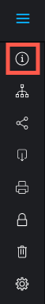

# プルーフビューアーでプルーフのアクティビティを表示

>[!IMPORTANT]
>
>この記事では、スタンドアロン製品 [!DNL Workfront Proof] の機能について説明します。 [!DNL Adobe Workfront] 内でのプルーフについて詳しくは、[プルーフ](../../../review-and-approve-work/proofing/proofing.md)を参照してください。

特定のプルーフに関する最近のアクティビティを表示できます。 これには、プルーフに割り当てられたすべてのユーザーによるすべてのアクティビティと決定が含まれます。

1. 左側のツールバーが表示されない場合は、プルーフビューアーの左上隅にある「**[!UICONTROL メニュー]**」アイコンをクリックします。

   

1. プルーフビューアの左側にあるツールバーで「**[!UICONTROL プルーフの詳細]**」ボタンをクリックします。

   

1. 「**[!UICONTROL プルーフの詳細]**」が選択された状態で表示される&#x200B;**[!UICONTROL プルーフの詳細]**&#x200B;ページで、プルーフの詳細、ステータス、および進行状況を表示します。

1. プルーフの状態について詳しくは、[ [!DNL Workfront Proof]](../../../workfront-proof/wp-work-proofsfiles/manage-your-work/proof-state.md) でプルーフの状態を理解を参照してください。

1. プルーフの進捗状態について詳しくは、[ [!DNL Workfront Proof]](../../../workfront-proof/wp-work-proofsfiles/manage-your-work/view-progress-and-status-of-proof.md) でプルーフの進捗状態とステータスを表示を参照してください。
1. 次の情報を表示するには、「**[!UICONTROL プルーフアクティビティ]**」をクリックします。

   * **日付**：アクションが行われた日時。
   * **アクション**：プルーフで発生したアクション。
   * **詳細**：アクションを実行したユーザー。
