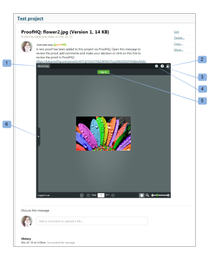

# [!DNL Workfront Proof] でミニプルーフを作成する

>[!IMPORTANT]
>
>この記事では、スタンドアロン製品 [!DNL Workfront Proof] の機能について説明します。[!DNL Adobe Workfront] 内でのプルーフについて詳しくは、[プルーフ](../../../review-and-approve-work/proofing/proofing.md)を参照してください。

ミニプルーフは、web ページ、ブログ、または wiki にプルーフを埋め込むためのウィジェットです。

Miniproof には、プルーフと、既存のすべてのコメントおよびマークアップが表示されます。[!DNL Workfront Proof] で作業しているかのように、プルーフに取り組むことができます。

Basecamp プロジェクトに埋め込まれた Miniproof の例を次に示します。

* プルーフの名前（1）
* 全画面表示（2）：プルーフビューアでプルーフを開きます（ミニプルーフが埋め込まれた環境の外）
* ヘルプリンク（3）
* アクションメニュー（4）
* サイドバーにコメントを表示する（5）

Web サイト、ブログ、wiki にミニプルーフを埋め込むには、次の手順を実行します。

1.  [!DNL Workfront Proof]](../../../workfront-proof/wp-work-proofsfiles/manage-your-work/manage-proof-details.md) の [プルーフ詳細の管理の説明に従って、プルーフの&#x200B;**[!UICONTROL プルーフ詳細]**&#x200B;ページに移動します。

1. ページの「**[!UICONTROL その他の共有オプション]**」のセクションを開きます
1. 埋め込みコードが有効になっている（1）。
1. 「[!UICONTROL コードをコピー]」リンク（2）をクリックして、埋め込みコードをクリップボードにコピーします。
1. ミニプルーフを埋め込むために作業している web サイト、ブログ、wiki にコードを貼り付けます。

![[!DNL Embed_code].png](assets/embed-code-350x218.png)
